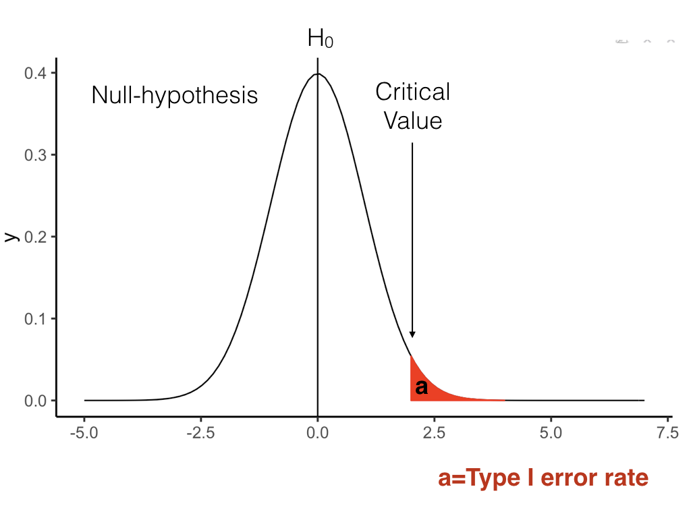

```{r setup, include=FALSE, echo=FALSE}
options(htmltools.dir.version = FALSE)
knitr::opts_chunk$set(echo = FALSE,message=FALSE,warning=FALSE, cache = TRUE)
```

# Overview

1. Power
2. Effect-size
3. Simulating data for a t-test for sample-size planning

---

# Experiment Design Question

I am planning to run an experiment, how many subjects do I need?

---

# Power and Effect-size

**Statistical Power**

- A property of designs. The likelihood that a design will detect a true effect when there is a true effect to be detected

**Effect size**

- Some measure of the size or magnitude of the effect in question

---

class: center, middle, clear, nopad

```{r, out.width="90%"}

```


---

class: center, middle, clear, nopad

```{r, out.width="90%"}
knitr::include_graphics("figs/power/Power.002.png")
```


---

class: center, middle, clear, nopad

```{r, out.width="90%"}
knitr::include_graphics("figs/power/Power.003.png")
```


---

class: center, middle, clear, nopad

```{r, out.width="90%"}
knitr::include_graphics("figs/power/Power.004.png")
```


---

class: center, middle, clear, nopad

```{r, out.width="90%"}
knitr::include_graphics("figs/power/Power.005.png")
```


---

# Power

You will often see researchers conducting a power-analysis of their design **before** they conduct the research.

In a paper, they will report something like this:

"Our design needed an N of 50 to achieve power .8 to detect an effect of d=.5"

---

# Cohen's d

A standardized measure of effect-size

**Within-subject design**

$d= \frac{|u1 - u2|}{\text{sd}}$

**Between-subject design**

$d= \frac{|u1 - u2|}{\text{sd}_\text{pooled}}$

---

# Interpeting d

- d=0, no mean difference
- d=1, the difference between means is 1 sd
- d=2, the difference between means is 2 sds.

---

# What is a big or small d?

Conventional recommendations by Cohen:

- d = .2 (small)
- d = .5 (medium)
- d >= .8 (large)

---

# More interpretation of d

- Researchers should establish for themselves a minimum effect-size of interest.
- Minimum effect-size of interest depends on the research question

For example:

- d = .1, is small (and perhaps meaningless) if we are talking about whether a drug cures symptom like headache pain
- d = .1 is small (but meaningful) if we are using theories to test for the presence or absence of an effect

---


# Data-simulation

A process for simulating the results of an experiment

1. Useful for understanding the likely outcomes of a particular design
2. General method, can be applied to many kinds of designs
3. Useful for sample-size planning

---

# simulating a t-test

Link: 

[T-test simulations](https://crumplab.github.io/psyc3400/Presentations/ttestSimulation.html)

---

# Next class:

1. Data simulation for ANOVAs
2. No quiz this week. We'll have the next one starting Tuesday


```{r,eval=F}
library(ggplot2)
ggplot(data.frame(x = c(-5, 7)), aes(x)) +
  stat_function(fun = dnorm) +
  stat_function(fun = dnorm, 
                xlim = c(2,4),
                geom = "area",
                color = "red",
                fill = "red")+
  geom_vline(xintercept=0)+
 # stat_function(fun = dnorm,
#                args = list(mean=3,sd = 1),
#                linetype =2)+
#  stat_function(fun = dnorm,
#                args = list(mean=3,sd = 1),
#                xlim = c(-4,2),
#                geom = "area",
#                color = "blue",
#                fill = "blue",
#                alpha=.5)+
#  geom_vline(xintercept=3)+
  theme_classic(base_size=15)
  
```


```{r,eval=F}
library(ggplot2)
ggplot(data.frame(x = c(-5, 7)), aes(x)) +
  stat_function(fun = dnorm) +
  stat_function(fun = dnorm, 
                xlim = c(2,4),
                geom = "area",
                color = "red",
                fill = "red")+
  geom_vline(xintercept=0)+
  stat_function(fun = dnorm,
                args = list(mean=3,sd = 1),
                linetype =2)+
  stat_function(fun = dnorm,
                args = list(mean=3,sd = 1),
                xlim = c(-4,2),
                geom = "area",
                color = "blue",
                fill = "blue",
                alpha=.5)+
  geom_vline(xintercept=3)+
  theme_classic(base_size=15)
  
```


```{r,eval=F}
library(ggplot2)
ggplot(data.frame(x = c(-5, 7)), aes(x)) +
  stat_function(fun = dnorm,
                args = list(mean=3,sd = 1),
                linetype =2)+
  stat_function(fun = dnorm,
                args = list(mean=3,sd = 1),
                xlim = c(-4,2),
                geom = "area",
                color = "blue",
                fill = "blue",
                alpha=.5)+
   stat_function(fun = dnorm,
                args = list(mean=3,sd = 1),
                xlim = c(2,7.5),
                geom = "area",
                color = "green",
                fill = "green",
                alpha=.5)+
  geom_vline(xintercept=3)+
    stat_function(fun = dnorm) +
  stat_function(fun = dnorm, 
                xlim = c(2,4),
                geom = "area",
                color = "red",
                fill = "red")+
  geom_vline(xintercept=0)+
  theme_classic(base_size=15)
  
```


