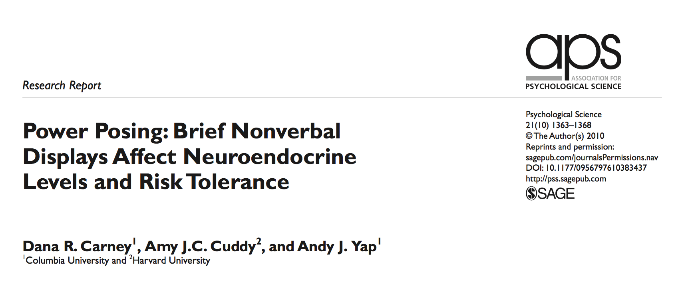
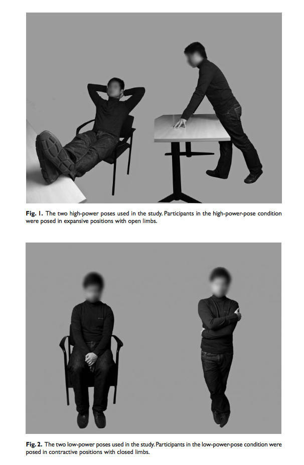
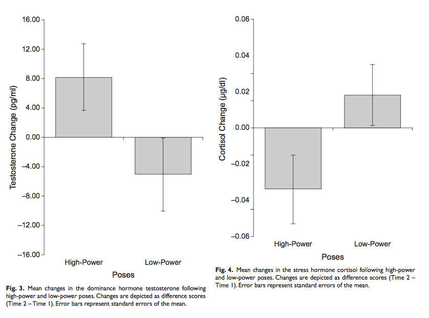
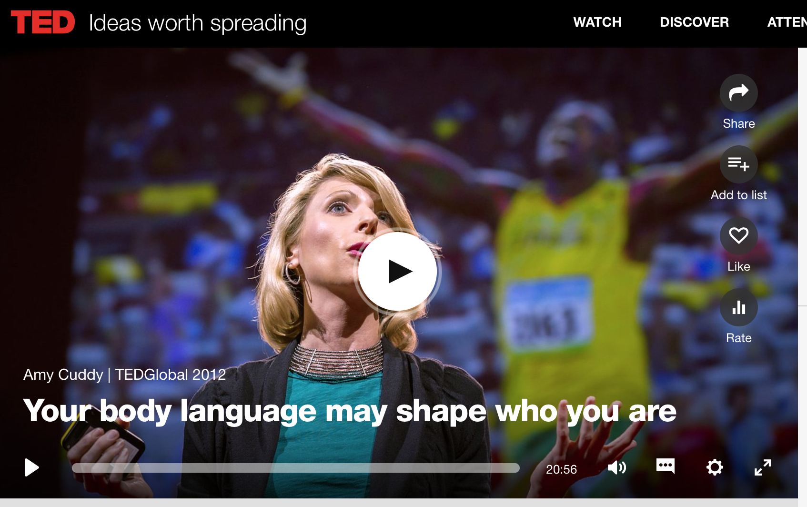

```{r setup, include=FALSE, echo=FALSE}
options(htmltools.dir.version = FALSE)
knitr::opts_chunk$set(echo = FALSE,message=FALSE,warning=FALSE, cache = TRUE)
```

class: pink, center, middle, clear

# Course Overview

---

class: pink, center, middle, clear

# Why is statistics a required course?

---

# Psychological Facts & Theories

Psychological science produces facts and theories.

--

1. "Facts" are produced by collecting measurements about psychological phenomena, and by  running experiments to establish the root causes of the phenomena

--

2. "Theories" are working explanations of a set of facts, they describe how causal forces work to produce the psychological phenomena

---

# Facts depend on Evidence

1. "Facts" about psychology are only as good as the evidence for them. 

   a. Facts can be relied upon when the evidence for their existence is indispustable (clear-cut). There are many reliable findings in Psychology.
   
2. You **should not** believe every fact you hear!

   a. Many findings in psychology are unreliable (other researchers can't reproduce them), some are faked! and, others are downright silly.
   
---

# Theories must explain evidence

The whole point of theories is to explain evidence, or the credible facts about a psychological phenomena of interest

1. There are many good, strong, theories in Psychology capable of explaining many aspects of Psychological phenomena, BUT:

2. You **should not** believe every theory you hear about in Psychology! Many "theories" do not explain the facts. Some "theories" aren't theories at all, they are just someone's opinion.

---

class: pink, center, middle, clear

# Umm, How can we trust the facts and theories in Psychology?

## You need to learn how to evaluate **the evidence** 

---

# All Psychology needs statistics

1. Psychologists run experiments to test research questions and claims

--

2. The experiments produce measurements, or evidence
--

3. Statistics are used to evaluate the evidence

--

  a. Does the evidence support the claim?
    
--

  b. Does the evidence not support the claim?


---

# When you hear a scientific claim...

1. You could accept the claim because "a Scientist said it was true"

2. You could evaluate the evidence for claim and decide for yourself if the evidence warrants the claim.

**Just because a scientist makes a claim, doesn't make it true**

---


class: pink, center, middle, clear

# The case of power-posing

---

# Can a powerful pose change your life?

```{r}

```

---

# High vs. low power poses

```{r, out.width=300, fig.align='center'}

```

---

# The "evidence"

```{r, out.width="80%", fig.align='center'}

```

---

# Big claims gone public

Amy Cuddy gave a TED Talk (viewed by 48 million people) claiming power posing can change your life!

[link to ted talk](https://www.ted.com/talks/amy_cuddy_your_body_language_shapes_who_you_are?language=en)

```{r, out.width="50%", fig.align='center'}

```


---

# The problem:

1. Only a single study, with weak evidence
2. Many other labs tried to reproduce the findings, but **they failed to replicate**

**Lesson 1**: Don't believe everything you hear just because Science says so.

**Lesson 2**: To understand Psychological science, you must understand how to evaluate evidence produced by Psychological science. 

---

class: pink, center, middle, clear

# Course Overview

---


# Course Resources

This is a zero-textbook cost course. All of the resources are online and FREE!

1. Course Website [https://crumplab.github.io/psyc3400](https://crumplab.github.io/psyc3400/)

2. FREE Textbook [https://crumplab.github.io/statistics](https://crumplab.github.io/statistics)

3. FREE Lab Manual [https://crumplab.github.io/statisticsLab](https://crumplab.github.io/statistics)

---

# Skills you learn in this course

1. Using data to answer questions about Psychology

--

2. Foundational statistical concepts

--

3. How to make your computer do statistics for you

--

4. How to think with data

--

5. How to critically evaluate research findings


---

class: pink, center, middle, clear

# How this course works

---

# Lectures

1. Generally 2 per week
2. We talk about statistics
3. **Read the chapters assigned for each week**
4. Ask questions
5. Attendance sheet handed out at beginning of class (missed class policy in a bit)

---

# Weekly Quizzes (25% of grade)

1. New quiz every week
2. Complete quiz on Blackboard (the blackboard account for your lecture section)
3. Can re-take as many times as you want
4. Always recieve grade on last attempt (not best attempt)
5. DO YOUR QUIZ BY YOURSELF
6. Must complete quiz by end of week deadline
7. Quizzes are worth 25% of final grade

You will see many of the quiz questions on the midterm and final.

---

# Midterm (10% of grade)

1. Multiple choice questions. Many taken from the quizzes

2. More info about midterm as we get closer

---

# Final (25% of grade)

1. Multiple choice questions. Many taken from the quizzes

3. Final is cumulative (75% last half of course, 25% first half)

---

# Labs (40% of grade)

1. Each week you will learn how to do statistics in **R** and **R-studio**, a free program for statistics. Labs have three parts
  
    a. Lab exercises (learning) (1 point pass/fail, must attend lab and submit your work to pass)
    
    b. Generalization, attempt to solve a problem using what you learned (1 point pass/fail, must submit something even if it doesn't work)
    
    c. Writing. Answer some concep questions (2 points, Graded by Lab instructor).

---

# Extra Credit

I will announce opporunities for extra credit as we go through the course. Extra credit opportunities may count for up to 2% of your final grade.

---

# Let's look at the course website

[https://crumplab.github.io/psyc3400](https://crumplab.github.io/psyc3400)

---

# R and R-studio

- Download R [https://www.r-project.org](https://www.r-project.org)

- Download R-studio [https://www.rstudio.com](https://www.rstudio.com)

- Or, use R-studio Cloud in your web-browser [https://rstudio.cloud](https://rstudio.cloud)


