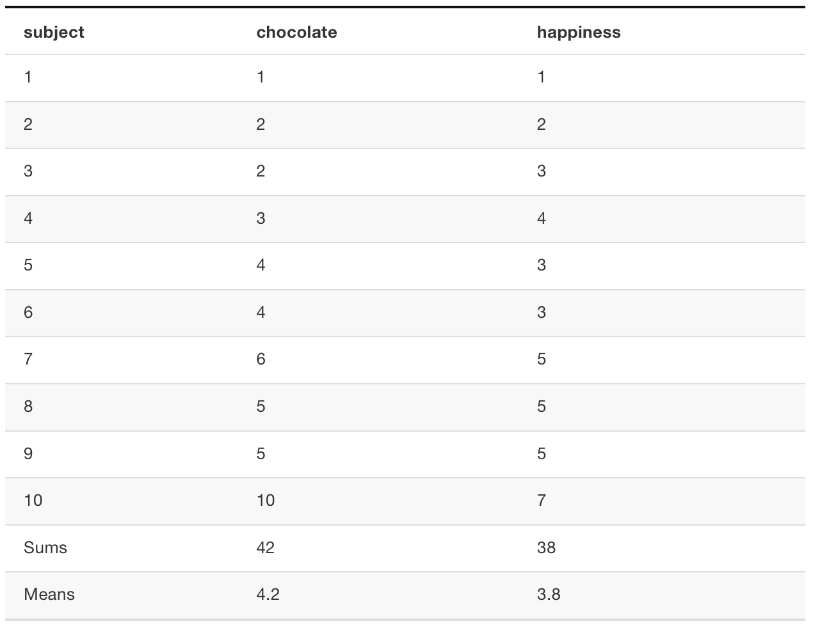
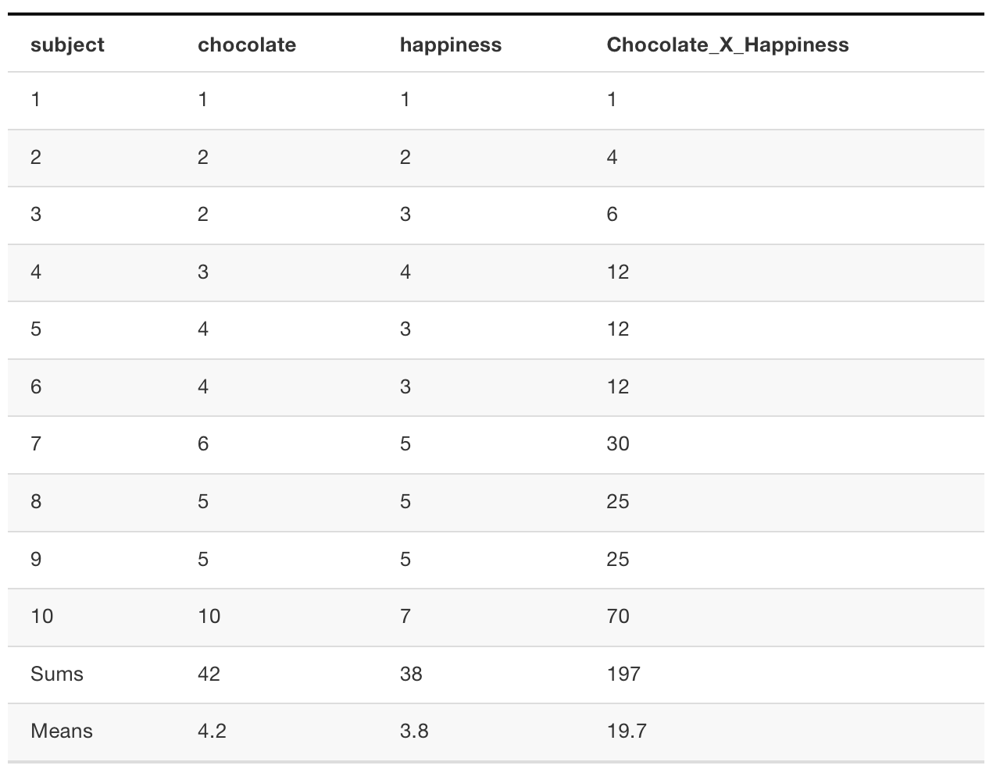

```{r setup, include=FALSE, echo=FALSE}
options(htmltools.dir.version = FALSE)
knitr::opts_chunk$set(echo = FALSE,message=FALSE,warning=FALSE, cache = TRUE)
```

class: pink, center, middle, clear

# Correlation does not equal Causation

---

# Questions for this class

1. **What is Causation?** Why do we care about it?

2. **What is Correlation?** Why do we care about it?

3. **Why does correlation not equal causation?**...lots of reasons

---

# Causation

Why does a ping pong ball move when you hit it?

```{r, out.width="75%"}

```


---

# Simple Physics

1. The energy from swinging the paddle gets transferred to the ping pong ball when they collide

2. The **force** in the paddle that is transferred to the ball **causes** the ball to move

---

# Measuring two things

What if we measured two things in the ping pong ball example

1. The strength of the swing

2. The distance travelled by the ball

Would we expect a relationship between the two measurements, what would happen to the ball if we swung the paddle soft, to medium, to hard?

---

class: pink, center, middle, clear

```{r}
knitr::include_graphics("figs/correlation/Figures/Figures.002.png")
```

---

class: pink, center, middle, clear

```{r}

```

---

class: pink, center, middle, clear

```{r}

```

---

class: pink, center, middle, clear

```{r}

```

---

# What have we learned 

1. We know hitting a ball can cause it to move

--

2. The action of the causal force can be measured by relating a measure of the cause (swing strength) to a measure of the outcome (distance travelled)

--

3. There is a positive relationship between the two measures, increasing swing strength is associated with longer distances

---

# What have we learned cont.

4. We use the term **correlation** to describe the relationship between the two measures, in this case we found a **positive** correlation

--

5. We have seen that a causal force (swing strength) can produce a correlation between two measures

---

class: pink, center, middle, clear

# What if we indirectly measured swing strength by asking the person to report how hard they thought the swing was

---

class: center, middle, clear

```{r}

```

---

class: pink, center, middle, clear

# What if our x-axis was a random number chosen by somebody before each swing?

---

class: center, middle, clear

```{r}

```

---

# Causation

1. Psychological science is interested in understanding the causes of psychological processes

--

2. We can measure change in a causal force, and measure change in an outcome (psychological process)

--

3. If the force causally changes the outcome, we expect a relationship or association between the force and the outcome.

---

# Correlation

1. A measure of association or relationship between two variables

--

2. In general, correlations occur when change in one variable corresponds in some regular way to change in another variable

---

# 3 kinds of correlation

```{r}
knitr::include_graphics('figs/correlation/3posnegrand-1.png')
```

---

# Positive correlation

- **Increases** in the X variable are associated with **increases** in the Y variable

AND

- **Decreases** in the X variable are associated with **decreases** in the Y variable

---

# Negative correlation

- **Increases** in the X variable are associated with **decreases** in the Y variable

AND

- **Decreases** in the X variable are associated with **increases** in the Y variable

---

# Random (no correlation)

- **Increases** in the X variable are **NOT** associated with **increases** or **decreases** in the Y variable

AND

- **Decreases** in the X variable are **NOT** associated with **increases** or **decreases** in the Y variable

---

class: pink, center, middle, clear

# Correlations can be weak or strong

---

# Increasing positive correlation

```{r}
library(ggplot2)
all_df<-data.frame()
for(r in 0:8){
  A<-1:20
  B<-1:20
  rA<-runif(20,-r,r)
  rB<-runif(20,-r,r)
  pearson<-round(cor((A+rA),(B+rB)),digits=2)
  temp_df<-data.frame(x=(A+rA), y=(B+rB),sim=rep(pearson,20))
  all_df<-rbind(all_df, temp_df)
}

ggplot(all_df, aes(x=x,y=y))+
  geom_point()+
  theme_classic(base_size=20)+
  facet_wrap(~sim)


```

---

# Negative correlations

```{r}
all_df<-data.frame()
for(r in 0:8){
  A<-1:20
  B<-20:1
  rA<-runif(20,-r,r)
  rB<-runif(20,-r,r)
  pearson<-round(cor((A+rA),(B+rB)),digits=2)
  temp_df<-data.frame(x=(A+rA), y=(B+rB),sim=rep(pearson,20))
  all_df<-rbind(all_df, temp_df)
}

ggplot(all_df, aes(x=x,y=y))+
  geom_point()+
  theme_classic(base_size=20)+
  facet_wrap(~sim)


```

---

# Correlation Strength

- Super strong (Perfect): dots all line up, no exceptions

- Strong: Clear pattern, not much variation in dots

- Medium: There is a pattern but dots have a lot of variaion

- Weak: Sort of a hint of a pattern, dots have loads of variation

- None: Dots are everywhere, no clear pattern

---

# Pearson's r

A single number that summarizes the strength of the correlation

- varies between -1 and 1
- 0 means no correlation
- 1 means perfect positive correlation
- (-1) means perfect negative correlation
- values in between indicate more or less strength

**How do we compute this number?**

---

# Formula for Pearson's r

```{r}

```

```{r}

```

---

# Covariation

If you have two measures that can vary, then **co-variation** is how they vary together

- If the variation in X is associated (predicts or corresponds to) variation in Y, then there is some co-variation

- If the variation in X is totally random (does not predict or correspond to) variation in Y, then there isn't co-variation, there's just a lot of variation.

---

# Measuring covariation

1. We will look at two set of measures taken from 10 fictitious people (how much chocolate they have, and how happy they are)

2. We show that multiplying the scores and summing them up can help us measure covariation

3. We then show to compute covarition more formally using mean difference scores

---

# Two variables

```{r,out.width="80%"}

```


---

# Sum of products

```{r,out.width="80%"}

```


---

# Sum of products continued

1. multiply each pair of scores
2. sum them all up

- What would make the sum of products very large?

- What would make the sum of prodcuts very small?


---

# Biggest (XY) vs. smallest (AB)

```{r,out.width="80%"}

```


---

# Biggest vs. smallest sums of products

**Biggest sum** - occurs when the smallest to largest numbers in X, are perfectly lined up with the smallest to largest numbers in Y

**Smallest sum** - occurs when the smallest to largest numbers in X, are perfectly lined up with LARGEST to SMALLEST numbers in Y

---

# Simulation demonstration

1. Take the numbers in X and Y
2. Randomly scramble the numbers in X
3. Randomly scramble the numbers in Y
4. Compute the sum of products
5. Do this a bunch to see if the sum of products is always between the smallest and biggest value that we have already found for these numbers

---

# Simulation Results

```{r,out.width="80%"}

```

---

# The problem

A sum of products can describe the covariation between two measurements, but it is not a convenient number.

- It is not readily interpretable, need to know the possible range to know whether the observed value reflects positive, negative, or 0 co-variation

---

# Covariation (the formula)

Notice the formula for the covariation involves a sum of products, but the products are not between the raw data, they are between the mean difference scores

```{r}

```

---

# Still a problem

Covariation can tell us about correlation in the data, it is a measure of correlation.

- It varies between negative and postive values, so we can know the direction of the correlation

- But, we still need to know the possible range to interpret the strength

- **Solution**, transform the covarition so it is always between -1 and +1

---


# Computing Covariation

```{r, out.width="90%"}

```

---

# Back to Pearson's r

Pearson's r divides the covariance by the product of the standard deviations of each variable. This causes the r-value to be between -1 and 1

```{r}

```

---

# R: sum of products

```{r, echo=TRUE}
x <- c(1,2,3,4,5)
y <- c(4,3,6,7,8)
x*y
sum(x*y)
```

---

# R: covariation

```{r, echo=TRUE}
x <- c(1,2,3,4,5)
y <- c(4,3,6,7,8)
N <- 5
sum((x-mean(x))*(y-mean(y)))/N
```

---

# R: Pearson's r

```{r, echo=TRUE}
x <- c(1,2,3,4,5)
y <- c(4,3,6,7,8)
N <- 5
covariation<-sum((x-mean(x))*(y-mean(y)))/N
SD_x <- sqrt(sum((x-mean(x))^2)/N)
SD_y <- sqrt(sum((y-mean(y))^2)/N)
r <- covariation/(SD_x*SD_y)
r
```

---

# R's cor() function

R has a function to compute correlations called `cor()`. 
```{r, echo=T}
x <- c(1,2,3,4,5)
y <- c(4,3,6,7,8)
cor(x,y)
```


```{r,eval=FALSE,echo=FALSE}
N<-5
SD_x <- sqrt(sum((x-mean(x))^2)/N)
SD_y <- sqrt(sum((y-mean(y))^2)/N)

sum(((x-mean(x))/sd(x))*((y-mean(y))/sd(y)))/4

sum(((x-mean(x))/SD_x)*((y-mean(y))/SD_y))/5

```

---

# Pearson's r (a different way)

1. Pearson's r gives us a value between -1 and 1 that is easier to interpret than covariation (which is not necessarilly between -1 and 1).

2. The reason covariance is not between -1 and 1 is because the values for X and Y can have very different ranges

What happens when we transform the X and Y values so they are in the same range...

---

# Transforming Scores

Any set of scores can be transformed. 

E.g., to transorm proportions (between 0 and 1) to percentages, between 0 and 100, we multiply the proportions by 100

```{r,echo=T}
x <- c(.1,  .3, .5, .6, .8, .9)
x
x*100
```

---

# Difference score transformation

If we subtract the mean from each score, we center the data around 0, and preserve the differences between the numbers, but ranges can be different. 

```{r,echo=T}
x <- c(1,3,5,7,9)
x-mean(x)

y <- c(100,300,500,700,900)
y-mean(y)
```


---

# Z score transformation

If we divide the mean difference scores by their standard deviation, we center the data around 0, and make the ranges the same

```{r,echo=T}
x <- c(1,3,5,7,9)
(x-mean(x)) / sd(x)

y <- c(100,300,500,700,900)
(y-mean(y)) / sd(y)
```

---

# Computing correlation from z-scores

```{r, echo=T}
x <- c(1,4,6,8,9)
y <- c(200,500,100,800,900)
N <- 5
z_x <- (x-mean(x)) / sd(x)
z_y <- (y-mean(y)) / sd(y)
covariation <- sum(z_x*z_y)/(N-1)
covariation
cor(x,y)

```

---

# Next class: Regression

1. Today we looked a measure of correlation, to summarize assocations between two measures

3. Wednesday, Feb 13th, we continue to look at interpreting correlations, and introduce the concept of regression. (READ THE TEXTBOOK)

---

# Reminder

1. Quiz 2 for Descriptives is due Wednesday, Feb 13th @ 11:59pm
2. Quiz 3 for correlation and regression will be posted on Wednesday Feb 13th


