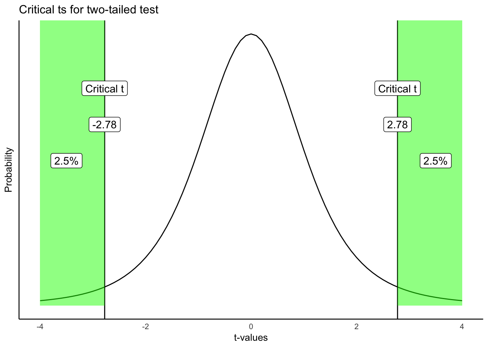

```{r setup, include=FALSE, echo=FALSE}
options(htmltools.dir.version = FALSE)
knitr::opts_chunk$set(echo = FALSE,message=FALSE,warning=FALSE, cache = FALSE)
```


#overview

1. Independent samples t-test calculation
2. Example from lab
3. Directional and non-directional test
4. t-test assumptions

---

class: pink, center, middle, clear

# t-tests and designs

---

# Three kinds of t-tests

1. one-sample
2. paired-sample
3. Independent sample

---

# Independent Sample t-test

Purpose: Compare two sample means in a between-subjects design

Between-subjects design: **Different** subjects are measured across both levels of the experimental manipulation (independent variable)

---

# Consider this

Between-subjects experiment, n=5, different subjects are measured in group A and B of the experiment.

```{r}
subjects_A<-c(1,2,3,4,5)
subjects_B<-c(6,7,8,9,10)
A <-c(1,4,3,6,5)
B <-c(4,8,7,9,10)
df<-data.frame(subjects_A,A, subjects_B,B)
knitr::kable(df, "html")
```


---

# Empirical question

Did the manipulation (A vs. B) cause a difference in the measure?

```{r}
knitr::kable(df, "html")
```

---

# Can't use Difference scores

Unlike a paired samples t-test, we can't look at the difference scores for a between-subjects design. Why not?

```{r}
knitr::kable(df, "html")
```

---

# Independent samples t-test

.pull-left[

Purpose: Compare two means from different samples


- $\bar{X}_1$ = mean of sample 1
- $\bar{X}_2$ = mean of sample 2
- $s_p$ = pooled standard deviation
- $s_p^2$ = pooled variance
- $n$ = sample-size
- $df$ = $n_1 + n_2 - 2$

]

.pull-right[

$t = \frac{\bar{X_1}-\bar{X_2}}{s_p\sqrt{\frac{1}{n_1}+\frac{1}{n_2}}}$

$s_p^2 = \sqrt{\frac{(n_1-1)s_\text{X1}^2+(n_2-1)s_\text{X2}^2}{n_1+n_2-2}}$

]

---

# Pooled standard deviation

$s_p$ (standard deviation) and $s_p^2$ (variance) are **pooled estimates** (combined).

We have two samples
1. The basic idea is to find the average of the standard deviations
2. The formula makes the estimate unbiased

---

# R: Calculating t

The `t.test()` function assumes independent samples by default. We do need to set the `var.equal=TRUE` option.

```{r,echo=T}
A <-c(1,4,3,6,5)
B <-c(4,8,7,9,10)
t.test(A,B,var.equal = T)$statistic
```

---

# Calculating pooled estimate

```{r, echo=T}
A <-c(1,4,3,6,5)
B <-c(4,8,7,9,10)
mean_dif <- mean(A)-mean(B)
numerator <- (4*var(A)) + (4*var(B))
denominator <- 5+5-2
sp2   <- sqrt(numerator/denominator)
t<- mean_dif/(sp2*sqrt((1/5)+(1/5)))
t
```

---

class: pink, center, middle, clear

# Lab Example

---

# Schroeder and Epley (2015)

```{r}

```

---

# Research Question

Are evaluations of a person's intellect better conveyed through writing or speaking?

---

# Method

- Job applicants in an interview give both a written statement, and an audio version of them reading the statement
- Interviewers (profesional recruiters) read or listen to each statement, and rate each applicant (intellect, general impression, Hiring likelihood)

---

# IVs and DVs

IVs: 
 - Read written transcript vs. Listen to spoken audio transcript
 
DVS:
 - Intellect rating (0-10)
 - general impression rating (0-10)
 - hiring likelihood rating (0-10)

---

# The results

```{r, out.width="80%"}

```

---

# The write-up

```{r}

```

---

# R analysis

```{r}

```

---

class: pink, center, middle, clear

# Directional vs. non-directional tests

---


# Critical t

Critical t is set by two properties:

1. the alpha criterion
2. whether the test is directional (one-tailed) or non-directional (two-tailed)

---

# Directional test (reminder)

A directional test assumes that the experimental manipulation will cause a difference in a particular direction.

- mean for A > (greater than) mean for B
- mean for A < (less than) mean for B

---

# Critical t (one-tailed) example

Critical t for a directional (one-tailed) test

- alpha = 0.05, or 5%

Critical t is the t-value associated with a null-distribution where this t-value or larger occurs 5% of the time.

---

# Critical t (one-tailed)

```{r}
knitr::include_graphics("figs/ttest/6critT-1.png")
```

---

# Critical t depends on df and alpha

.pull-left[

The table shows values of critical t for a one-tailed test

- alpha values of .10, .05, and .01
- degress of freedom from 5 to 100

]

.pull-right[

```{r}
df<-c(5,6,7,8,9,10,20,50,100)
p_05 <- round(qt(.95,df), digits=2)
p_01 <- round(qt(.99,df), digits=2)
p_10 <- round(qt(.90,df), digits=2)

t_df <- data.frame(df, p_10,p_05,p_01)
knitr::kable(t_df,"html")
```

]

---

# Non-Directional test 

A non-directional test assumes that the experimental manipulation will cause **any** difference.

- mean for A != (will not equal) mean for B

E.g., 

- Mean for A could be bigger or smaller than mean for B

---

# Non-directional test (2-tailed)

```{r}

```

---

# Comparing critical t (1 vs 2 tailed)

.pull-left[

One-tailed

```{r}
df<-c(5,10,20,50,100)
p_05 <- round(qt(.95,df), digits=2)
p_01 <- round(qt(.99,df), digits=2)
p_10 <- round(qt(.90,df), digits=2)

t_df <- data.frame(df, p_10,p_05,p_01)
knitr::kable(t_df,"html")
```

]

.pull-right[

Two-tailed

```{r}
df<-c(5,10,20,50,100)
p_05 <- round(qt(.975,df), digits=2)
p_01 <- round(qt(.995,df), digits=2)
p_10 <- round(qt(.95,df), digits=2)

t_df <- data.frame(df, p_10,p_05,p_01)
knitr::kable(t_df,"html")
```

]

---

# Making decisions

.pull-left[
One-tailed
 - reject null 
  - observed t in green area
 - fail to reject null 
  - observed t in white area

]

.pull-right[

```{r,out.width="100%"}
knitr::include_graphics("figs/ttest/6critT-1.png")
```

]

---

# Making decisions

.pull-left[
Two-tailed
 - reject null 
  - observed t in green area
 - fail to reject null 
  - observed t in white area

]

.pull-right[

```{r,out.width="100%"}

```

]

---

class: pink, center, middle, clear

# t-test assumptions

---

class: center, middle, clear

```{r, results='asis',out.extra=""}
cat('<iframe style="width:100%;height:100%;border-style:none;", src="https://crumplab.shinyapps.io/indTtest/" />\n')
```


---


# Next class: Power and Effect-size

1. Quiz on t-tests starts today, due next Monday
2. Midterm review next Monday
3. Midterm review sheet and info is posted on Blackboard


