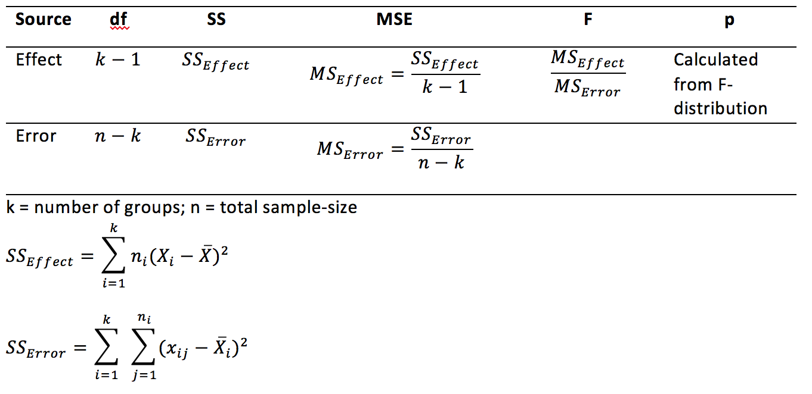

```{r setup, include=FALSE, echo=FALSE}
options(htmltools.dir.version = FALSE)
knitr::opts_chunk$set(echo = FALSE,message=FALSE,warning=FALSE, cache = TRUE)
```

# Overview

1. Visual intution for Observed F
2. The F-distribution
3. Statistical inference with F's
4. Examples

---

# Observed F

Observed F is computed directly from the data:

```{r}

```

---

# F is a ratio of variances

$F = \frac{MS_\text{Effect}}{MS_\text{Error}}$

- F is greater than 1 when the variance due to mean differences between the groups is larger than the remaining error variance

- F is less than 1 when the variance due to to mean differences between the groups is smaller than the remaining error variance

---

# Visualizing the sources of variance

The one-factor ANOVA splits up the total variance into two parts, one for the effect of the means, and one for the remaining unexplained variance.

- Let's look at some graphs with sample data and see if we can form intuitions about the value of F

---

# Questions to answer

1. How big is the variation between the group means? This tells us about the variation due to the effect.

2. How big is the variation between each group mean and the scores in each group? This tells us about the leftover variation due to sampling error.

3. Is one bigger than the other?

---

# Example 1

.pull-left[


```{r, cache=F}
A<-rnorm(10,5,1)
B<-rnorm(10,20,1)
C<-rnorm(10,40,1)
DV<-c(A,B,C)
IV<-rep(c("A","B","C"),each=10)
df<-data.frame(IV,DV)
sum_aov<-summary(aov(DV~IV,df))
library(dplyr)
df_means <- df %>%
            group_by(IV) %>%
            summarise(means = mean(DV))
library(ggplot2)
ggplot(df_means, aes(x=IV, y=means))+
  geom_point(data=df, aes(x=IV, y=DV, color=IV), size=3)+
  geom_point(color="black", size=3)+
  theme_classic(base_size=25)
```

]

.pull-right[

- MS Effect = `r round(sum_aov[[1]]$"Mean Sq"[1],digits=2)`
- MS Error = `r round(sum_aov[[1]]$"Mean Sq"[2],digits=2)`
- F = `r round(sum_aov[[1]]$"F value"[1],digits=2)`

]

---

# Example 2

.pull-left[


```{r, cache=F}
A<-rnorm(10,5,5)
B<-rnorm(10,20,5)
C<-rnorm(10,40,5)
DV<-c(A,B,C)
IV<-rep(c("A","B","C"),each=10)
df<-data.frame(IV,DV)
sum_aov<-summary(aov(DV~IV,df))
#library(dplyr)
df_means <- df %>%
            group_by(IV) %>%
            summarise(means = mean(DV))
#library(ggplot2)
ggplot(df_means, aes(x=IV, y=means))+
  geom_point(data=df, aes(x=IV, y=DV, color=IV), size=3)+
  geom_point(color="black", size=3)+
  theme_classic(base_size=25)
```

]

.pull-right[

- MS Effect = `r round(sum_aov[[1]]$"Mean Sq"[1],digits=2)`
- MS Error = `r round(sum_aov[[1]]$"Mean Sq"[2],digits=2)`
- F = `r round(sum_aov[[1]]$"F value"[1],digits=2)`

]

---

# Example 3

.pull-left[


```{r, cache=F}
A<-rnorm(10,5,20)
B<-rnorm(10,20,20)
C<-rnorm(10,40,20)
DV<-c(A,B,C)
IV<-rep(c("A","B","C"),each=10)
df<-data.frame(IV,DV)
sum_aov<-summary(aov(DV~IV,df))
#library(dplyr)
df_means <- df %>%
            group_by(IV) %>%
            summarise(means = mean(DV))
#library(ggplot2)
ggplot(df_means, aes(x=IV, y=means))+
  geom_point(data=df, aes(x=IV, y=DV, color=IV), size=3)+
  geom_point(color="black", size=3)+
  theme_classic(base_size=25)
```

]

.pull-right[

- MS Effect = `r round(sum_aov[[1]]$"Mean Sq"[1],digits=2)`
- MS Error = `r round(sum_aov[[1]]$"Mean Sq"[2],digits=2)`
- F = `r round(sum_aov[[1]]$"F value"[1],digits=2)`

]

---

# Summary of Examples 1-3

The examples had:

1. Systematic mean differences between the groups
2. Increasing variance within each group (from example 1 to 3)

Result:

F was large for Example 1, and decreased for E2 and E3 as the error variance increased (compared to the effect variance)


---

# Null examples

Let's sample data into three groups from the **same** normal distribution. 
- 3 groups
- n = 10 in each group
- mean = 10
- standard deviation = 20


---

# Null Example 1

.pull-left[


```{r, cache=F}
A<-rnorm(10,10,20)
B<-rnorm(10,10,20)
C<-rnorm(10,10,20)
DV<-c(A,B,C)
IV<-rep(c("A","B","C"),each=10)
df<-data.frame(IV,DV)
sum_aov<-summary(aov(DV~IV,df))
#library(dplyr)
df_means <- df %>%
            group_by(IV) %>%
            summarise(means = mean(DV))
#library(ggplot2)
ggplot(df_means, aes(x=IV, y=means))+
  geom_point(data=df, aes(x=IV, y=DV, color=IV), size=3)+
  geom_point(color="black", size=3)+
  theme_classic(base_size=25)
```

]

.pull-right[

- MS Effect = `r round(sum_aov[[1]]$"Mean Sq"[1],digits=2)`
- MS Error = `r round(sum_aov[[1]]$"Mean Sq"[2],digits=2)`
- F = `r round(sum_aov[[1]]$"F value"[1],digits=2)`

]


---

# Null Example 2

.pull-left[


```{r, cache=F}
A<-rnorm(10,10,20)
B<-rnorm(10,10,20)
C<-rnorm(10,10,20)
DV<-c(A,B,C)
IV<-rep(c("A","B","C"),each=10)
df<-data.frame(IV,DV)
sum_aov<-summary(aov(DV~IV,df))
#library(dplyr)
df_means <- df %>%
            group_by(IV) %>%
            summarise(means = mean(DV))
#library(ggplot2)
ggplot(df_means, aes(x=IV, y=means))+
  geom_point(data=df, aes(x=IV, y=DV, color=IV), size=3)+
  geom_point(color="black", size=3)+
  theme_classic(base_size=25)
```

]

.pull-right[

- MS Effect = `r round(sum_aov[[1]]$"Mean Sq"[1],digits=2)`
- MS Error = `r round(sum_aov[[1]]$"Mean Sq"[2],digits=2)`
- F = `r round(sum_aov[[1]]$"F value"[1],digits=2)`

]


---

# Null Example 3

.pull-left[


```{r, cache=F}
A<-rnorm(10,10,20)
B<-rnorm(10,10,20)
C<-rnorm(10,10,20)
DV<-c(A,B,C)
IV<-rep(c("A","B","C"),each=10)
df<-data.frame(IV,DV)
sum_aov<-summary(aov(DV~IV,df))
#library(dplyr)
df_means <- df %>%
            group_by(IV) %>%
            summarise(means = mean(DV))
#library(ggplot2)
ggplot(df_means, aes(x=IV, y=means))+
  geom_point(data=df, aes(x=IV, y=DV, color=IV), size=3)+
  geom_point(color="black", size=3)+
  theme_classic(base_size=25)
```

]

.pull-right[

- MS Effect = `r round(sum_aov[[1]]$"Mean Sq"[1],digits=2)`
- MS Error = `r round(sum_aov[[1]]$"Mean Sq"[2],digits=2)`
- F = `r round(sum_aov[[1]]$"F value"[1],digits=2)`

]


---


# Null Example 4

.pull-left[


```{r, cache=F}
A<-rnorm(10,10,20)
B<-rnorm(10,10,20)
C<-rnorm(10,10,20)
DV<-c(A,B,C)
IV<-rep(c("A","B","C"),each=10)
df<-data.frame(IV,DV)
sum_aov<-summary(aov(DV~IV,df))
#library(dplyr)
df_means <- df %>%
            group_by(IV) %>%
            summarise(means = mean(DV))
#library(ggplot2)
ggplot(df_means, aes(x=IV, y=means))+
  geom_point(data=df, aes(x=IV, y=DV, color=IV), size=3)+
  geom_point(color="black", size=3)+
  theme_classic(base_size=25)
```

]

.pull-right[

- MS Effect = `r round(sum_aov[[1]]$"Mean Sq"[1],digits=2)`
- MS Error = `r round(sum_aov[[1]]$"Mean Sq"[2],digits=2)`
- F = `r round(sum_aov[[1]]$"F value"[1],digits=2)`

]


---


# Null Example 5

.pull-left[


```{r, cache=F}
A<-rnorm(10,10,20)
B<-rnorm(10,10,20)
C<-rnorm(10,10,20)
DV<-c(A,B,C)
IV<-rep(c("A","B","C"),each=10)
df<-data.frame(IV,DV)
sum_aov<-summary(aov(DV~IV,df))
#library(dplyr)
df_means <- df %>%
            group_by(IV) %>%
            summarise(means = mean(DV))
#library(ggplot2)
ggplot(df_means, aes(x=IV, y=means))+
  geom_point(data=df, aes(x=IV, y=DV, color=IV), size=3)+
  geom_point(color="black", size=3)+
  theme_classic(base_size=25)
```

]

.pull-right[

- MS Effect = `r round(sum_aov[[1]]$"Mean Sq"[1],digits=2)`
- MS Error = `r round(sum_aov[[1]]$"Mean Sq"[2],digits=2)`
- F = `r round(sum_aov[[1]]$"F value"[1],digits=2)`

]


---

# Summary Null Examples

**Remember**: we sampled scores into each group from the same population, so on average the means for each group should be the same, but they are not always the same because of sampling error

**By chance**:
 - variation between groups can be larger or smaller than variation within groups
 - F-values can be larger or smaller than 1 by chance

---

# The sampling distribution of F

The sampling distribution of F is a hypothetical distribution. It shows the distribution of F-values you could get for particular situations:

1. depends on n per group
2. number of groups
3. the population the scores come from

---

# How does F behave under the null?

In order to use an observed F-value for statistical inference, we need to know what kind of F-values can be produced by chance alone, when all of the sample data for each group is taken from the same population.

---

# Simulating an F distribution in R

**This simulates a null-distribution**

```{r, echo=T}
save_f<-c()
for(i in 1:1000){
  A <- rnorm(10,10,20)
  B <- rnorm(10,10,20)
  C <- rnorm(10,10,20)
  DV <- c(A,B,C)
  IV <- rep(c("A","B","C"),each=10)
  df <- data.frame(IV,DV)
  sum_aov <- summary(aov(DV~IV,df))
  save_f[i] <- sum_aov[[1]]$`F value`[1]
}
```

---

# histogram of simulated Fs

```{r,echo=T}
hist(save_f)
```

---

# Analytic formula for F-distribution

[see wikipedia page on the F-distribution](https://en.wikipedia.org/wiki/F-distribution)

---

# F-distribution shape

- right-skewed
- changes depending on dfs for the numerator and denominator

Question: Can you ever get an F less than 0?

---

# Critical F (alpha= .05)

Critical F (2,27) = `r qf(.95,2,27)` 

```{r}
f_density<-df(seq(0,10,.1),2,27)
f_values<-seq(0,10,.1)
df_f<-data.frame(f_density,f_values)
ggplot(df_f, aes(x=f_values,y=f_density))+
  geom_line() +
  geom_vline(xintercept=qf(.95,2,27))+
  theme_classic(base_size=25) +
  ggtitle("F-distribution (df1=2,df2=27)")
```

---

# Critical F (alpha= .05)

Critical F (9,50) = `r qf(.95,9,50)` 

```{r}
f_density<-df(seq(0,10,.1),9,50)
f_values<-seq(0,10,.1)
df_f<-data.frame(f_density,f_values)
ggplot(df_f, aes(x=f_values,y=f_density))+
  geom_line() +
  geom_vline(xintercept=qf(.95,9,50))+
  theme_classic(base_size=25) +
  ggtitle("F-distribution (df1=2,df2=27)")
```

---

# Critical F by df1 and df2

```{r}
df1<-seq(1,100,1)
df2<-c(10,50,100)

fs<-c()
for(i in df1){
  for(j in df2){
    fs<-c(fs,qf(.95,i,j))
  }
}

df_1 <- rep(df1,each=length(df2))
df_2 <- as.factor(rep(df2,length(df1)))
f_df <- data.frame(df_1,df_2,fs)

ggplot(f_df, aes(x=df_1,y=fs, group=df_2, color=df_2))+
  geom_point()+
  geom_line() +
  theme_classic(base_size=25) +
  ylab("Critical F")+
  ggtitle("Critical F by df1 and df2")
```

---

# Statistical inference with F

- Observed F = the f-value you got from your data
- p-value = the probability of obtaining your f-value or larger by chance

- Critical F = the f-value associated with your alpha criterion (and df1, df2)
- p-value = set by the alpha criterion

---

# Rejecting the Null

Decisions:

1. Reject the null: When the p-value for the observed F is smaller than alpha (or, F observed is larger than F critical)

2. Fail to reject: When the p-value for the observed F is larger than alpha (or, F observed is smaller than F critical)

---

# What does rejecting the null mean?

Rejecting the null = the mean differences between the groups are unlikely to be produced by chance

---

# F-tests are non-directional

Why?

---

# An R example

We simulate data from a between-subjects design with 3 groups.

- n = 10 in each group
- all sample data comes from a normal with standard deviation = 5
- we program some differences in to the means

---

# simulate the data

```{r, cache=F, echo=T}
A <- rnorm(10,20,5)
B <- rnorm(10,20,5)
C <- rnorm(10,40,5)
DV <- c(A,B,C)
IV <- rep(c("A","B","C"),each=10)
df <- data.frame(IV,DV)
```

---

# plot the data

```{r}
plot_df <- df %>%
           group_by(IV) %>%
           summarise(means=mean(DV),
                     SEMs=sd(DV)/sqrt(length(DV)))
ggplot(plot_df,aes(x=IV, y=means))+
  geom_point()+
  geom_errorbar(aes(ymin=means-SEMs, 
                    ymax=means+SEMs), 
                width=.2)+
  theme_classic(base_size=25)
```

---

# Conduct the ANOVA

```{r, echo=T}
summary(aov(DV~IV,df))
```

---

# Conduct follow-up comparisons

- The ANOVA will only test the omnibus question...Are there any differences anywhere?

- Need to concuct additional tests to compare specific means...

- There are numerous recommendations for the "right" way to do this...For now we do follow-up t-tests, and discuss the implications of this choice in later lectures.

---

# conduct follow-up t-tests A vs. B

```{r, echo=T}
t.test(A,B,var.equal=T)
```

---

# conduct follow-up t-tests A vs. C

```{r, echo=T}
t.test(A,C,var.equal=T)
```

---

# Write-up the results

See the lab manual for some examples and tips

---

class: pink, center, middle, clear

Some questions to start thinking about

---

# Obtaining statistical significance

Let's say you set your alpha criterion to .05 for your statistical test.

1. If your experimental manipulation **does not** work (causes no change across levels), what proportion of the time would you expect to reject the null-hypothesis?

---

# More questions

2. If your experimental manipulation **does** work, what proportion of the time would you expect to reject the null-hypothesis?

3. If your experimental manipulation **does** work, what proportion of the time would you expect to fail to reject the null-hypothesis?

---

# Even more questions

Assume your experimental manipulation does work, and it causes some change between levels

4. What can you change about your experimental design to increase the proportion of times you would reject the null hypothesis?

---


# Next class: Repeated measures ANOVA

1. First ANOVA quiz due Wednesday, April 10th. 


