```{r setup, include=FALSE, echo=FALSE}
options(htmltools.dir.version = FALSE)
knitr::opts_chunk$set(echo = FALSE,message=FALSE,warning=FALSE, cache = TRUE)
```

# Overview

1. Repeated Measures ANOVA
2. New partition for subjects
3. Lab example

---

# Repeated measures ANOVA

When to use:

1. Your design is within-subjects
2. Your IV has multiple levels (2 or more).

---

class: center, middle, clear, nopad

```{r, out.width="90%"}
knitr::include_graphics("figs/rmanova/SS_ANOVA.png")
```

---

# A new partition for Subjects

```{r}
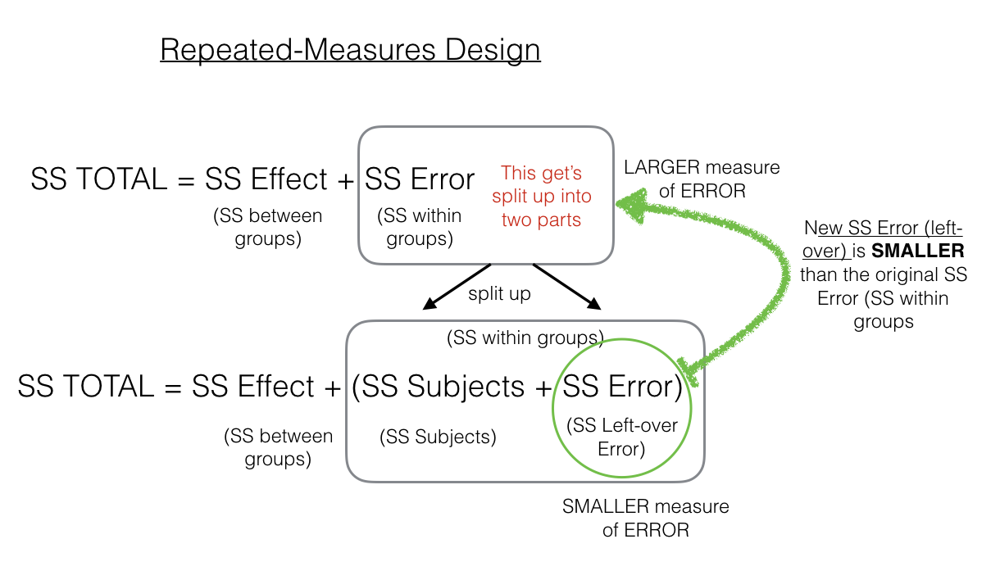
```

---

class: center, middle, clear, nopad

```{r}
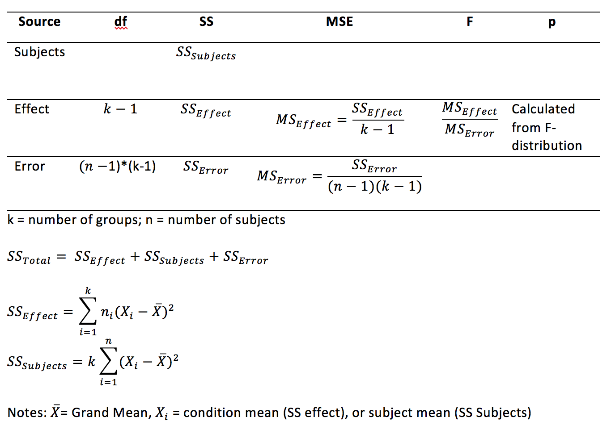
```

---

# Goal: Fill in this table

```{r}
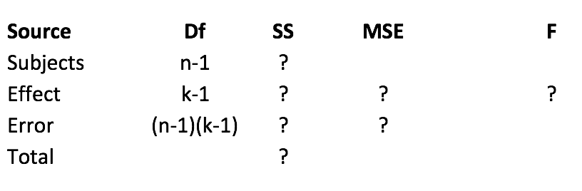
```

---

# SS TOTAL

```{r, out.width="90%"}
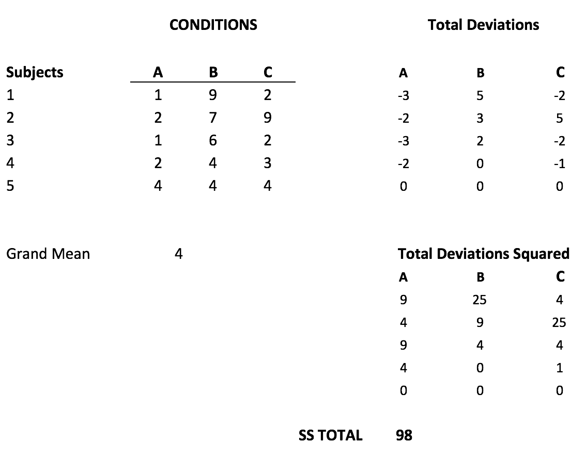
```

---

# SS Effect

```{r, out.width="90%"}
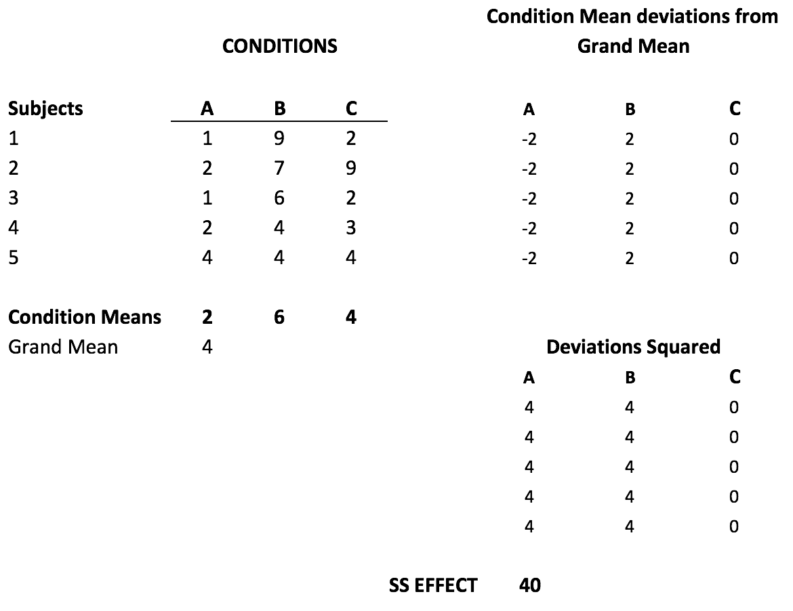
```

---

# SS Subject

```{r, out.width="90%"}
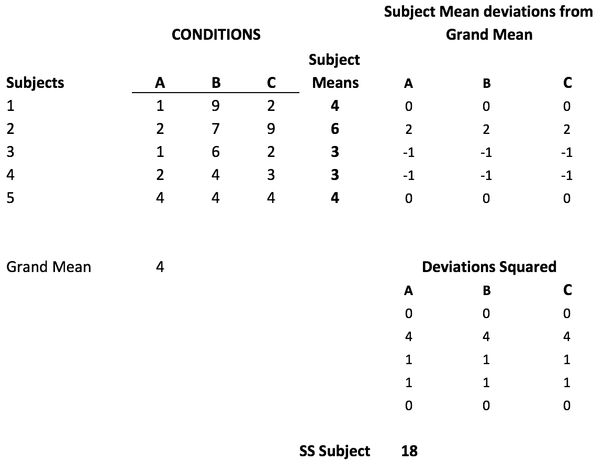
```

---

# Again: SS effect and subject

```{r, out.width="100%"}
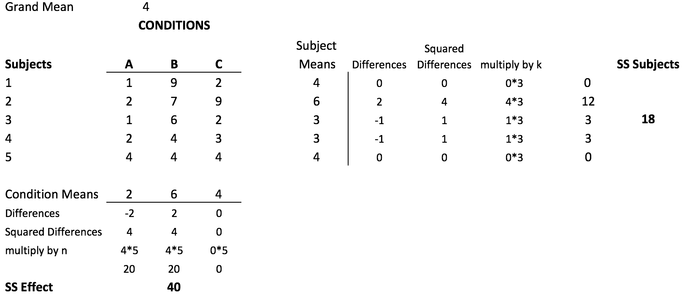
```

---

# ANOVA table

```{r, out.width="90%"}
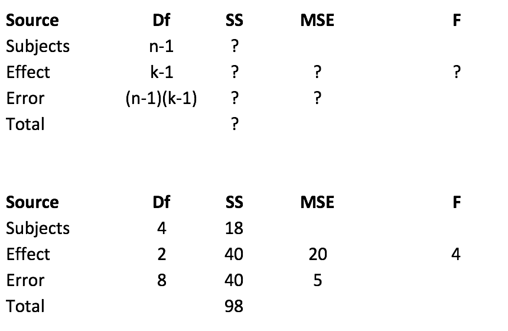
```

---

# R for RM anova

```{r, echo=T}
A <- c(1,2,1,2,4)
B <- c(9,7,6,4,4)
C <- c(2,9,2,3,4)
DV <- c(A,B,C)
subjects <- as.factor(c(1,2,3,4,5))
IV <- rep(c("A","B","C"), each=5)
df <- data.frame(subjects,IV, DV) 
```

---

# the data frame (rows 1:8)

```{r}

knitr::kable(df[1:8,], "html")

```

---

# the data frame (rows 9:15)

```{r}

knitr::kable(df[9:15,], "html")

```

---

# R anova formula for repeated measures

`aov(DV~IV + Error(subjects/IV), df)`

```{r, eval=F, echo=T}
summary(aov(DV~IV+Error(subjects/IV),df))
```

---

# R anova table

```{r}
summary(aov(DV~IV+Error(subjects/IV),df))
```

---

# calculating SS subjects

```{r, echo=T}
library(dplyr)
subject_means <- df %>%
                 group_by(subjects) %>%
                 summarise(means=mean(DV))
grand_mean <- mean(df$DV)
n_groups <- length(unique(df$IV))
SS_subjects <- n_groups*sum((subject_means$means-grand_mean)^2)
print(SS_subjects)
```

---

# Fs and ps

R has `pf()` and `qf()` functions for finding critical values of F given a particular p-value, and p-values associated with particular Fs

---

# pf()

What is the p-value associated with F(3,27) = 2.15 ?

`pf(q, df1, df2)` (q is the f-value, stands for quantile)

```{r, echo=T}
1-pf(2.15, 3, 27)
```

An F of 2.15 or larger, with degrees of freedom (3,27), occurs with this probability.

---

# qf()

Assume an alpha of .05. What is the critical value of F, with degrees of freedom (3,27)?

`qf(p, df1, df2)`

```{r, echo=T}
qf(.95, 3, 27)
```

We set p to .95. Fs larger than the critical value will occur less than 1-.95=.05 of the time.

---

# Lab Example

```{r, out.width="100%"}
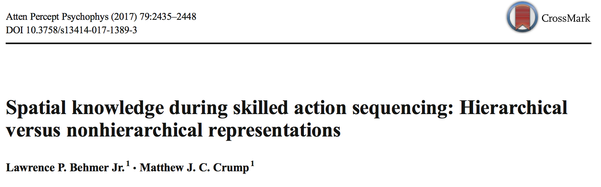
```

---

# Research question

One research question was whether we would replicate previous finding showing that people type faster when the letters are in word or word like arrangements, compared to random strings

- Word: truck
- english-like: quemp
- random: wxzjy

---

# Repeated Measures Design

- everybody typed letters in the word, english-like, and random conditions

```{r, out.width="90%"}
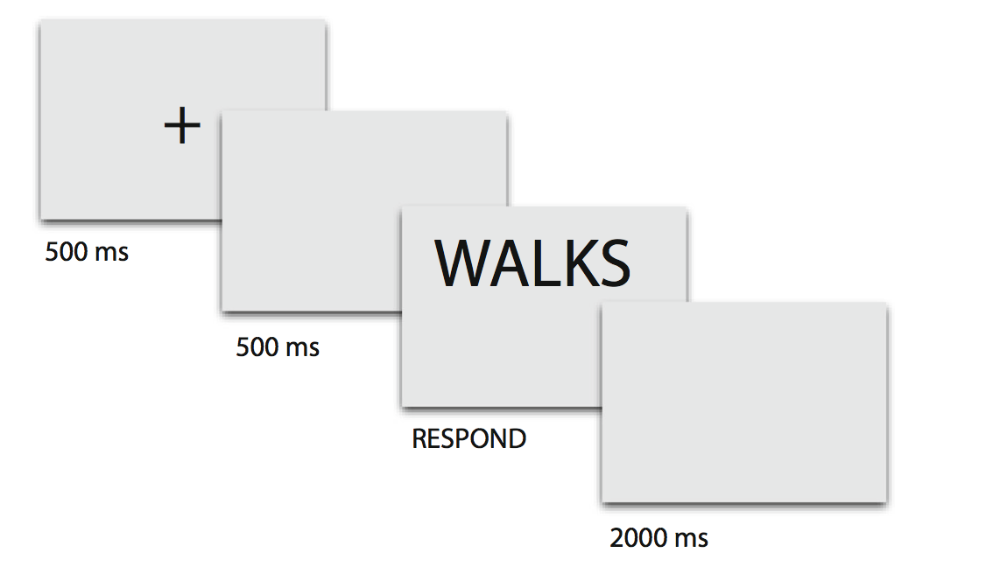
```

---

# Results

```{r, out.width="100%"}
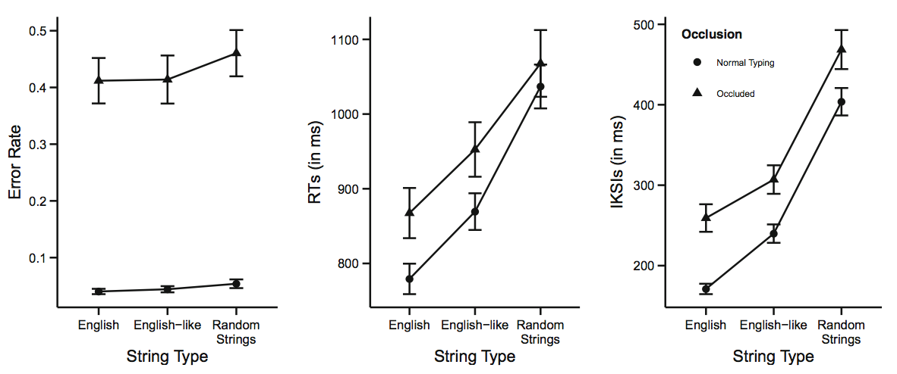
```

---


# Next class: Repeated measures ANOVA II

1. First ANOVA quiz due Wednesday, April 10th
2. Repeated measures ANOVA quiz will begin Wednesday, April 10th
3. Review of extra-credit assignment on Wednesday, April 10th


