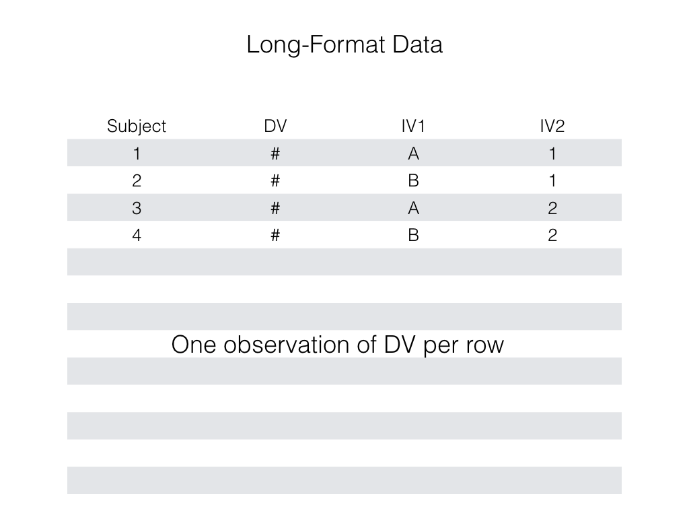
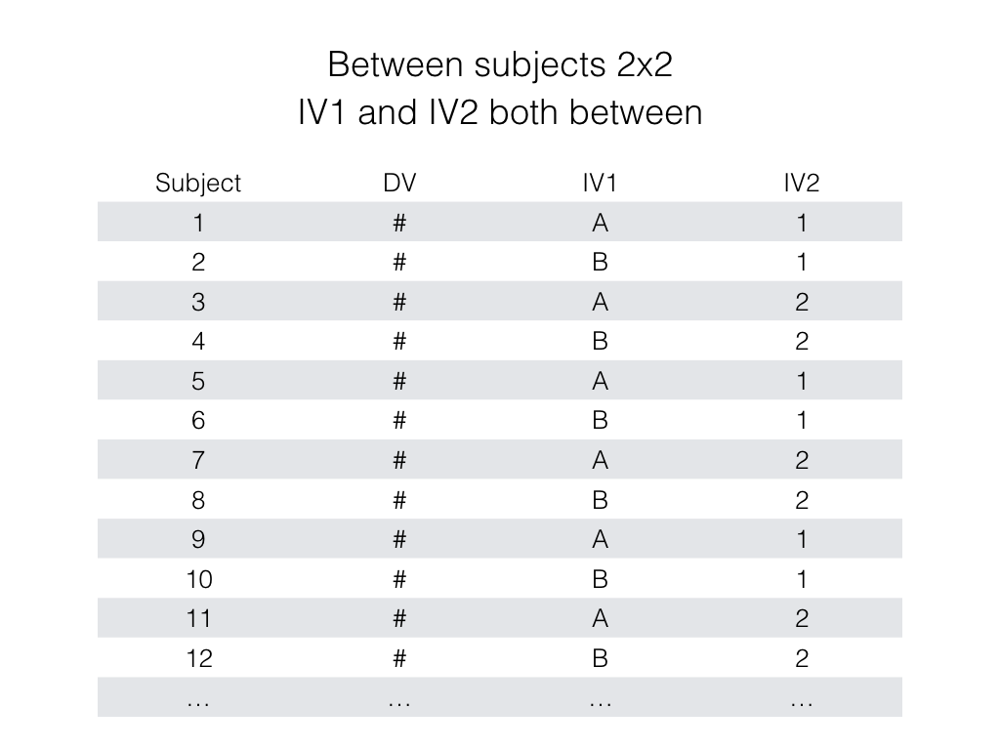
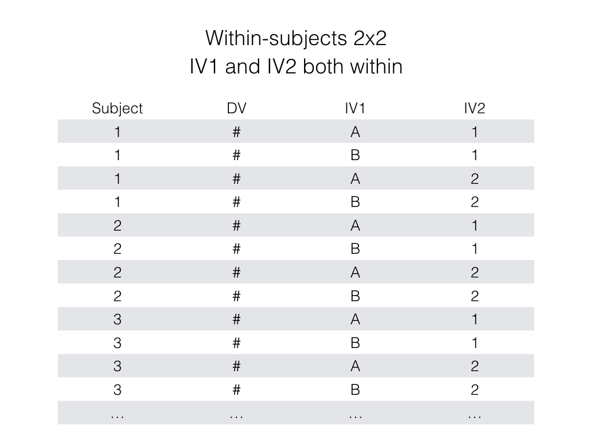
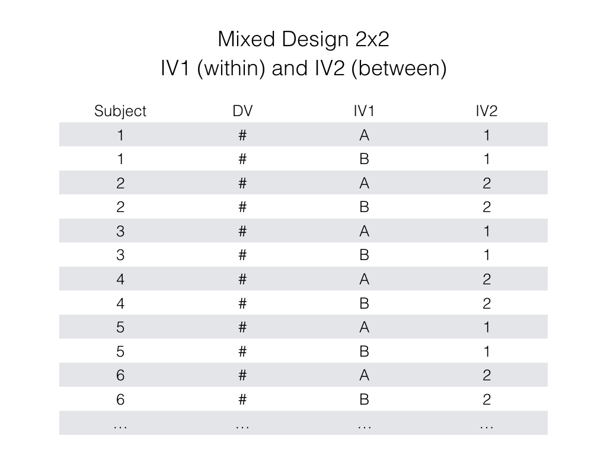
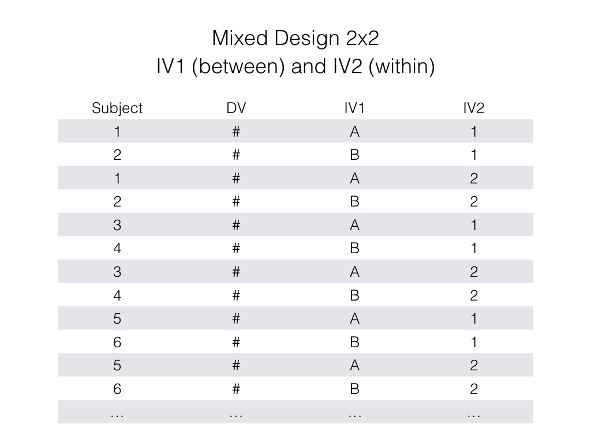

```{r setup, include=FALSE, echo=FALSE}
options(htmltools.dir.version = FALSE)
knitr::opts_chunk$set(echo = FALSE,message=FALSE,warning=FALSE, cache = TRUE)
```

# Overview

1. Factorial ANOVA basics
2. Main effects and interactions
3. Textbook Example

---

# Factorial skills

Be able to:

1. Identify the pattern of main effects in a table, bar graph or line graph

2. Identify the pattern of an interaction in a table, bar graph or line grpah

3. Conduct and interpret a 2x2 factorial ANOVA in R (between, repeated, or mixed)

---

# Conducting Factorial ANOVAs in R

1. put your data in a long-format data-frame
2. Get means for each subject in each condition
3. Make sure your subject and IV columns are factors
4. run the aov and summary functions

---

class: center, middle, clear, nopad

```{r, out.width="90%"}

```


---

class: center, middle, clear, nopad

```{r, out.width="90%"}

```


---

class: center, middle, clear, nopad

```{r, out.width="90%"}

```


---

class: center, middle, clear, nopad

```{r, out.width="90%"}

```


---

class: center, middle, clear, nopad

```{r, out.width="90%"}

```


---

# R factorial ANOVA Formulas

Between-subjects formula 

`aov(DV ~ IV1*IV2, data = dataframe)`

Within-subjects formula 

`aov(DV ~ IV1*IV2 + Error(Subjects/(IV1*IV2)), 
data = dataframe)`

Mixed design formula 

`aov(DV ~ IVW*IVB + Error(Subjects/(IVW)), 
data = dataframe)`

---

# Simulated 2x2 data (both between)

```{r, echo=T}
n_subject <- 5 # in each condition 20 total
DV  <- rnorm(5*2*2,0,1)
IV1 <- as.factor(rep(c("A","B"),each=5*2))
IV2 <- as.factor(rep(c("1","2"),5*2))
df  <- data.frame(DV,IV1,IV2)
head(df) # prints the first few lines of df
```

---

# Between ANOVA

```{r, echo=T}
aov_output <- aov(DV~IV1*IV2, data=df)
summary(aov_output)
```

---

# Simulated 2x2 data (both within)

```{r, echo=T}
n_subject <- 5 # in each condition 5 total
DV  <- rnorm(5*2*2,0,1)
IV1 <- as.factor(rep(c("A","B"),each=5*2))
IV2 <- as.factor(rep(c("1","2"),5*2))
subjects <- as.factor(rep(seq(1,5,1),4))
df  <- data.frame(subjects,DV,IV1,IV2)
head(df) # prints the first few lines of df
```

---

# within ANOVA

```{r, echo=T}
aov_output <- aov(DV~IV1*IV2 + 
                    Error(subjects/(IV1*IV2)),
                    data=df)
```

---

class: clear, nopad, font150

```{r, echo=T}
summary(aov_output)
```

---

# Simulated 2x2 data (mixed)

```{r, echo=T}
n_subject <- 5 # in each condition 10 total
DV  <- rnorm(5*2*2,0,1)
IV1 <- as.factor(rep(c("A","B"),each=5*2)) # within
IV2 <- as.factor(rep(c("1","2"),5*2)) # between
subjects <- as.factor(rep(seq(1,5*2,1),2))
df  <- data.frame(subjects,DV,IV1,IV2)
head(df) # prints the first few lines of df
```

---

# mixed ANOVA

```{r, echo=T}
aov_output <- aov(DV~IV1*IV2 + 
                    Error(subjects/IV1),
                    data=df)
```

---

class: clear, nopad, font180

```{r, echo=T}
summary(aov_output)
```

---
class: clear, font130

### getting means from aov

```{r, echo=T}
model.tables(aov_output,"means")
```


---

# Looking at the means

1. Compute main effect for IV1
2. Compute main effect for IV2
3. Compute interaction for IV1*IV2

---

# Main effect IV1

```{r}
dv <- c(6,8,10,20)
IV1 <- c("A","A","B","B")
IV2 <- c("1","2","1","2")
df<-data.frame(dv,IV1,IV2)
knitr::kable(df,"html")
```

- mean A = (6+8)/2 = 14/2 = 7
- mean B = (10+20)/2 = 30/2 = 15
- Main effect IV1 = 15-7 = 8

---

# Main effect IV2

```{r}
dv <- c(6,8,10,20)
IV1 <- c("A","A","B","B")
IV2 <- c("1","2","1","2")
df<-data.frame(dv,IV1,IV2)
knitr::kable(df,"html")
```

- mean 1 = (6+10)/2 = 16/2 = 8
- mean 2 = (8+20)/2 = 28/2 = 14
- Main effect IV2 = 14-8 = 6

---

# IV1 * IV2 interaction

```{r}
dv <- c(6,8,10,20)
IV1 <- c("A","A","B","B")
IV2 <- c("1","2","1","2")
df<-data.frame(dv,IV1,IV2)
knitr::kable(df,"html")
```

- A: 2-1 = 8-6 = 2
- B: 2-1 = 20-10 = 10
- Interaction = 10-2 = 8

---

# IV1 * IV2 interaction

```{r}
dv <- c(6,8,10,20)
IV1 <- c("A","A","B","B")
IV2 <- c("1","2","1","2")
df<-data.frame(dv,IV1,IV2)
knitr::kable(df,"html")
```

- 1: B-A = 10-6 = 4
- 2: B-A = 20-8 = 12
- Interaction = 12-4 = 8

---

# Looking at the labs...

---

# Next class:

1. Interpreting main effects and interactions
2. Factorial quiz for this week is online, due next tuesday @ 11:59pm.


