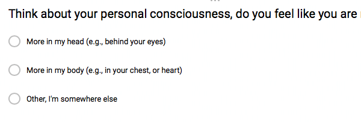
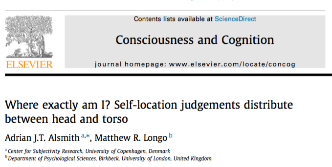
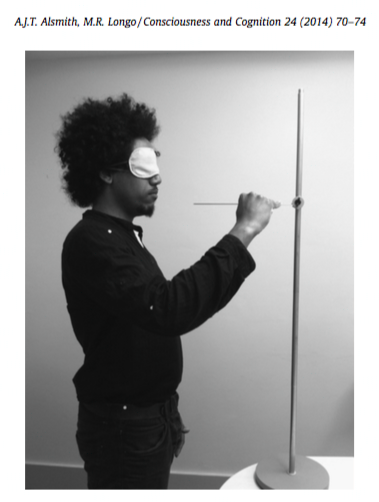
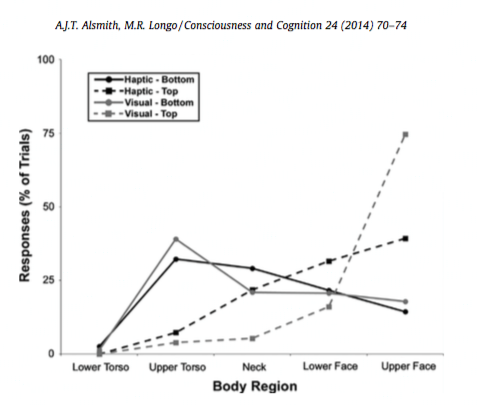
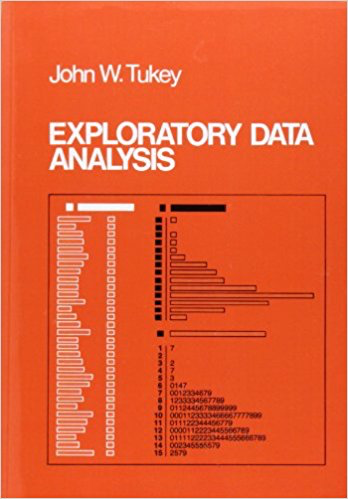
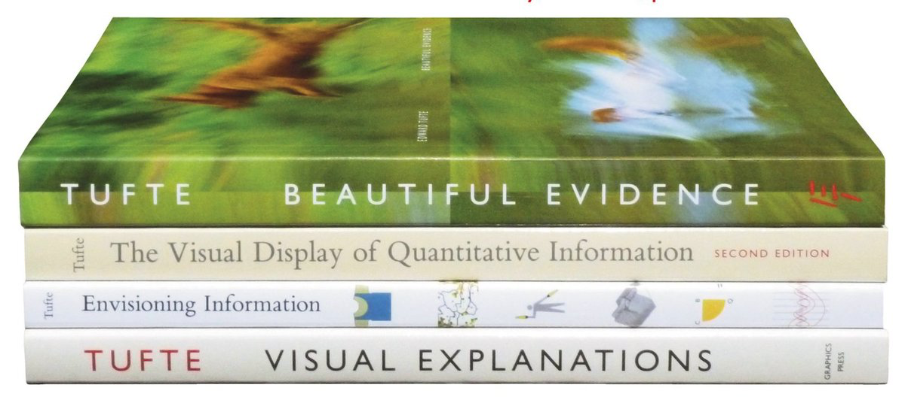
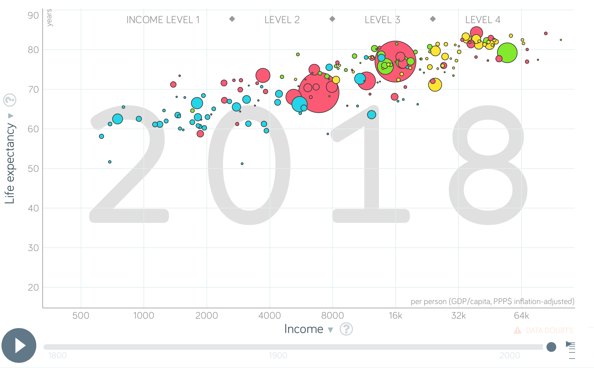

```{r setup, include=FALSE, echo=FALSE}
options(htmltools.dir.version = FALSE)
knitr::opts_chunk$set(echo = FALSE,message=FALSE,warning=FALSE, cache = TRUE)
```

class: pink, center, middle, clear

# What is Data Visualization?

--

## Making a way to look at the data

---

class: pink, center, middle, clear

# Why do we visualize data?

--

## So we can see what it looks like

---

class: pink, center, middle, clear

# Why would we want to see what data looks like?

--

## So we can use the data to answer questions

---

class: pink, center, middle, clear

# Examples: Let's look at the data from the questionnaire I sent out on Tuesday

---

# Here's what I did

1. I used [https://www.google.com/forms/](https://www.google.com/forms/) to create the questionnaire. It's free, and you can send the link to anyone.

2. You answered the questions, and the data was saved in a google spreadsheet.

3. Let's take a look

---

# The questions

1. How many people do you know in this class?
2. How many text messages do you send per day?
3. How many books have you read in your life?
4. Think back to your earliest memory, how old were you?
5. Where is your consciousness...
6. How vivid is your mental imagery?

---

# How can we look at the data?

1. We can look at the summary provided by google forms
2. We can look at the raw data in the google spreadsheet
3. We can download the data, and use R to make graphs

---
# Interpreting graphs

We are about to look at data visualizations for your answers to each of the questionnaire questions.

1. A data visualization is useful if we can easily interpret the pattern in the data by looking at it
2. Visualizations present data in different ways, need to make sure you are interpreting the visual meaning correctly

---

# Q1: People you know in class?

```{r, cache=FALSE, echo=FALSE, eval=FALSE}
library(googlesheets)
gs_ls()
web_df <- gs_title("Psyc 3400 (Responses)")
ss_df <- gs_read(ss=web_df, ws = "Form Responses 1", skip=0)

year <- c()
for(i in 1: dim(ss_df)[1]){
  a <- strsplit(ss_df$Timestamp[i],split=" ")
  b <- strsplit(a[[1]][1],"/")
  year[i] <- b[[1]][3]
}

ss_df <- cbind(ss_df,year)

```

```{r, fig.align='center'}
load("1_b_Data2019.RData")
ss_df_all <- ss_df
ss_df <- ss_df[ss_df$year==2019,]

library(ggplot2)
names(ss_df)<-c("timestamp",
                "people_you_know",
                "texts_per_day",
                "books_read",
                "earliest_memory",
                "consciousness",
                "Mental Imagery",
                "year")

names(ss_df_all)<-c("timestamp",
                "people_you_know",
                "texts_per_day",
                "books_read",
                "earliest_memory",
                "consciousness",
                "Mental Imagery",
                "year")

ggplot(ss_df, aes(y=people_you_know, x=1:dim(ss_df)[1]))+
  geom_point()+
  theme_classic(base_size = 24)+
  xlab("Individual (first to last)")+
  ylab("Number of people")

```

---
# Interpretation

1. Each dot was a single data point from a single person
--

2. x-axis represented an index number for each person (first person to last person to fill out questionnaire)
--

3. y-axis represented the answer given by each person (how many people they said they knew in class)
--

4. **Was it useful?** Sort of, we can see the raw data, but the dots are kind of everywhere, not very useful for summarizing the patterns


---
# Stacked dot plot

```{r, fig.align='center'}

ggplot(ss_df, aes(x = people_you_know)) +
  geom_dotplot(method="histodot", binwidth = 1, dotsize=.2)+
  theme_classic(base_size = 24)+
  xlab("Number of People")+
  ylab("?")

```

---
# Interpretation

1. Each dot was a single data point from a single person
--

2. x-axis represents the range of answers given to the question (ordered from the smallest to largest)
--

3. Dots are stacked on top of each other, showing how many people gave each answer
--

4. Y-axis is meaningless (the default settings from R make the y-axis meaningless)
--

5. **Was it useful?** Yes, we can see the raw data, and we can see the pattern of the data (which answers were more or less common)


---
# Histogram

```{r, fig.align='center'}

ggplot(ss_df, aes(x = people_you_know)) +
  geom_histogram(bins=7, color="white")+
  theme_classic(base_size = 24)+
  xlab("Number of people you know")+
  ylab("Frequency Counts")

```

---
# Histogram interpretation

1. Each bar is a bin, counting up the number of values in a range
--

2. x-axis represents the range of answers given to the question (ordered from the smallest to largest)
--

3. y-axis shows the frequency count for each bin (number of answers in that bin)
--

4. **Was it useful?** Yes, we can't see the raw data, **but** we can see the pattern of the data (which **ranges** of answers were more or less common)

---
# Histogram - bin width

```{r, fig.align='center'}

library(ggpubr)

a<-ggplot(ss_df, aes(x = people_you_know)) +
  geom_histogram(bins=2, color="white")+
  theme_classic(base_size = 15)+
  xlab("Number of people you know")+
  ylab("Frequency Counts")

b<-ggplot(ss_df, aes(x = people_you_know)) +
  geom_histogram(bins=4, color="white")+
  theme_classic(base_size = 15)+
  xlab("Number of people you know")+
  ylab("Frequency Counts")

c<-ggplot(ss_df, aes(x = people_you_know)) +
  geom_histogram(bins=5, color="white")+
  theme_classic(base_size = 15)+
  xlab("Number of people you know")+
  ylab("Frequency Counts")

d<-ggplot(ss_df, aes(x = people_you_know)) +
  geom_histogram(bins=7, color="white")+
  theme_classic(base_size = 15)+
  xlab("Number of people you know")+
  ylab("Frequency Counts")

ggarrange(a,b,c,d, ncol=2, nrow=2)

```


---

# Q2: Texts sent per day

```{r, fig.align='center'}

ggplot(ss_df, aes(x = texts_per_day)) +
  geom_histogram(bins=100, color="white")+
  theme_classic(base_size = 24)+
  xlab("Texts sent per day")+
  ylab("Frequency Counts")

```

---

# Q2: texts sent, < 250 only

```{r, fig.align='center'}

ggplot(ss_df[ss_df$texts_per_day<=250,], aes(x = texts_per_day)) +
  geom_histogram(bins=100, color="white")+
  theme_classic(base_size = 24)+
  xlab("Texts sent per day")+
  ylab("Frequency Counts")

```

---

# Q3: Books read in life

```{r, fig.align='center'}

ggplot(ss_df, aes(x = books_read)) +
  geom_histogram(bins=50, color="white")+
  theme_classic(base_size = 24)+
  xlab("Number of Books Read in Life")+
  ylab("Frequency Counts")

```

---

# Q4: Age of Earliest Memory

```{r, fig.align='center'}

ggplot(ss_df[ss_df$earliest_memory<20,], aes(x = earliest_memory)) +
  geom_histogram(bins=10, color="white")+
  theme_classic(base_size = 24)+
  xlab("Age of earliest memory")+
  ylab("Frequency Counts")

```

---

# Q5: Where is your consciousness?

```{r, fig.align='center'}

ss_df$consciousness<-as.factor(ss_df$consciousness)
levels(ss_df$consciousness)<-c("Body","Head", "Other")

library(dplyr)

plot_df <- ss_df %>%
           group_by(consciousness) %>%
           summarize(counts = length(consciousness))

ggplot(plot_df, aes(x = consciousness, y=counts)) +
  geom_bar(stat="identity")+
  theme_classic(base_size = 24)+
  xlab("Location of consciousness")+
  ylab("Frequency Counts")

```

---

# Q6: Mental Imagery?

```{r, fig.align='center'}

ss_df$`Mental Imagery` <-as.factor(ss_df$`Mental Imagery`)

plot_df <- ss_df %>%
           group_by(`Mental Imagery`) %>%
           summarize(counts = length(`Mental Imagery`))

ggplot(plot_df, aes(x = `Mental Imagery`, y=counts)) +
  geom_bar(stat="identity")+
  theme_classic(base_size = 20)+
  coord_flip()+
  xlab("Mental Imagery")+
  ylab("Frequency Counts")+
  scale_x_discrete(labels = function(x) lapply(strwrap(x, width = 40, simplify = FALSE), paste, collapse="\n"))

```


--- 
class: pink, center, middle, clear

# Conceptual issues for data-visualization

---

# Knowing what the graph represents

The raw data is transformed into a graph, it may or may not show raw scores

  a. Dot plots show the **raw data**
  
  b. Histograms show **summaries** (frequency counts) of the raw data in particular bins (ranges)
  
---

# Histogram concepts

Histograms are useful for seeing 

1. The **shape** of the data

2. **Central tendencies** (where most of the data is)

3. **Differences** (how the data is spread around)


---

# Sameness vs. Differentness

The **shape** of the histogram tells us about two properties of the data

1. **Sameness**: What makes the numbers the same. Are most of the numbers clustering somewere? Do they have a central tendency?

2. **Differentess**: Are the numbers spread about, showing that there are lots of different kinds of numbers?

---
class: pink, center, middle, clear

# Let's look at some histograms, and discuss their shape, sameness and differentness


---

# Histogram shape: Bell-Shaped

```{r, fig.align='center'}
p_df<- data.frame(s=1:1000,
                  d<-rnorm(1000,100,25))

ggplot(p_df, aes(x = d)) +
  geom_histogram(bins=25, color="white")+
  theme_classic(base_size = 15)+
  xlab("values")+
  ylab("counts")+
  ggtitle("Bell-shaped")

```

---

# Histogram shape: Right Skew

```{r, fig.align='center'}
d<-rnorm(1000,100,25)
d<-d[d>100]
p_df<- data.frame(s=1:length(d),
                  d)

ggplot(p_df, aes(x = d)) +
  geom_histogram(bins=25, color="white")+
  theme_classic(base_size = 15)+
  xlab("values")+
  ylab("counts")+
  ggtitle("Right Skew")

```

---

# Histogram shape: Left Skew

```{r, fig.align='center'}

d<-rnorm(1000,100,25)
d<-d[d<100]
p_df<- data.frame(s=1:length(d),
                  d)

ggplot(p_df, aes(x = d)) +
  geom_histogram(bins=25, color="white")+
  theme_classic(base_size = 15)+
  xlab("values")+
  ylab("counts")+
  ggtitle("Left Skew")

```

---

# Histogram shape: Bimodal

```{r, fig.align='center'}

d<-c(rnorm(500,100,25),rnorm(500,200,25))
p_df<- data.frame(s=1:1000,
                  d)

ggplot(p_df, aes(x = d)) +
  geom_histogram(bins=25, color="white")+
  theme_classic(base_size = 15)+
  xlab("values")+
  ylab("counts")+
  ggtitle("bimodal")

```

---

# Histogram shape: Uniform

```{r, fig.align='center'}

d<-runif(10000,50,150)
p_df<- data.frame(s=1:10000,
                  d)

ggplot(p_df, aes(x = d)) +
  geom_histogram(bins=20, color="white")+
  theme_classic(base_size = 15)+
  xlab("values")+
  ylab("counts")+
  ggtitle("Uniform")

```

---


class: pink, center, middle, clear

# Conceptual issues for the questions we asked

---

# Can we trust the numbers?

Potential issues:

1. Guessing
--

2. Lying / Fooling around
--

3. Different understandings of the question
--

4. Relying on Subjective report...

---

# Validity

Do the numbers measure what we want them to measure?

--

```{r, fig.align='center'}

```

---

# Converging measures

There can be many ways to measure a **construct** of interest

**Constructs** are the psychological process we are interested in studying (e.g., like the subjective experience of consciousness)

When different measures of the same construct converge on similar patterns, we cna be more confident that we measuring what we think we are measuring.

---

# A different self-location measure

```{r, fig.align='center'}

```

---

# The new measure

```{r, fig.align='center', out.width="400px"}

```

---

# The results

```{r, fig.align='center'}

```

---

# Generalization

- We **sampled** data from the class by asking 6 questions

--

- The patterns we found represent data from the portion of the class that answered the questions

--

1. Would the patterns **generalize** (be the same) if we took another sample from another class?

2. Would the patterns **generalize** to the entire population of humans?

---

# Q5: Where is your consciousness?

```{r, fig.align='center'}

ss_df_all$consciousness<-as.factor(ss_df_all$consciousness)
levels(ss_df_all$consciousness)<-c("Body","Head", "Other")

library(dplyr)

plot_df <- ss_df_all %>%
           group_by(year,consciousness) %>%
           summarize(counts = length(consciousness))

ggplot(plot_df, aes(x = consciousness, y=counts)) +
  geom_bar(stat="identity")+
  theme_classic(base_size = 24)+
  xlab("Location of consciousness")+
  ylab("Frequency Counts")+facet_wrap(~year)

```

---

class: pink, center, middle, clear

# Data Visualization Extras

---

# John Tukey

Pioneered methods for visual analysis and exploration of data.

```{r, fig.align='center', out.width="300px"}

```

---

# Edward Tufte

Lots of books showing histories and good/bad ways of data visualization in many domains

```{r, fig.align='center', out.width="600px"}

```

---

# ggplot2 (r package) Hadley Wickham

ggplot2 is an r package for data visualization

- “The emphasis in ggplot2 is reducing the amount of thinking time by making it easier to go from the plot in your brain to the plot on the page.” (Wickham, 2012)

- “Base graphics are good for drawing pictures; ggplot2 graphics are good for understanding the data.” (Wickham, 2012)

- [https://ggplot2.tidyverse.org](https://ggplot2.tidyverse.org)

---

# gapminder

- interactive website for visualizing data on world metrics (like life exepctancy and income over time) [https://www.gapminder.org/tools/](https://www.gapminder.org/tools/)

```{r, fig.align='center', out.width="600px"}

```

---

# Reminders

1. Quiz 1 is online, due Monday the 4th, end of day (11:59pm). You must take the quiz before the deadline, otherwise you will receive 0 points. You can take the quiz as many times as you want before the deadline


