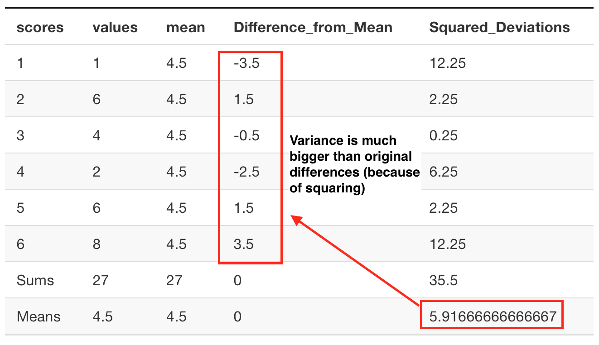

```{r setup, include=FALSE, echo=FALSE}
options(htmltools.dir.version = FALSE)
knitr::opts_chunk$set(echo = FALSE,message=FALSE,warning=FALSE, cache = TRUE)
```

class: pink, center, middle, clear

# We already know what lots of numbers look like

---

# Lots of Numbers look like this

Like this

<div class=rtable>
```{r}
a<-matrix(round(runif(200,-100,100)),ncol=20)
knitr::kable(a, 'html')
```
</div>

---

# Summary numbers

We want to reduce the big set of numbers down to a few numbers that we can look at and make sense of.

**Sameness (Central Tendency)**

- What are all the numbers close to? (topic from last class)

**Differentness (Variance)**

- How different are the numbers? (topic for this class)

---


class: pink, center, middle, clear

# Graph the numbers to get a better look at the differences

---

# Histogram

We can see the spread in the data, there are different numbers...

```{r, fig.align='center', fig.height=5}
library(ggplot2)
a<-as.numeric(a)
qplot(x=a)+
  geom_histogram(color="white")+
  theme_classic(base_size = 30)+
  ylab("count")+
  xlab("value")
```

---

class: pink, center, middle, clear

# Range

---


# The Range

```{r, fig.align='center', fig.height=5}
qplot(x=a)+
  geom_histogram(color="white")+
  theme_classic(base_size = 30)+
  geom_vline(xintercept=min(a), color="red", size=2)+
  geom_vline(xintercept=max(a), color="red", size=2)+
  ylab("count")+
  xlab("value")
```

---

# The Range

The range is two numbers.

- minimum value: the smallest number in the data
- maximum value: the largest number in the data

`1 4 3 6 5 7 6 8 7 6 9`

Range is (1,9)

- smallest number is 1
- largest number is 9

---

# min()

Use the `min()` function to find the smallest value in a variable in R

```{r, echo=T}
x <- c(1,4,3,6,5,7,6,8,7,6,9)
min(x)

```

---

# max()

Use the `max()` function to find the largest value in a variable in R

```{r, echo=T}
x <- c(1,4,3,6,5,7,6,8,7,6,9)
max(x)
```

---

# Thinking about the range

- Pros: Great way to find out the largest possible difference

- Cons: The biggest possible difference is probably not representative of all the differences in the numbers


---

# Some numbers

Here are two sets of numbers. What is the range? Does it do a good job showing the average differences?

`1 5 6 5 4 5 6 5 4 5 6 5 4 100`

`1 2 1 2 1 1 1 1 2 2 2 2 1 2` 


---

# Average differences

- It would be nice if we could find a way to measure the average amount of differences. 

- This average could be a **representative** value that summarizes the differences between the numbers

---

# Average differences

What should the average difference for these numbers be?

` 1 2 1 2 1 1 1 1 2 2 2 2 1 2` 

- All of the numbers are 1s or 2s. 
- The difference between 1 and 2 is 1
- It seems the average difference should be 1 (+ or -)

---

# Differences between numbers

Consider these 10 numbers:

` 1 3 4 5 5 6 7 8 9 24`

- We can see there are some differences, they are not all the same.

- We can measure the differences, by finding the difference between each score, and every other scores

- e.g., 1-3 = 2, 1-4 = 3, etc.

---

# Difference scores

```{r}

```

---

# Problem: The sum = 0

```{r}

```

---

# Summarizing the difference scores

1. We can find the differences between scores
--

2. There are lots of difference scores
--

3. Even though we can see the difference scores have different values, we can't summarize them in the normal fashion

--
4. The sum adds up to 0...

--
5. How can we solve the problem?

---

class: pink, center, middle, clear

# Difference scores from the mean

---

# Difference scores from the mean

Consider these numbers:

` 1 6 4 2 6 8`

1. We can compute the mean to describe the central tendency of the numbers

2. How far off is the mean for each number? This is the amount of error

3. The difference scores from the mean show how far off (different) each score is from the mean

difference score = $\bar{X} - x_{i}$

---

# Difference scores from the mean

```{r}

```

---

# sum = 0, Same problem...

```{r}

```

---

# Mean is the balancing point

1. The mean is the balancing point in the data

--
2. Half of the data is on one side of the mean, the other half is on the other side

--
3. Difference scores from mean will always sum to 0

---

# The mean minimizes the deviations

The mean is the only number that minimizes the sum of the deviations (difference scores)

$\sum_{i=1}^{i=N} (\bar{X} - x_{i}) = 0$

--

If the mean difference scores will always sum to 0, how can we find a sum for the difference scores that does not sum to 0?

---

class: pink, center, middle, clear

# Squared Deviations

---

# Squared deviations

```{r}

```

---

# Squared deviations

Why square the deviations (differences between mean and each score)?

- Squaring converts all the negative numbers to postive numbers
- This allows us to sum them all up, and not get 0!

---

class: pink, center, middle, clear

# SS (Sum of squared deviations)

---

# SS (sum of squared deviations)

```{r}

```

---

# SS (sum of squared deviations)

The formula for the sum of squared deviations (SS, also called sum of squares) is:

$SS = \sum_{i=1}^{i=N} (\bar{X} - x_{i})^2$

---

# What next?

1. We've found a way to sum up the differences (SS)

--

2. We used the squared differences from the mean, and added them all up

--
3. How can we find the average? Remember, we want a single number that does a good job of representing the differences...

---

class: pink, center, middle, clear

# Variance

---

# Variance = SS/N

```{r}
knitr::include_graphics('figs/2bsquaredV.png')
```

---

# Jargon

1. Learning statistics can be confusing because there are many new terms, and some of them refer to normal everyday concepts

Everyday words:

  - Variability & Variance: The things aren't all the same, they have some variability
  
**Statistical Variance**: The average of the sum of the squared difference scores from the mean 

---

# Variance

The average of the sum of the squared difference scores from the mean 

$Variance = SS / N$

$Variance = \frac{\sum_{i=1}^{i=N}(\bar{X}-x_i)^2}{N}$

Usefulness

Pros: The variance provides us with one summary number about the average differences

Cons: We squared the differences, so the variance doesn't directly relate to size of the original differences

---

# The variance is too big

```{r}

```

---

# What to do?

1. We are searching for a summary number to represent the differences in our data.

--
2. The variance is too big because of squaring

--
3. What can we do to solve the problem, and make our summary number in the range of the actual differences?

---

# Square root the variance

1. Squaring numbers makes them bigger (e.g., $2^2 =4$)
2. Square rooting numbers brings them back down to their unsquared size (e.g., $\sqrt{2^2}=2$)
3. Let's square root the variance

---

# Square root the variance

```{r}

```

---

class: pink, center, middle, clear

# Standard Deviation

---

# Standard deviation = sqrt(variance)

When we took the square root of the variance, we also did something else, called computing the **standard deviation**.

$\text{standard deviation} = \sqrt{\text{variance}}$

$\text{standard deviation} = \sqrt{\frac{SS}{N}}$

$\text{standard deviation} = \sqrt{ \frac{\sum_{i=1}^{i=N}(\bar{X}-x_i)^2}{N}}$

The standard deviation is a summary of the variability in the data that is in the same scale as the original differences

---

# Standard Deviation

```{r}

```

---

# Populations vs samples

There are different formulas for the variance and standard deviation, depending on whether your data represents an entire population of scores, or just a sample (a subset of the population).

**Population**: Divide by N (this is what you will do for the quiz, we tell you to divide by N)

**Sample**: Divide by N-1 (this is what you will do when you are working with samples later on this class)

- The differences are explained in week 4 (distributions and sampling)

---

class: pink, center, middle, clear

# Data sense with Descriptives

---

# What if?

- Someone told you they had some numbers with:

--

- Mean = 100, Standard Deviation = 25

--

- What would most of the numbers be like?
- What would be a good summary of the average differences in the data?
- What kind of numbers would you expect to see or not see?

---

# Animating the standard deviation

```{r, fig.align='center'}

```


---

class: pink, center, middle, clear

# R tips

---

# Warning

- R has functions for variance and standard deviation...
- **But**, they divide by N-1, not N
- We talk about what this means later in the course, and why R does this
- For now, you can't use the R formulas `sd()` or `var()`

---

# R: Mean difference scores

```{r, echo=T}
x <- c(8,2,6,4,6,2,4,4)
mean(x)-x
sum(mean(x)-x)
```

---

# R: Squared deviations

```{r, echo=T}
x <- c(8,2,6,4,6,2,4,4)
(mean(x)-x)^2
```

---

# R: SS, sum of squares

```{r, echo=T}
x <- c(8,2,6,4,6,2,4,4)
sum((mean(x)-x)^2)
```

More explicit code:

```{r, echo=T}
x <- c(8,2,6,4,6,2,4,4)
squared_deviations <- (mean(x)-x)^2
SS <- sum(squared_deviations)
SS
```

---

# R: Variance

```{r, echo=T}
x <- c(8,2,6,4,6,2,4,4)
squared_deviations <- (mean(x)-x)^2
SS <- sum(squared_deviations)
N <- length(x)
variance <- SS/N
variance
```

---

# R: Standard Deviation

```{r, echo=T}
x <- c(8,2,6,4,6,2,4,4)
squared_deviations <- (mean(x)-x)^2
SS <- sum(squared_deviations)
N <- length(x)
variance <- SS/N
standard_deviation <- sqrt(variance)
standard_deviation
```

---

# Next class: Correlation

1. Today we looked measures of variability, to summarize differences in the data

2. Next class (Monday, 11th) we look at how measurements of more than one variable can be related to one another (correlation)

3. Quiz 2 is due Monday, 11th @ 11:59pm
