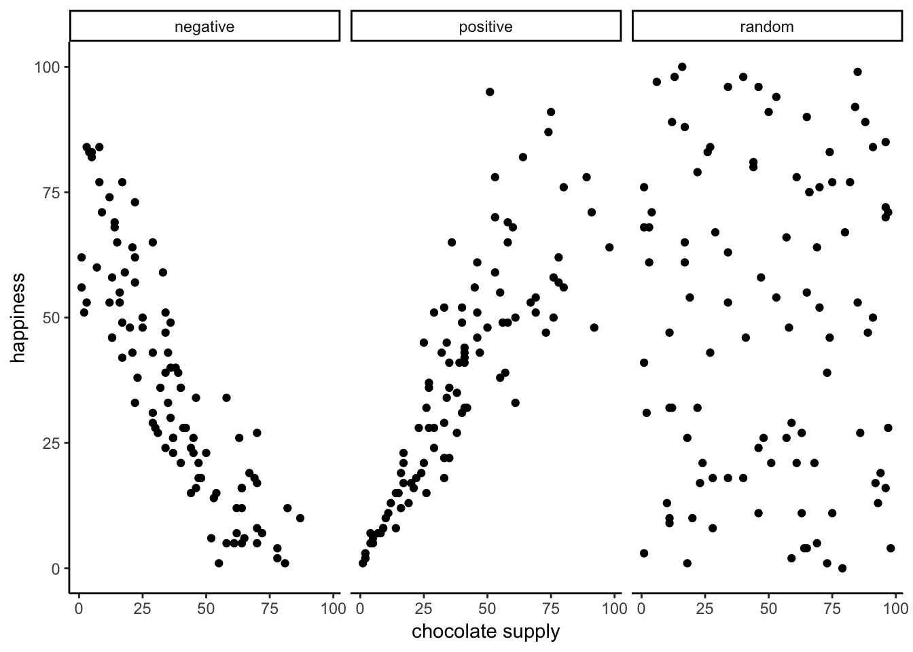
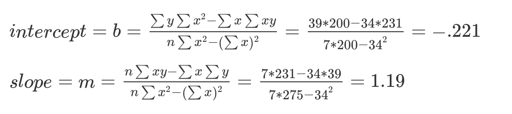

```{r setup, include=FALSE, echo=FALSE}
options(htmltools.dir.version = FALSE)
knitr::opts_chunk$set(echo = FALSE,message=FALSE,warning=FALSE, cache = TRUE)
```

class: pink, center, middle, clear

# Correlations can occur by chance

---

# Issues for this class

1. **What is Regression?** 

2. **Interpretation of Correlations**

3. **Correlation and chance**

---

class: pink, center, middle, clear

# Regression

---

# Regression

- geometric interpretation of correlation
- can be used for prediction

---

# Examples of correlation

```{r}

```

---

# Correlation with Regression lines

```{r}

```

---

# What is a regression line?

- the best fit line

- what makes it the best fit line?

---

# Residuals and error

```{r}

```

---

# What is a regression line?

- the best fit line

- what makes it the best fit line?

**The regression line minimizes the sum of the residuals**

---

# Animated Residuals

```{r}
knitr::include_graphics('figs/correlation/regression-1.gif')
```

---

# Minimizing the error

```{r}

```

---

# Finding the best fit line

- how do we find the best fit line?

- First step, remember what lines are...

---

# Equation for a line

$y = mx +b$

$y = \text{slope}*x + \text{y intercept}$


- y = value on y-axis
- m = slope of the line
- x = value on x-axis
- b = a constant for the y-intercept

---

class: center, middle, clear

```{r, results='asis',out.extra=""}
cat('<iframe style="width:100%;height:100%;border-style:none;", src="https://crumplab.shinyapps.io/Lines/" />\n')
```

---

# solving for y

$y = .5x + 2$

What is the value of y, when x is 0?

$y = .5*0 + 2 = 0+2 = 2$

What is the value of y, when x is 4?

$y = .5*4 + 2 = 2+2 = 4$

---

# solving for x

$y = .5x + 2$

What is the value of x, when y is 4?

$4 = .5*x + 2$

$4-2 = .5*x$

$2 = .5*x$

$\frac{2}{.5} = x$

$x = 4$

---

# Finding the best fit line

```{r}

```


---

# sample data

```{r}

```

---

# sample calculations

```{r}

```

---

# scatterplot plus regression line

```{r}

```

---

# R: intercept and slope

```{r, echo=T}
x <- c(1,4,3,6,5,7,8)
y <- c(2,5,1,8,6,8,9)
df <- data.frame(x,y)
coef(lm(y~x, data=df))

```

---

# Reminders: y-intercept

What does the y-intercept mean?

It is the value where the line crosses the y-axis when x = 0.

---

# Reminders: slope

What does the slope mean?

The slope tells you the rate of change. For example, for every 1 unit of x, you move the the "slope" amount on y.

E.g., if slope = .5, then for every 1 unit of x, you increase y by .5 units.

---

class: pink, center, middle, clear

# Interpreting Correlations

```{r}

```

---

# What do correlations mean?

Could mean that one variable causes change in another variable

**BUT**, it can mean other things...

2. Causal direction problem
3. Non-linear problem
4. Spurious correlations
5. Chance problem

---

# Correlations as causes

```{r, out.width="80%"}

```

---

# Causal Directionality problem

```{r, out.width="60%"}

```

---

# Nonlinearity problem

```{r, out.width="60%"}
knitr::include_graphics("figs/correlation/CorNonlinear.png")
```

---

# Spurious correlations

[http://www.tylervigen.com/spurious-correlations](http://www.tylervigen.com/spurious-correlations)

---

# Chance problem

Correlations between two variables can occur by chance, and be completlely meaningless

---

class: pink, center, middle, clear

# Correlations and Random Chance

---

# What is Randomness?

Two related ideas:

1. Things have equal chance of happening (e.g., a coin flip)
  - 50% heads
  - 50% tails

2. Independence: One thing happening is totally unrelated to whether another thing happens
  - the outcome of one flip doesn't predict the outcome of another
  
---

# Two random variables

On **average** there should be zero correlation between two variables containing randomly drawn numbers

1. The numbers in variable X are drawn randomly (independently), so they do not predict numbers in Y
2. The numbers in variable Y are drawn randomly (independently), so they do not predict numbers in X

If X can't predict Y, then correlation should be 0 right?

---

# R: random numbers

`runif()` allows you to sample `n` random numbers between a minimum and maximum value. Numbers in the range have an equal chance of occuring.

```{r, echo=T}
runif(n=5, min=0, max=5)
runif(n=5, min=0, max=5)
```

---

# "Random" Correlations

```{r, echo=T}
x <- runif(n=5, min=0, max=5)
y <- runif(n=5, min=0, max=5)
x
y
cor(x,y)
```


---

class: center, middle, clear

```{r, results='asis',out.extra=""}
cat('<iframe style="width:100%;height:100%;border-style:none;", src="https://crumplab.shinyapps.io/ChanceCorrelation/" />\n')
```

---

# Small N "random" correlations

```{r}
knitr::include_graphics('figs/correlation/corUnifn10-1.gif')
```

---

# What is chance capable of?

1. We can see that randomly sampling numbers can produce a range of correlations, even when there shouldn't be a "correlation"

--

2. What is the average correlation produced by chance?

--

3. What is the range of correlations that chance can produce?

---

# Simulating what chance can do

```{r}

```

---

# The role of sample size (N)

```{r}
knitr::include_graphics('figs/correlation/corUnifFourNs-1.gif')
```

---

# The role of sample size (N)

The range of chance correlations decreases as N increases

```{r, out.width="75%"}

```

---

class: pink, center, middle, clear

# Statistical Inference (The rest of this course)

---

# The inference problem

1. Let's say we found a correlation, (r = .5)

2. We know chance can sometimes produce correlations

**Problem for inference:**
  - Is the correlation real? Is one variable really related to the other?
  - Or, is the correlation spurious, and just happened to occur by chance?

---

# Making inferences about chance


```{r, out.width="80%"}

```

---

# Next class: Distributions

1. NO CLASS, Monday 18th - College Closed

2. Wednesday, February 20th: We explore ideas about samples, populations, and distributions

---

# Reminder

1. Quiz 2 for descriptives is due today @ 11:59pm

2. Quiz 3 for correlation/regression opens today, due Monday Feb 25th


