```{r setup, include=FALSE, echo=FALSE}
options(htmltools.dir.version = FALSE)
knitr::opts_chunk$set(echo = FALSE,message=FALSE,warning=FALSE, cache = TRUE)
```

class: pink, center, middle, clear

# Chance does things

---

# Big ideas for this course

1. Psychology interpets patterns in data to draw conclusions about psychological processes

--

2. Chance can produce "patterns" in data

--

3. **Problem**: How can we know if the pattern is real, or simply a random accident produced by chance

---

# Solutions

1. Need to understand what chance is

--

2. Need to find out what chance can actually do in a particular situation

--

3. Create tools to help us determine whether chance was likely or unlikely to produce patterns in the data

---

# Issues for this class

1. **Probability Basics** 

2. **Distributions**

3. **Sampling from distributions**

---

class: pink, center, middle, clear

# Probability Basics

---

# What is a probability?

- A number bounded between 0 and 1

- Describes the "chances" or "likelihood" of an event

---

# Proportions and Percentages

- Percentage (%) : A ratio between event frequency, and total frequency, expressed in units of 100.
- Proportion : a decimal version (range between 0-1)

$100\% = \frac{100}{100} = 1 = 1*100 = 100\%$

$50\% = \frac{50}{100} = .5 = .5*100 = 50\%$

$\frac{2}{4} = .5 = .5*100 = 50\%$

---

# Two probability statements

- A coin has a 50% chance of landing heads

  - p(heads) = .5

--

- There is a 10% chance of rain tomorrow
  - p(rain tomorrow) = .1

---

# Frequentist vs. Bayesian

Probability is defined differently depending on philosophical tradition.

1. Frequentist: The long-run chances (odds) of an event occurring

2. Bayesian: Degree of belief

---

# A fair coin

A fair coin has a 50% chance of landing heads or tails

- Frequentist: If you flip this coin an infinity of times, **in the long run** half of the outcome will be heads, and half will be tails

- Bayesian: I am uncertain about the outcome, I can't predict what it will be.

---

# 10% chance of rain tomorrow

10% chance of rain tomorrow refers to a single event that hasn't yet occurred

- Frequentist: I don't know what to say. Tomorrow it will rain or not rain, so there will be a 0% or 100% chance of rain, we'll find out after tomorrow happens

- Bayesian: It is unlikely to rain tomorrow, I won't bring an umbrella.

---

class: pink, center, middle, clear

# 50% chance

---

# Coin flipping

I made R flip a fair coin 100 times:

```{r}
coins <- sample(c("H","T"),100, replace=T)
coins<-matrix(coins,ncol=10, byrow=T)
coins
#coins<-as.data.frame(coins)
#knitr::kable(coins)
```


---

# Flipping a coin 100 times

```{r}
library(ggplot2)
outcomes<-sample(c(0,1),100, replace=T)
mean_heads <-c()
for(i in 1:100){
  mean_heads[i]<-mean(outcomes[1:i])
}
flips<-1:100
df<-data.frame(flips, outcomes, mean_heads)

ggplot(df, aes(x=flips, y=mean_heads))+
  geom_point()+
  geom_line()+
  geom_point(aes(x=flips, y=outcomes, color=outcomes))+
  theme_classic(base_size=20)+
  ggtitle("flipping a coin 100 times, 1= heads")+
  theme(legend.position="none")


```

---

# Four simulations

```{r}
library(ggplot2)

all_df<-data.frame()
for(j in 1:4){
  outcomes<-sample(c(0,1),100, replace=T)
  mean_heads <-c()
  for(i in 1:100){
    mean_heads[i]<-mean(outcomes[1:i])
  }
  flips<-1:100
  df<-data.frame(sim=rep(j,100),flips, outcomes, mean_heads)
  all_df<-rbind(all_df,df)
}

ggplot(all_df, aes(x=flips, y=mean_heads))+
  geom_point()+
  geom_line()+
  geom_point(aes(x=flips, y=outcomes, color=outcomes))+
  theme_classic(base_size=15)+
  ggtitle("flipping a coin 100 times, 1= heads")+
  theme(legend.position="none")+
  facet_wrap(~sim)


```

---

# Flipping a coin 10000 times

```{r}
library(ggplot2)
outcomes<-sample(c(0,1),10000, replace=T)
mean_heads <-c()
for(i in 1:10000){
  mean_heads[i]<-mean(outcomes[1:i])
}
flips<-1:10000
df<-data.frame(flips, outcomes, mean_heads)

ggplot(df, aes(x=flips, y=mean_heads))+
  geom_point()+
  geom_line()+
  geom_point(aes(x=flips, y=outcomes, color=outcomes))+
  theme_classic(base_size=20)+
  ggtitle("flipping a coin 10000 times, 1= heads")+
  theme(legend.position="none")


```

---

# coin flipping summary

1. 50% heads/tails means that **over the long run**, you should get half heads and half tails

2. When sample size (number of flips) is small, you can "randomly" get more or less than 50% heads

3. Chance is lumpy

---

# Discrete probability distributions

1. Defines the probability of each item in a set. 
2. All probabilities must add up to 1

---

# Coin flipping distribution

```{r}
df<-data.frame(side=c("heads","tails"),probability=c(.5,.5))
ggplot(df, aes(x=side, y=probability))+
  geom_bar(stat="identity")+
  theme_classic(base_size = 20)+
  coord_cartesian(ylim=c(0,1))+
  ggtitle("Fair coin Discrete probability distribution")


```


---

class: pink, center, middle, clear

# What can the coin flipping distribution do?

---

# 10 sets of 10 flips

```{r}

library(dplyr)

flips<-sample(c("heads","tails"),100,replace=T)
set <- rep(1:10,each=10)
df<-data.frame(flips,set)

sum_df <-  df %>%
           group_by(set,flips) %>%
           summarize(outcomes=length(flips))

ggplot(sum_df, aes(x=flips, y=outcomes))+
  geom_bar(stat="identity")+
  theme_classic(base_size = 15)+
  facet_wrap(~set)
```


---

# flipping a coin 10 times

1. We expect to get 5 heads and 5 tails on average
2. But, we often do not get exactly 5 heads and 5 tails
3. Randomly sampling from the distribution can produce a variety of answers

---

# simulating 10 flips many times

Steps:

1. Flip a coin 10 times
2. count the number of heads, save the number
3. Repeat above 1,000 times or more
4. plot the histogram of number of heads

---

# Distribution of heads (10 flips)

```{r}
flips<-sample(c("heads","tails"),10000,replace=T)
set <- rep(1:1000,each=10)
df<-data.frame(flips,set)

sum_df <-  df %>%
           group_by(set,flips) %>%
           summarize(outcomes=length(flips))

hist(sum_df$outcomes, breaks=0:10,
     xlab="number of heads",
     ylab="number of simulations",
     main="Simulation of 1,000 sets")

```

---

# Summary of simulation

1. Chance produces a range of outcomes (number of heads out of 10)

2. Chance most frequently produces 5 heads and 5 tails

3. Chance produces more extreme outcomes with increasingly less frequency (lower probability)

4. E.g., chance is very unlikely to produce 9 out of 10 heads

---

# flipping a coin 100 times

What if we simulated flipping a coin 100 times, what would the range of outcomes be?

---

# flipping a coin 100 times

```{r}
flips<-sample(c("heads","tails"),100000,replace=T)
set <- rep(1:1000,each=100)
df<-data.frame(flips,set)

sum_df <-  df %>%
           group_by(set,flips) %>%
           summarize(outcomes=length(flips))

hist(sum_df$outcomes,
     xlab="number of heads",
     ylab="number of simulations",
     main="Simulation of 1,000 sets")

```

---

class: pink, center, middle, clear

# Distributions

---

# Distributions

1. A tool to define the chances of getting particular numbers
2. Distributions have shapes
3. Higher values indicate higher chance of getting a value

---

# Distributions have shapes

```{r, out.width="80%"}
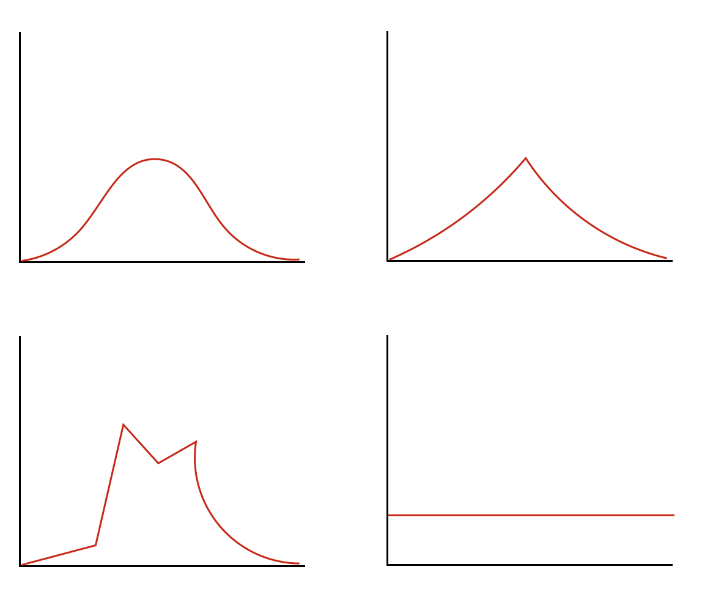
```

---

# Area under the curve

```{r, out.width="80%"}
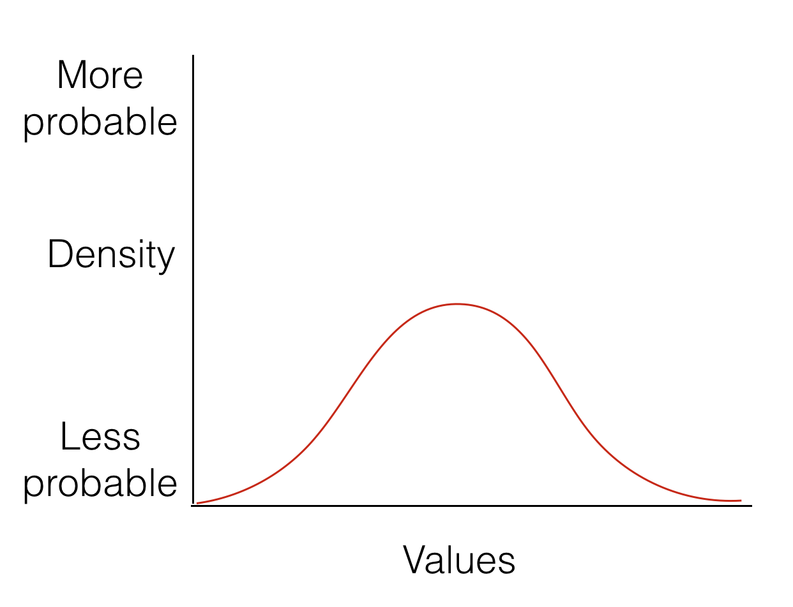
```


---

# Interpreting distributions

```{r, out.width="80%"}
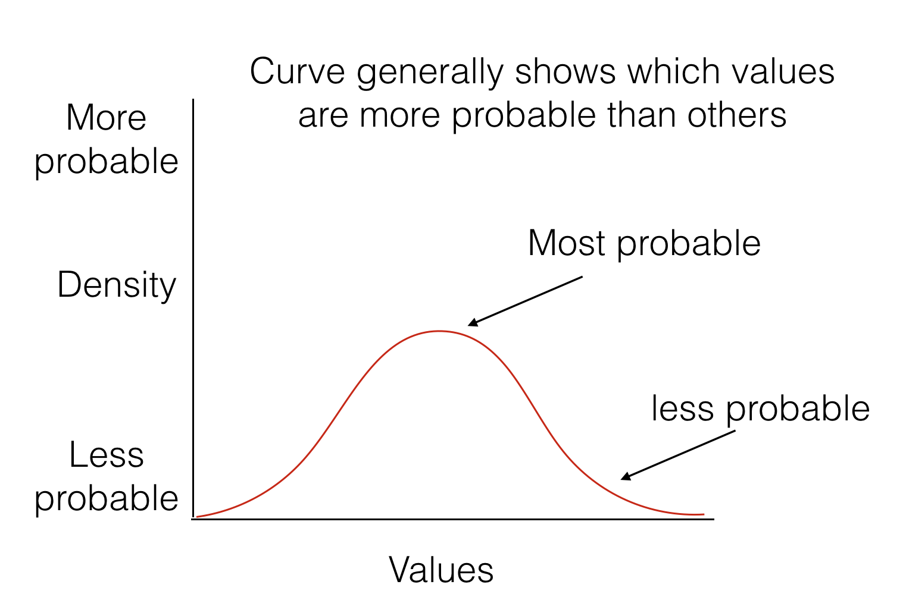
```

---

# Point Estimates

```{r, out.width="80%"}
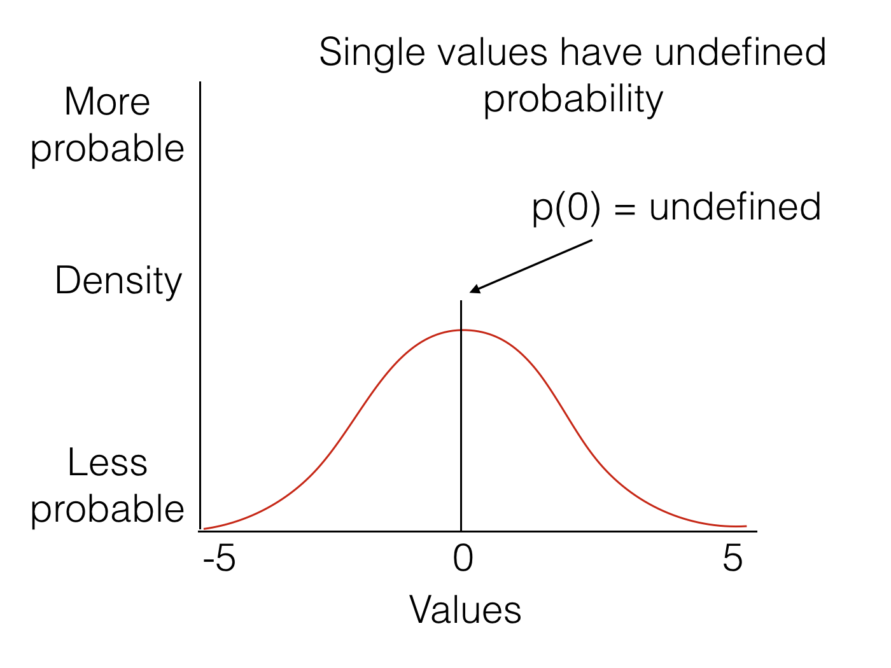
```

---

# Probability ranges

```{r, out.width="80%"}
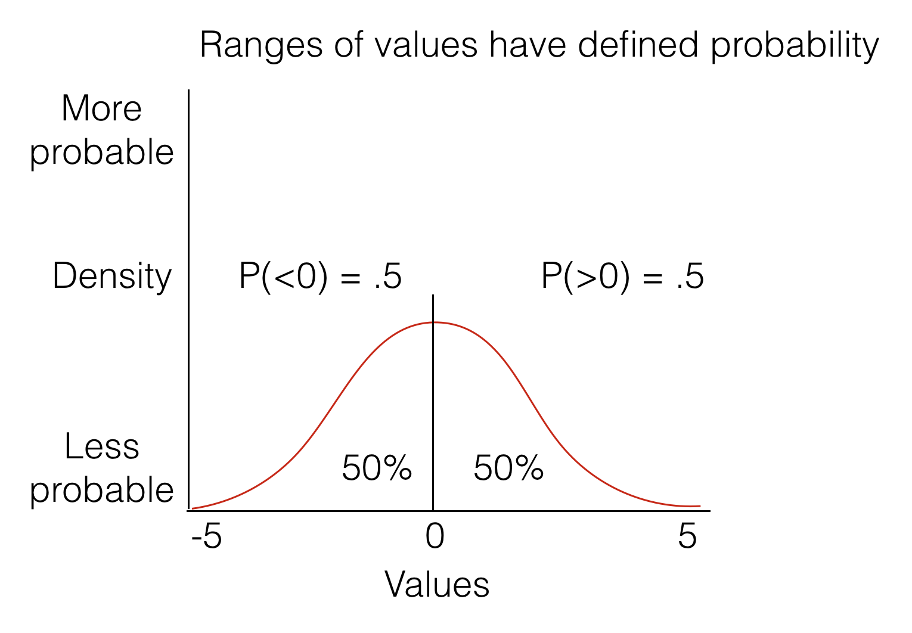
```

---

# Uniform Distribution

Definition:

1. All numbers in a particular range have an equal (uniform) chance of occuring

---

# Uniform Distribution

```{r}
ggplot()+
  xlim(1,10)+
  ylim(0,1)+
  geom_hline(yintercept=.1)

```

---

# Sampling from a uniform

R let's you sample numbers from a uniform distribution

```{r,echo=T}
runif(n=3,min=0,max=10)
runif(n=3,min=0,max=10)
```

---

# looking at samples

```{r}
knitr::include_graphics('figs/distribution/sampleUnifExpected-1.gif')
```

---

# Random samples are not all the same

```{r, out.width="90%"}
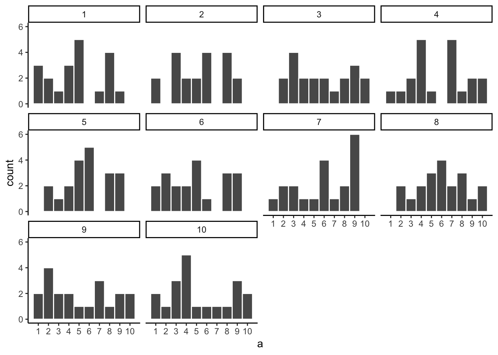
```

---

# Samples estimate the distribution

1. Samples are sets of numbers taken from a distribution

--

2. **Samples become more like the distribution they came from, as sample size (N) increases**

---

# Uniform: N=100

```{r, out.width="80%"}
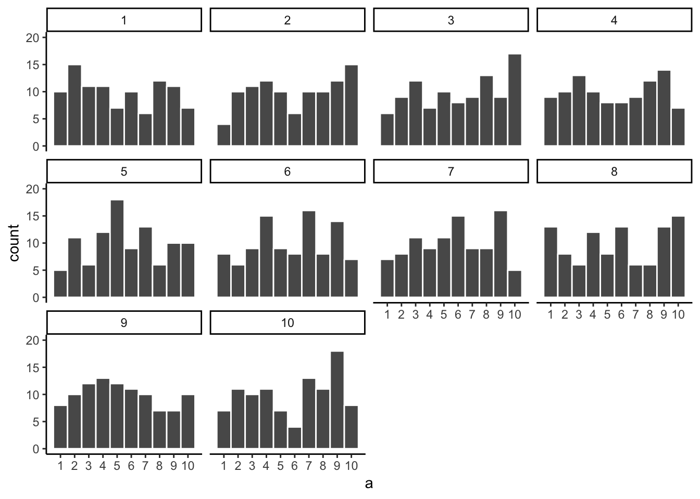
```

---

# Uniform: N=1,000

```{r, out.width="80%"}
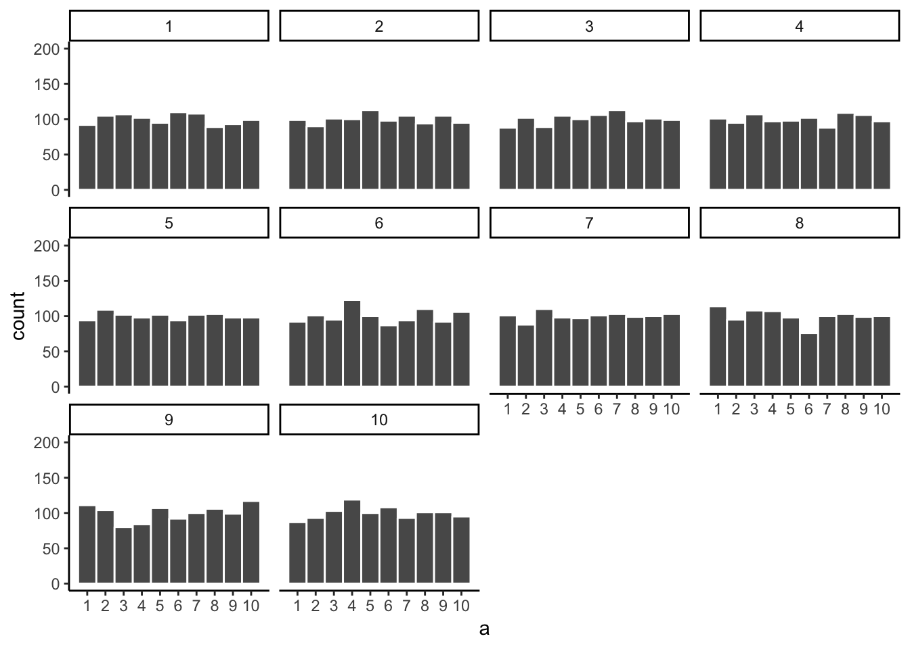
```

---

# Uniform: N=100,000

```{r, out.width="80%"}
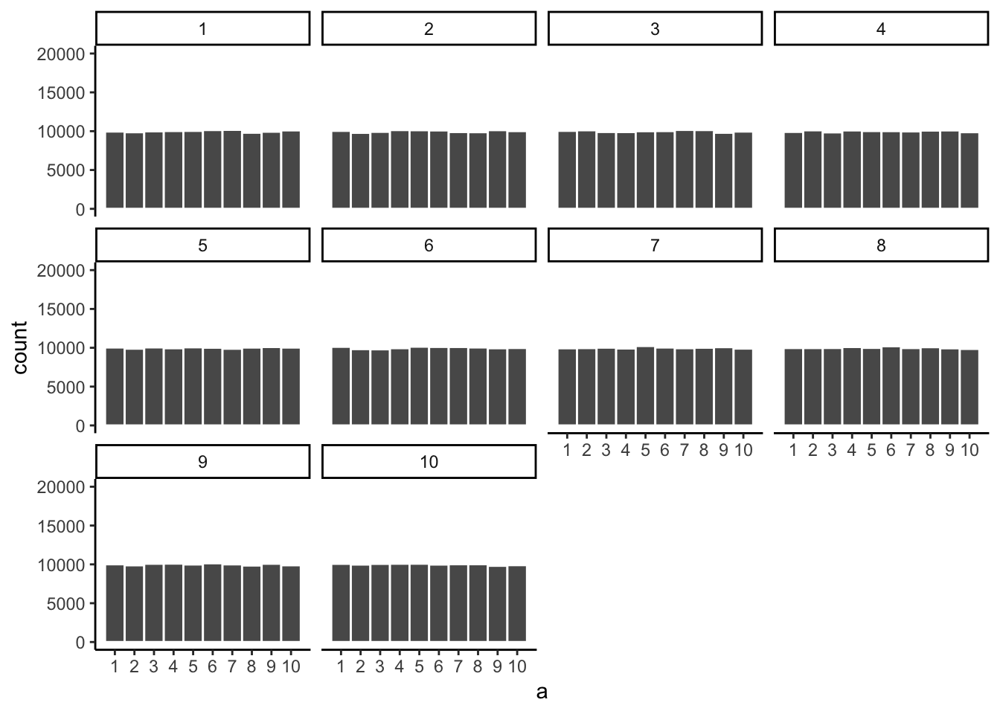
```

---

class: pink, center, middle, clear

# Some questions

---

# Samples and distributions

How do samples relate to distributions?

--

  - Samples come from distributions
--

  - Samples approximate the distribution they came from as sample-size increases

---

# Is my sample likely?

Let's say you take a sample of numbers from a distribution.

1. Is your sample representative of the population?
2. Was your sample likely (you would usually get a sample like this), or unlikely (you got a weird sample, usually you would not get a sample like this)

---

# Simulation and sampling

How can we know if a sample we obtained is "normal", or "weird"?

--

- We can find out by simulating the process of sampling.
- We sample some numbers, measure the sample, then repeat
- We can now look at how our measurement of the sample behaves

---

# Animation of sample mean

```{r}
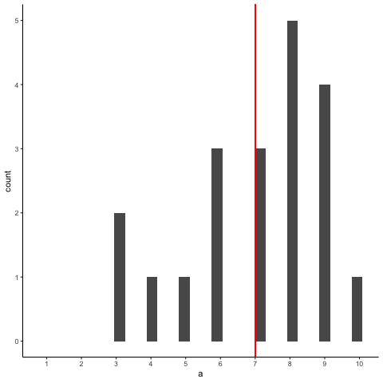
```

---

# What to notice

- The histogram shows that each sample is different
- But, the mean of each sample is always around 5.5
- We have measured a property of the sample (the mean), each time.

---

# Something Curious

```{r}
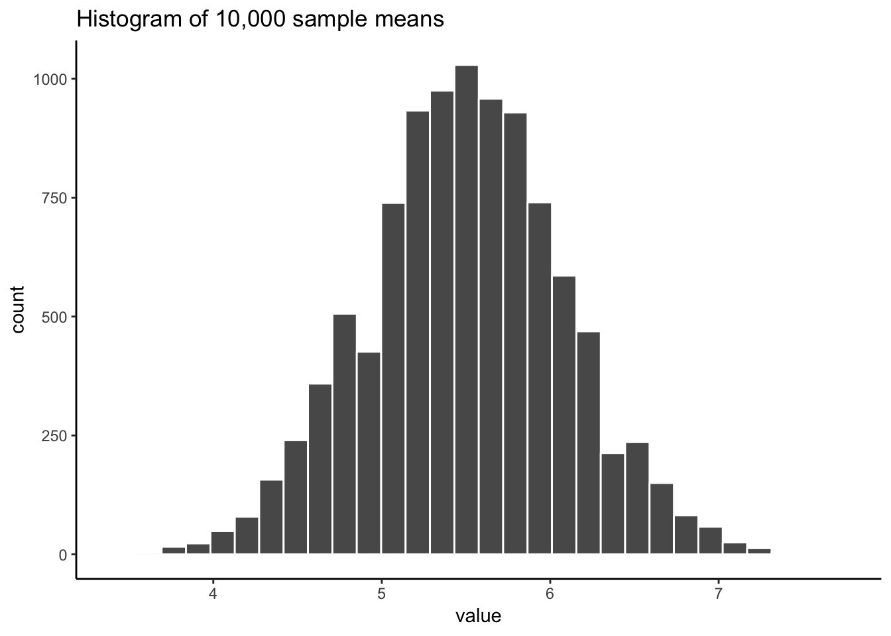
```

---

# Next class: Sampling

1. Monday, February 25th: We explore ideas about samples, populations, and distributions

2. Regression/Correlation quiz due Monday Feb 25th.


