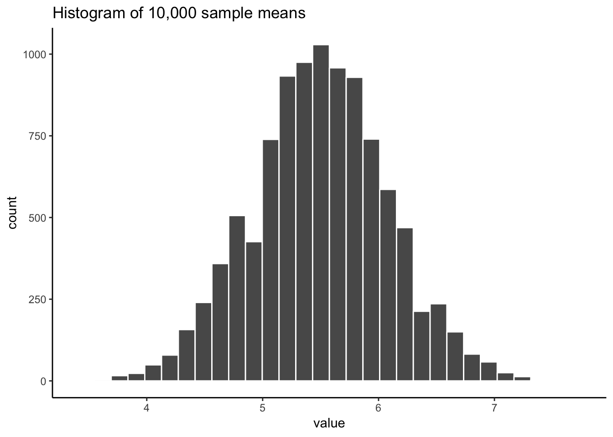

```{r setup, include=FALSE, echo=FALSE}
options(htmltools.dir.version = FALSE)
knitr::opts_chunk$set(echo = FALSE,message=FALSE,warning=FALSE, cache = TRUE)
```


class: pink, center, middle, clear

# Make sure you understand sampling distributions

---

class: pink, center, middle, clear

# Make sure you understand this next graph

---

class: center, middle, clear

```{r}

```

---

# Big ideas for this course

1. Psychology interpets patterns in data to draw conclusions about psychological processes

--

2. Chance can produce "patterns" in data

--

3. **Problem**: How can we know if the pattern is real, or simply a random accident produced by chance

---

# Issues for this class

1. **Sampling distributions**

2. **Normal distributions and central limit theorem**

3. **Estimation**

---

class: pink, center, middle, clear

# Samples and populations

---

# Samples and populations

- Population: A defined set of things

- Sample: a subset of the population

---

# Random Sampling

- A process for generating a sample (taking things from a population)

--
- Random samples ensure that each value in a sample is drawn **independently** from other values

--
- all values in the population have a chance of being in the sample

---

# Example: Sampling heights of people

Let's say we wanted to know something about how tall people are. We can't measure the entire population (it's too big). So we take a sample.

--

What would happen if:

1. We only measured really tall people (biased sample)

--

2. We randomly measured a bunch of people?


---

# Population statistics

Populations have statistics. For example,

The population of all people has:

1. A distributions of heights
2. The distribution has a mean (mean height of all people)
3. The distribution has a standard deviation

---

# The population problem

In the real world, we usually do not have all of the data for the entire population.

So, we never actually know:

1. The population distribution
2. The population mean
3. The population standard deviation, etc.


---

# The sampling solution

Unknown: The population

Solution: Take a sample of the population

1. Samples will tend to look the population they came from, especially when sample-size (N) is large.

2. We can use the sample to **estimate** the population.

---

# The sampling problem

We take samples, and use them to estimate things. This works well when we have large, representative samples. 

But, how do we know if the sample we obtained is "normal", or happens to be "weird"?

Solution: We need to learn how the process of sampling works. We can use R to simulate the process of sampling. Then we can see how samples behave.

---

# Samples become populations

- As sample-size increases, the sample becomes more like the population. 

- As sample N approaches the population N, the sample becomes the population.

---

# Law of large numbers

- As sample-size increases, properties of the sample become more like properties of the population

Example:

- As sample-size increases, the mean of the sample becomes more like the mean of the population

---

# Simulation: Population mean=100

```{r}
save_mean<-c()
for(i in 1:1000){
  save_mean[i]<-mean(rnorm(i,100,25))
}
df<-data.frame(sample=1:1000,save_mean)

library(ggplot2)
ggplot(df, aes(x=sample, y=save_mean))+
  geom_point()+
  geom_line()+
  theme_classic(base_size = 12)+
  ggtitle("Sample mean approaches 100 \n
          as N increases")


```


---

# The sampling problem

We take samples, and use them to estimate things. This works well when we have large, representative samples. 

**But, how do we know if the sample we obtained is "normal", or happens to be "weird"?**

Solution: **Sampling Distributions**


---

class: pink, center, middle, clear

# Sampling distributions

---

# What are sampling distributions?

- Definition: The distribution of a sample statistic

- Example: 
  - Many samples are drawn from the same distribution
  - A statistic (e.g., mean, standard deviation) is computed for each sample, and saved
  - The sampling distribution is the distribution of the measured statistic for each sample
  - Sampling distributions can be simulated in R

---

# Begin with a distribution

```{r}
ggplot()+
  xlim(1,10)+
  ylim(0,1)+
  geom_hline(yintercept=.1)+
  theme_classic(base_size = 20)

```

---

# Take many samples

Save a sample statistic (e.g., mean) for each sample

```{r}
knitr::include_graphics('figs/distribution/sampleHistUnif-1.gif')
```

---

# Plot distribution of sample statistic

```{r}

```

---

# Sampling distribution is bell-shaped

Notice that the sampling distribution of the mean is bell-shaped, also called a **Normal Distribution**.

```{r, out.width="50%"}

```

---

# Sampling distributions for anything

A sampling distribution can be found for any sample statistic.

1. Choose a statistic to measure (e.g., mean, median, variance, standard deviations, max, min, etc.)
2. Measure statistics for each sample
3. Plot the sampling distribution

---

# A few sampling distributions

```{r}


```


---

# Use for sampling distributions?

Question: What does a sampling distribution tell us?

Answer: 

- The distribution of values a sample statistic can take, for a sample of a particular size

In other words,

- Gives us information about range and probability of obtaining particular sample statistics

---

# Sampling distribution of the mean

```{r}

```

---

# Standard error of the mean (SEM)

- Definition: the standard deviation of the sampling distribution of the sample means

Formulas: Can be computed directly for samples of any size if you know the standard deviation of the population distribution.

$\text{SEM}=\frac{\text{standard deviation}}{\sqrt{N}}$

$\text{SEM}=\frac{\sigma}{\sqrt{N}}$

$\sigma$ = population standard deviation

---

# SEM

What does the SEM (standard error of the mean) tell you.

- Let's say your sample mean was 5, and the SEM was 2.

- The SEM is the standard deviation of the sampling distribution of the sample mean

- Now you know that your sample mean is 5, but as an estimate of the population mean, that number varies a little bit. SEM tells you how much in standard deviation units.


---

# Central limit theorem

With enough samples, sampling distributions are approximately **normal distributions**

- Sampling distributions have the same shape as a normal distribution, even when the distribution that the sample came from does not have a normal shape.

---

class: pink, center, middle, clear

# Normal Distributions

---

# Normal distributions are bell-shaped

```{r, out.width="80%"}
knitr::include_graphics('figs/distribution/standardNormal-eps-converted-to.png')
```

---

# Normal distribution formula

```{r}
knitr::include_graphics('figs/distribution/Normal_formula.png')
```

---

# Normal distribution parameters

Normal distributions have two important parameters that change their shape:

1. The mean (where the peak of the distribution is centered)
2. The standard deviation (how spread out the distribution is)

---

# Normal: Changing the mean

```{r}
knitr::include_graphics('figs/distribution/normalMovingMean-1.gif')
```

---

# Normal: Changing standard deviation

```{r}
knitr::include_graphics('figs/distribution/normalMovingSD-1.gif')
```

---

# rnorm()

R has a function for generating numbers from a normal distribution.

- n = number of samples
- mean = mean of distribution
- sd = standard deviation of distribution

```{r, eval=F, echo=T}
rnorm(n=100, mean = 50, sd = 25)
```

---

# plotting a sample from a normal

```{r, echo=T, out.width="60%"}
hist(rnorm(n=100, mean=50, sd=25))
```

---


# increasing N

```{r, echo=T, out.width="60%"}
hist(rnorm(n=1000, mean=50, sd=25))
```


---

# Animating the central limit theorem

```{r}
knitr::include_graphics('figs/distribution/sampleDistNormal-1.gif')
```

---

# Normal & central limit

```{r}
knitr::include_graphics('figs/distribution/4sampledistmeannorm-1.png')
```

---

# Uniform & central limit

```{r}

```

---

# exponential & Central limit

```{r}

```

---

# Importance of central limit theorem

1. We see that our sample statistics are distributed normally

2. We can use our knowledge of normal distributions to help us make inferences about our samples.

Question:

A. What do we need to know about the normal distribution to make use of it?

---

# Normal distributions and probability

```{r}

```

---

# Normal distributions and probability

```{r}

```

---

# pnorm()

Use the `pnorm()` function to determine the proportion of numbers up to a particular value

q = quantile

What proportion of values are smaller than 0, for a normal distribution with mean =0, and sd= 1?

```{r, eval=T, echo=T}
pnorm(q=0, mean= 0, sd =1)
```


---

# pnorm() continued

What proportion of values are between 0 and 1, for a normal distribution with mean =0, and sd =1?

```{r, eval=T, echo=T}
lower_value <- pnorm(q=0, mean= 0, sd =1)
higher_value <- pnorm(q=1,mean=0, sd=1)
higher_value-lower_value
```

---

class: pink, center, middle, clear

# Estimation

---

# Goals of estimation

- Use statistics of samples to estimate the statistics of the population (parent distribution) they came from

- Use statistics of samples to estimate "error" in the sample

---

# Biased vs. unbiased estimators

Biased estimators: Sample statistics that are give systematically wrong estimates of a population parameter

Unbiased estimators: Sample statistics that are not biased estimates of a population parameter

---

# Sample means are unbiased

- The mean of a sample is an unbiased estimator of the population mean

---

# Sample demonstration

```{r}
save_means<-c()
sequence<-seq(10,100,10)
for(i in 1:10){
  t_means<-c()
  for(j in 1:1000){
    t_means[j]<- mean(rnorm(sequence[i],100,25))
  }
  save_means[i] <- mean(t_means)
}

df<-data.frame(sample_size=sequence,sample_mean=save_means)

ggplot(df, aes(x=sample_size, y=sample_mean))+
  geom_hline(yintercept = 100)+
  geom_point()+
  geom_line()+
  theme_classic(base_size=20)+
  ylim(75,125)+
  ggtitle("Average sample mean, \n 1000 simulations")
```


---


# Standard deviation is biased

- The standard deviation formula (dividing by N) is a **biased** when applied to a sample, is a biased estimator of the population standard deviation.

Formula for Population Standard Deviation

$\text{Standard Deviation} = \sqrt{\frac{\sum{(x_{i}-\bar{X})^2}}{N}}$

---

# Sample demonstration

```{r}
pop_sd<-function(x){
  a<-sqrt(sum((x-mean(x))^2)/length(x))
  return(a)
}

save_sds<-c()
sequence<-seq(2,20,1)
for(i in 1:19){
  t_sds<-c()
  for(j in 1:1000){
    t_sds[j]<- pop_sd(rnorm(sequence[i],100,25))
  }
  save_sds[i] <- mean(t_sds)
}

df<-data.frame(sample_size=sequence,sample_sd=save_sds)

ggplot(df, aes(x=sample_size, y=sample_sd))+
  geom_hline(yintercept = 25)+
  geom_point()+
  geom_line()+
  theme_classic(base_size=20)+
  ylim(15,30)+
  ggtitle("Average SD, \n 1000 simulations")

```

---

# Sample Standard Deviation

- If we divide by N-1, which is the formula for a sample standard deviation, we get an **unbiased** estimate of the population standard deviation

Formula for **Sample Standard Deviation**

$\text{Standard Deviation} = \sqrt{\frac{\sum{(x_{i}-\bar{X})^2}}{N-1}}$


---

# Sample demonstration

```{r}

pop_sd<-function(x){
  a<-sqrt(sum((x-mean(x))^2)/length(x))
  return(a)
}

save_psds<-c()
save_ssds<-c()
sequence<-seq(2,20,1)
for(i in 1:19){
  p_sds<-c()
  s_sds<-c()
  
  for(j in 1:1000){
    p_sds[j]<- pop_sd(rnorm(sequence[i],100,25))
    s_sds[j]<- sd(rnorm(sequence[i],100,25))
  }
  save_psds[i] <- mean(p_sds)
  save_ssds[i] <- mean(s_sds)
}

df<-data.frame(sample_size=sequence,
               type=rep(c("population_SD","sample_SD"),each=19),
               SD=c(save_psds,save_ssds)
)

ggplot(df, aes(x=sample_size, y=SD, group=type, color=type))+
  geom_hline(yintercept = 25)+
  geom_point()+
  geom_line()+
  theme_classic(base_size=20)+
  ylim(15,30)+
  ggtitle("Average SDs, \n 1000 simulations")

```

---

class: center, middle, clear

```{r}

```

---

# sd() and SEM in R

`sd()` computes the standard deviation using N-1

```{r,echo=T}
x <- c(4,6,5,7,8)
sd(x)
```

SEM is estimate of standard deviation divided by square root of N

```{r,echo=T}
sd(x)/sqrt(length(x))
```


---

# Questions for yourself

1. What is the difference between a population mean and sample mean?

2. What is the difference between a population standard deviation and sample standard deviation?

3. There are two standard deviation formulas for a sample, one divides by N, and the other divided by N-1. What is the difference between the two?

---

# More questions

1. What is a sampling distribution, how is it different from a single sample?

2. What is the sampling distribution of the sample means?

3. What is the standard error of the mean (SEM), and how does it relate to the sampling distribution of the sample means?

---

# Even more questions

1. What is the difference between the standard error of the mean, and the estimated standard error of the mean?

---


# Next class: Inference

1. Wednesday, February 27th: We explore foundational ideas for statistical inference

2. Correlations quiz due today @ 11:59pm

3. Distribution/Sample quiz begins today, due Next Monday @ 11:59pm

---


```{r,eval=F,echo=F}
library(ggpubr)

normal_df<-data.frame(values=seq(50,150,1),
                      density=dnorm(seq(50,150,1),100,10))
a<-ggplot(normal_df,aes(x=values,y=density))+
  geom_line()+
  theme_classic(base_size = 13)+
  ggtitle("Population Distribution")

sample_df <- data.frame(nums=1:20,
                        values=rnorm(20,100,10))

b<-ggplot(sample_df,aes(x=values))+
  geom_histogram(color="white",bins=10)+
  theme_classic(base_size = 13)+
  ggtitle("One sample (N=20)")

sample_mean<-c()
for(i in 1:10000){
  sample_mean[i]<-mean(rnorm(20,100,10))
}

SEM_df<-data.frame(nums=1:10000,values=sample_mean)

c<-ggplot(SEM_df,aes(x=values))+
  geom_histogram(color="white",bins=20)+
  theme_classic(base_size = 13)+
  ggtitle("Sampling distribution of mean")

ggarrange(a,b,c,ncol=3,nrow=1)

```
