```{r setup, include=FALSE, echo=FALSE}
options(htmltools.dir.version = FALSE)
knitr::opts_chunk$set(echo = FALSE,message=FALSE,warning=FALSE, cache = TRUE)
```


class: pink, center, middle, clear

# Did chance produce your difference?

---

# Issues for this class

1. **Sampling distribution of the mean differences**

2. **Experiments**

3. **Crump test**

---

class: pink, center, middle, clear

# What is statistical inference?

---

# Descriptive vs. inferential statistics

Descriptive statistics:
  - Tools for summarizing the shape, center, and variance of sample data

Inferential statistics:
  - Tools for making educated guesses about where the sample data came from

---

# Making inferences about chance

Let's say you run an experiment: You measure two samples in each of two experimental conditions, and you find a difference between the sample means.

Question:

1. Did the experimental manipulation cause the difference between the sample means?

2. Could random chance (sampling error) have caused the difference?

---

# Gumballs: A silly start

.pull-left[
1. 50% red and green balls
2. You are blindfolded
3. You grab 5 balls with left hand, then 5 with right hand

Question:

Can using your left hand cause you to grab more green balls?

]

.pull-right[

```{r}
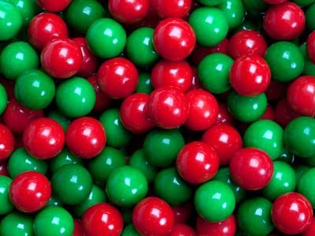
```

]

---

# Outcome of one experiment

```{r}
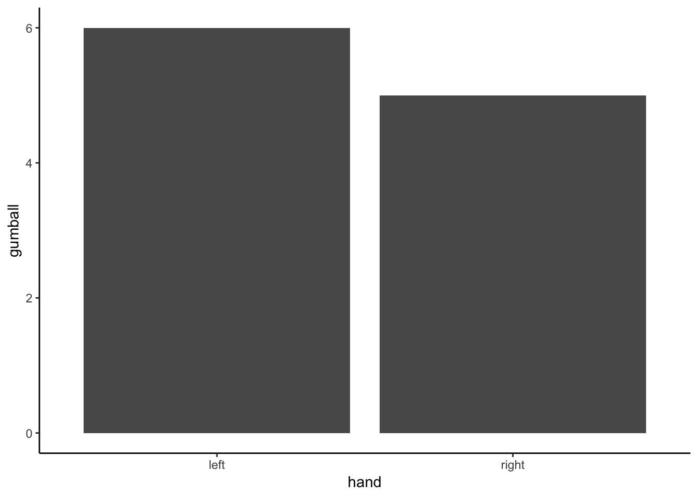
```

---

# Outcome of many experiments

```{r}
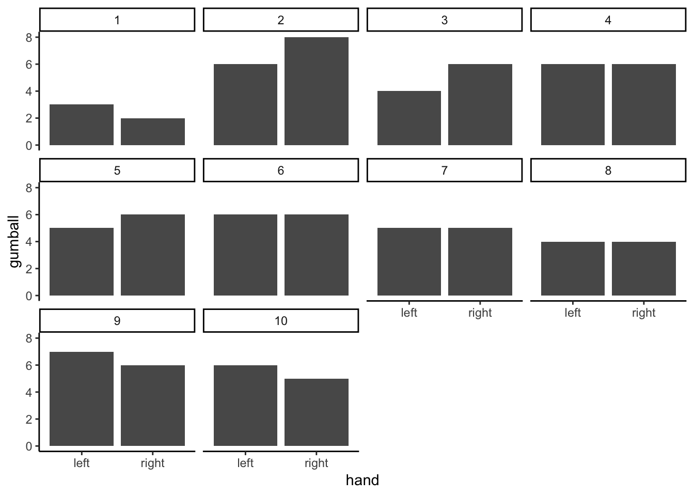
```

---

# Difference scores

```{r}
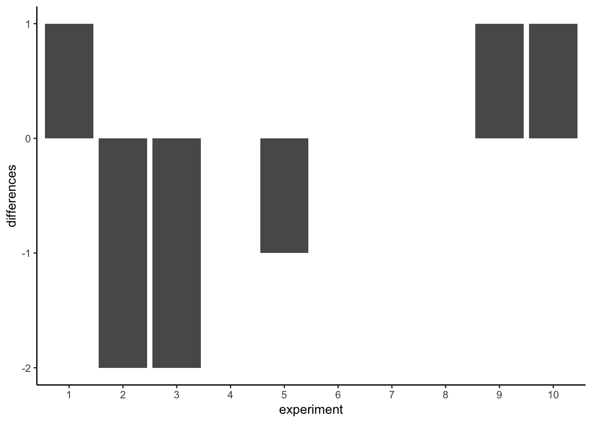
```

---

# Difference scores (100 sims)

```{r}
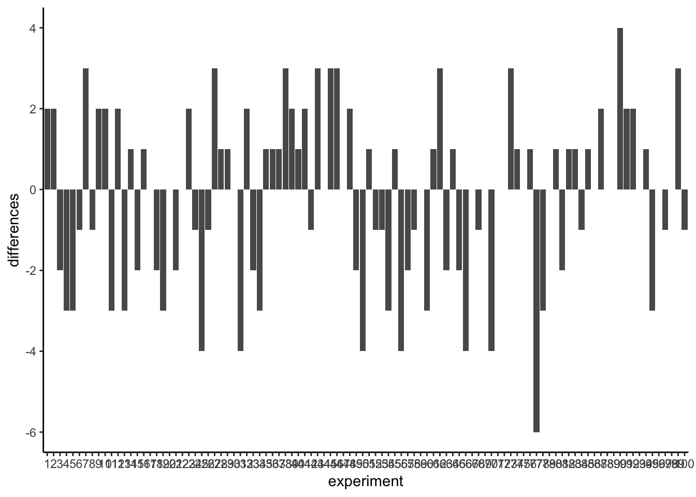
```

---

# Histogram: Difference scores

```{r}
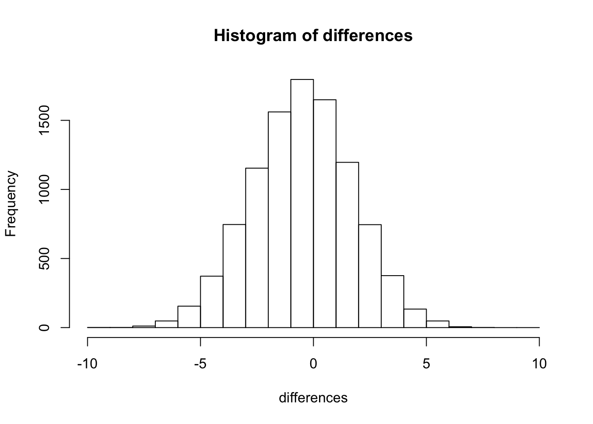
```

---

# Interpretation

.pull-left[

The sampling distribution of mean difference scores shows the range of mean differences that can be produced by chance alone.

- We can use this to evaluate the outcome of an experiment

]

.pull-right[

```{r}

```

]

---

# Interpretation

.pull-left[

- What if mean difference was 0?

- What if mean difference was 3?

- What if mean difference was 6?

]

.pull-right[

```{r}

```

]

---

# How much evidence do you need?

- How big would the mean difference need to be? to convince you that the difference was not caused by chance

---

class: pink, center, middle, clear

# Experiments

---

# Experiments

Experiments are tools we use to uncover causal forces. At minimum they must have:

1. One independent variable
  - The Manipulation
  - must have at least 2 levels
2. One dependent variable
  - The Measurement

---

# A simple experiment

```{r}
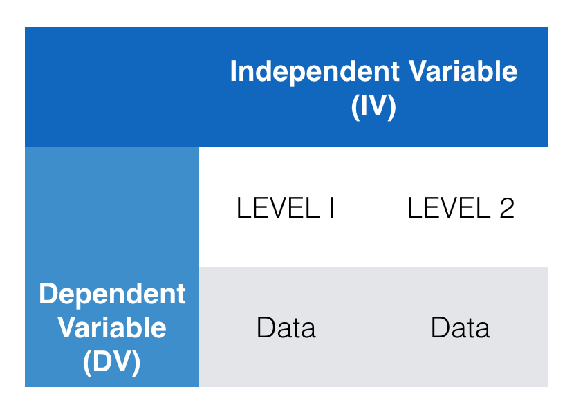
```
            
---

# The empirical question

```{r, out.width="50%"}
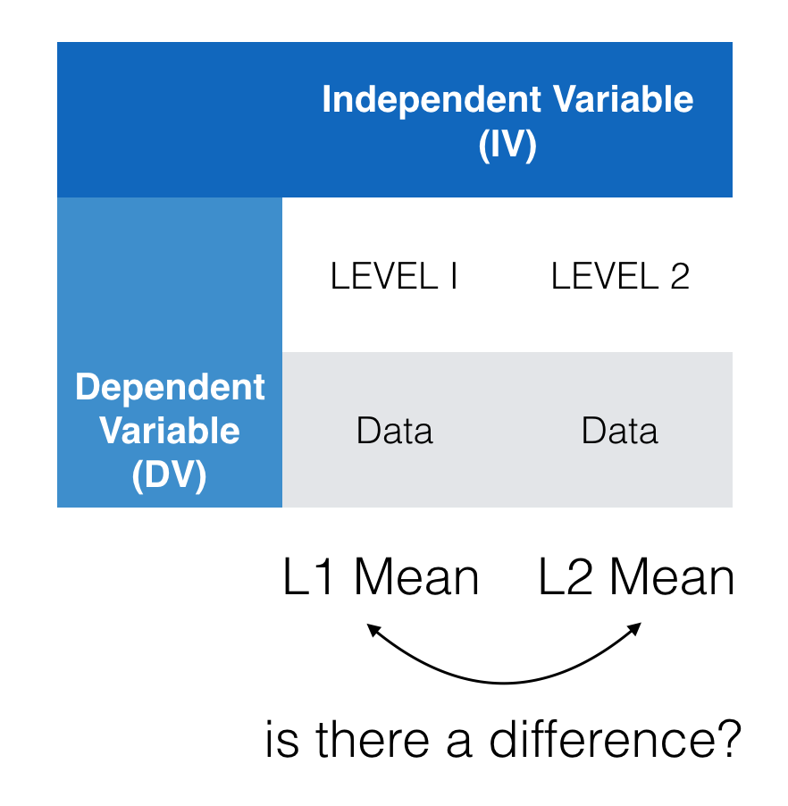
```
            
---

# Interpreting the outcomes

```{r}
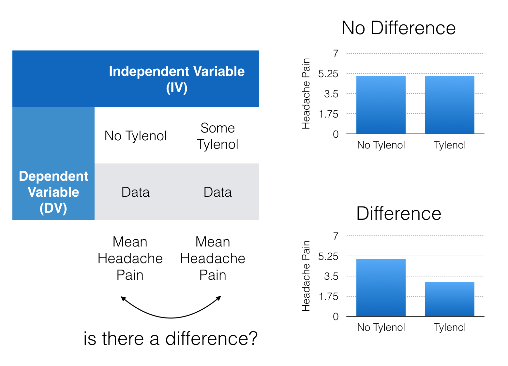
```
            
---

# Interpreting the outcomes

1. We run experiments to determine if a manipulation can cause differences in a measurement.

2. If we find a difference, it could mean:

- Manipulation caused the difference
- A confound caused the difference
- Difference was produced by chance
            
---

# The role of chance

Question: How can we know if a difference we observed was produced by chance?

Answer: We find out the range of differences that chance can produce, then we compare our observed difference to this range. 

---

class: pink, center, middle, clear

# The Crump Test

---

# The Crump Test

- A made up test to illustrate the process of statistical inference

1. Frequency of occurence (what is not alot)
2. Simulating chance
3. Judgment and Decision-making
4. Experiment design
5. Power

---

# Frequency of occurence

We will be finding out how often chance produces mean differences of particular sizes

1. Let's say chance produced a difference of 5 fairly often, if we found a difference of 5, we would know that chance could have produced it.

2. When would we say that an outcome **does not occur very often**?

---

# Infrequent events

How many times does something need to happen for it to happen not very much, or even really not at all? 

Rare enough for you to not worry about it at all happening to you?

---

# Lightning strikes

Would you go outside everyday if you thought that you would get hit by lightning 1 out of every 10 days?

What about?

- 1/100 days (3 times per year)
- 1/1,000 days (once every 2.7 years)
- 1/10,000 days (once every 27 years)
- 1/100,000 days (once every 273 years)

Where do you draw the line?

---

# Drawing the line

There is no objective line defining rare events. You need to pick one you are comfortable with.

Let's pick 1/10,000

We are saying that if an event happens once in 10,000 times, it is a rare event.

---

# Textbook Example

- Experiment with two groups, A and B. Let's imagine there is no manipulation, so we are measuring sampling from the same population twice.

- Each group has 10 subjects (N=10)

- Samples are taken from a normal population with mean=100, and sd = 20

- `rnorm(10,mean=100, sd=20)`

---

# set paramaters of simulation

```{r, echo=T}
sims_to_run <- 10000
sample_n   <- 10
dist_mean  <- 100
dist_sd    <- 20
```


---
# run simulation

```{r, echo=T}
mean_differences <- length(sims_to_run)
for(i in 1:sims_to_run){
  mean_A <- mean(rnorm(sample_n, dist_mean, dist_sd))
  mean_B <- mean(rnorm(sample_n, dist_mean, dist_sd))
  mean_differences[i] <- mean_A - mean_B
}
```

---

# Histogram: Mean differences

```{r}

```

---

# The Chance window

```{r}
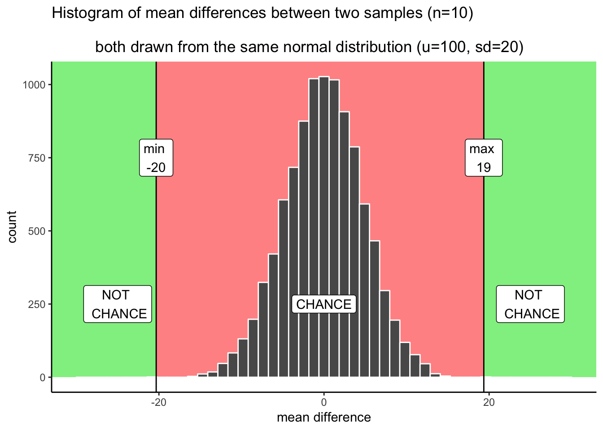
```

---

# Allowing for uncertainty

```{r}
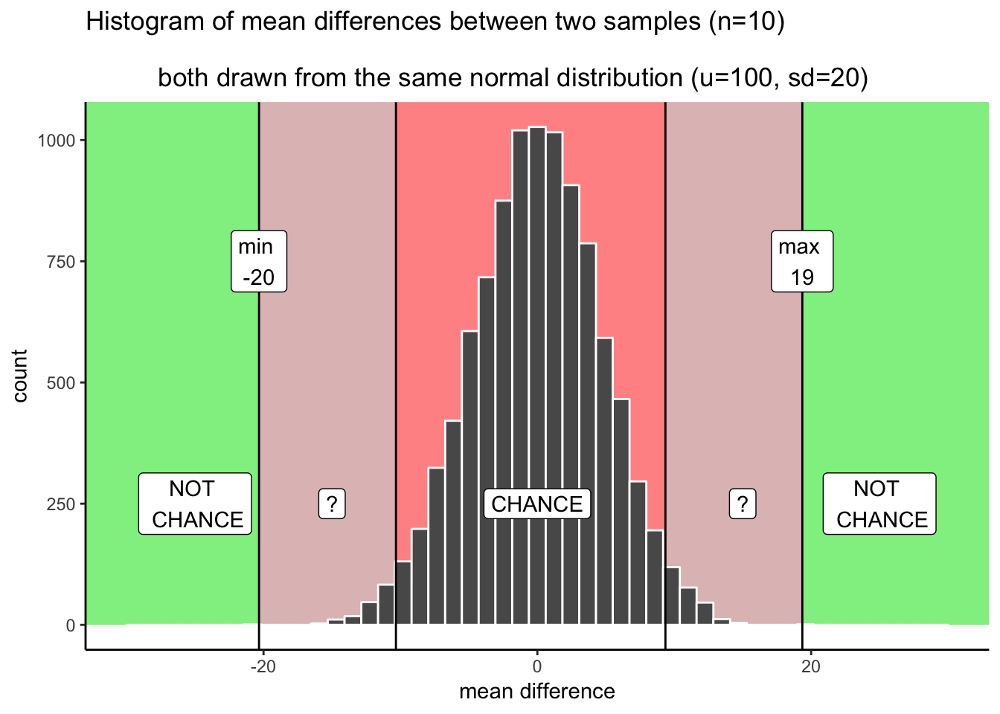
```

---

# Shades of uncertainty

```{r}
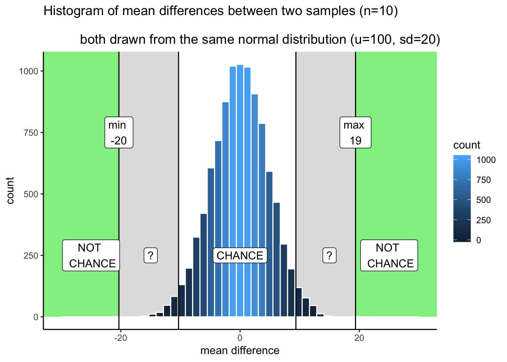
```

---

# Sample size

```{r}
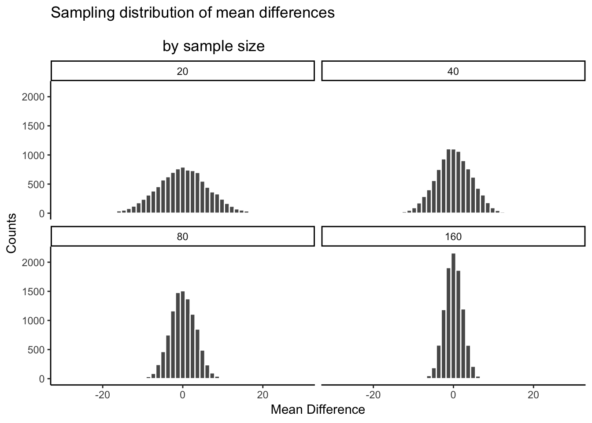
```

---

# Differences that chance can produce

```{r}
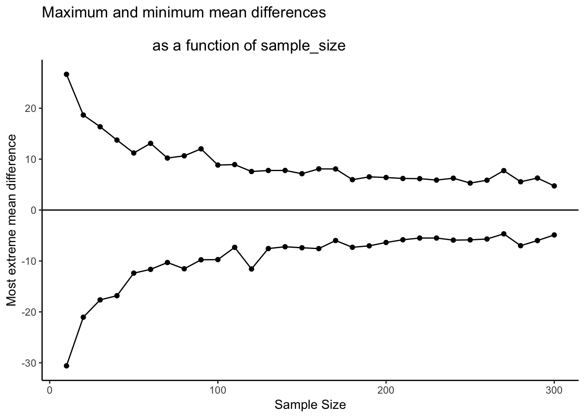
```

---

# Sample-size and detecting differences

```{r}
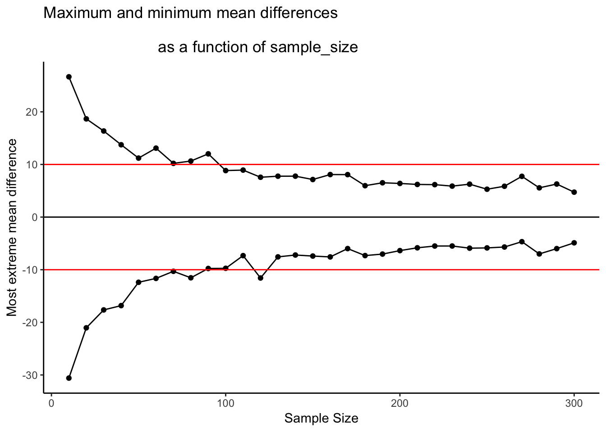
```

---

# Test-enhanced learning

```{r}
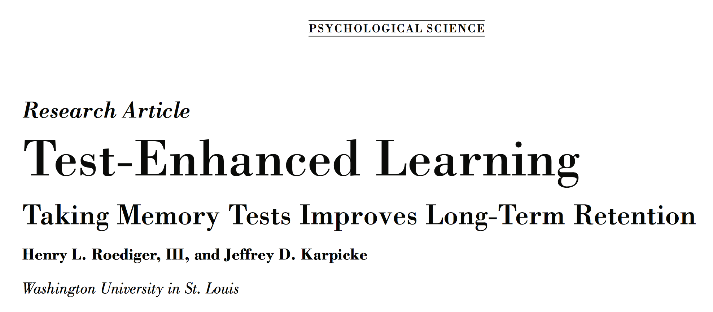
```

---

# The experiment

- Question: Does being tested on the material cause you to remember it better later?

- Study-Study group: Studied some text twice

- Study-Test group: Studied some text, then given brief quizzes about the text


---

# the data

```{r, out.width="70%"}
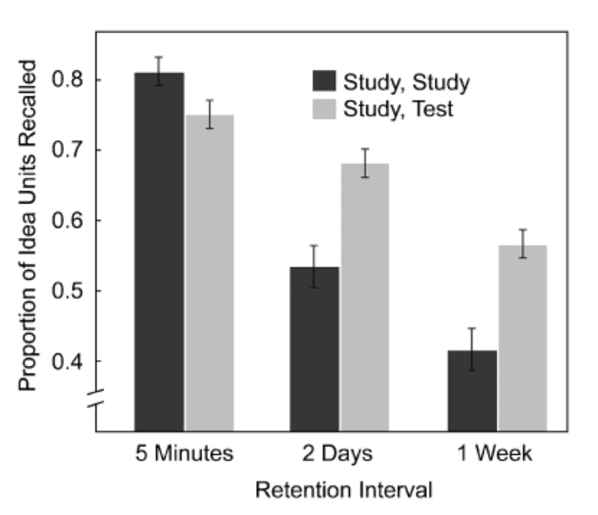
```

---

# Estimate parameters

- Assume both samples came from same distribution, estimated parameters from paper:

```{r, echo=T}
sims_to_run <- 100
sample_n   <- 40
dist_mean  <- .49
dist_sd    <- .168
```

---

# run simulation

- Simulate 100 times

```{r, echo=T}
mean_differences <- length(sims_to_run)
for(i in 1:sims_to_run){
  mean_control_A      <- mean(rnorm(sample_n, dist_mean, dist_sd))
  mean_control_B      <- mean(rnorm(sample_n, dist_mean, dist_sd))
  mean_differences[i] <- mean_control_A - mean_control_B
}
```

---

# plot mean differences

```{r}
plot_df <- data.frame(sim=1:sims_to_run,mean_differences)

library(ggplot2)
ggplot(plot_df,aes(x=mean_differences))+
  geom_histogram(bins=20, color="white")+
  theme_classic()+
  ggtitle("Histogram of mean differences in proportion remembered")+
  xlab("mean difference")
```

---

# find range, make a judgment

```{r}
min(mean_differences)
max(mean_differences)
```

-observed mean difference was .14

---

# Next class: Randomization Test

1. Thursday, October 4th: Randomizing data from a sample for statistical inference, and intro to hypothesis testing

---

# Reminder

1. Quiz 4 is due today Tuesday, October, 2nd end of day (11:59pm).

2. Quiz 5 for Inference will be posted tonight.

---

