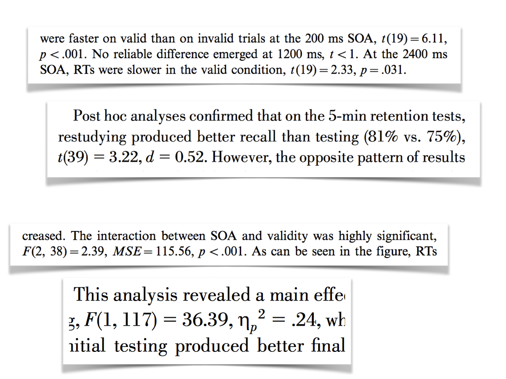
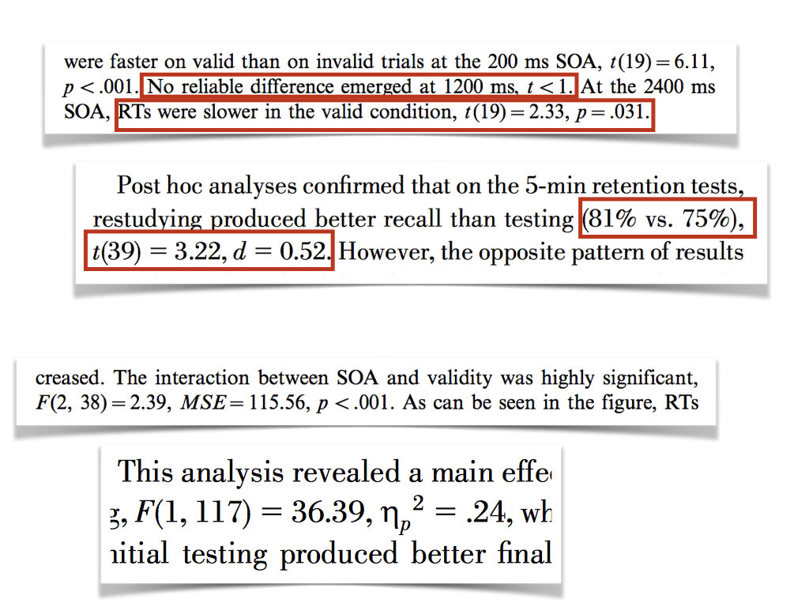
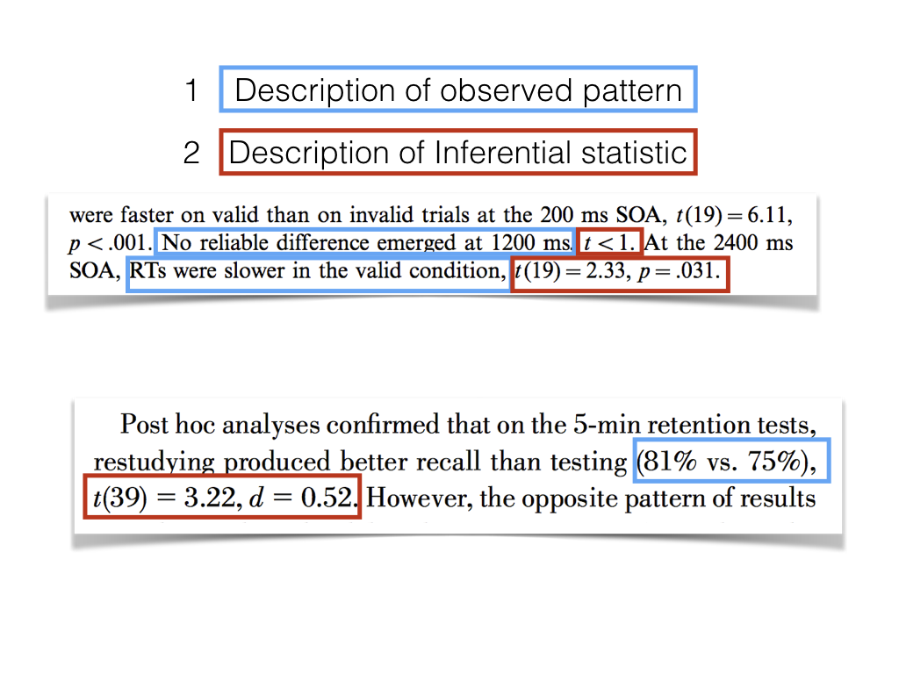
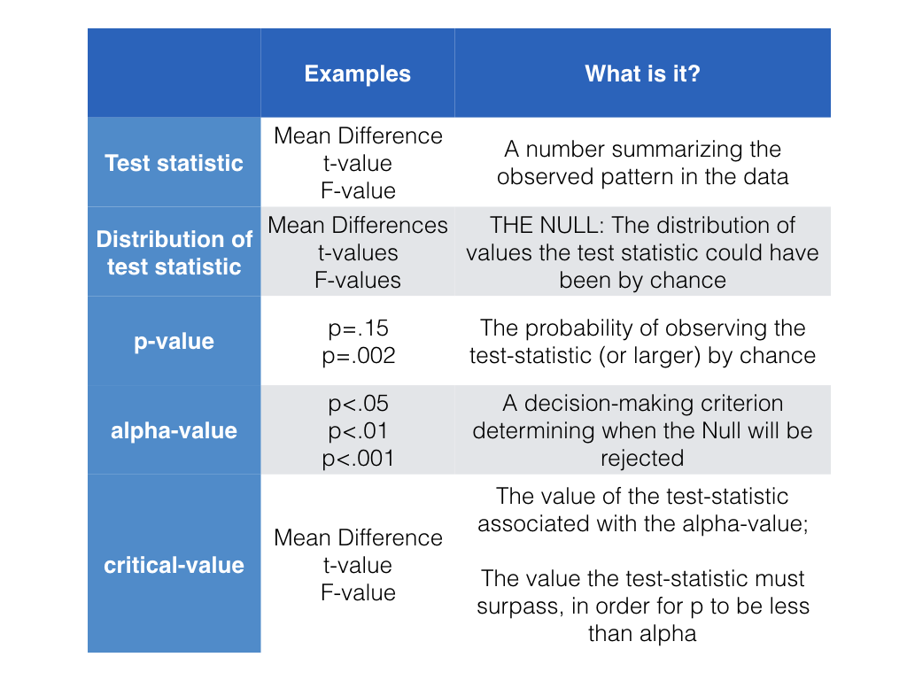
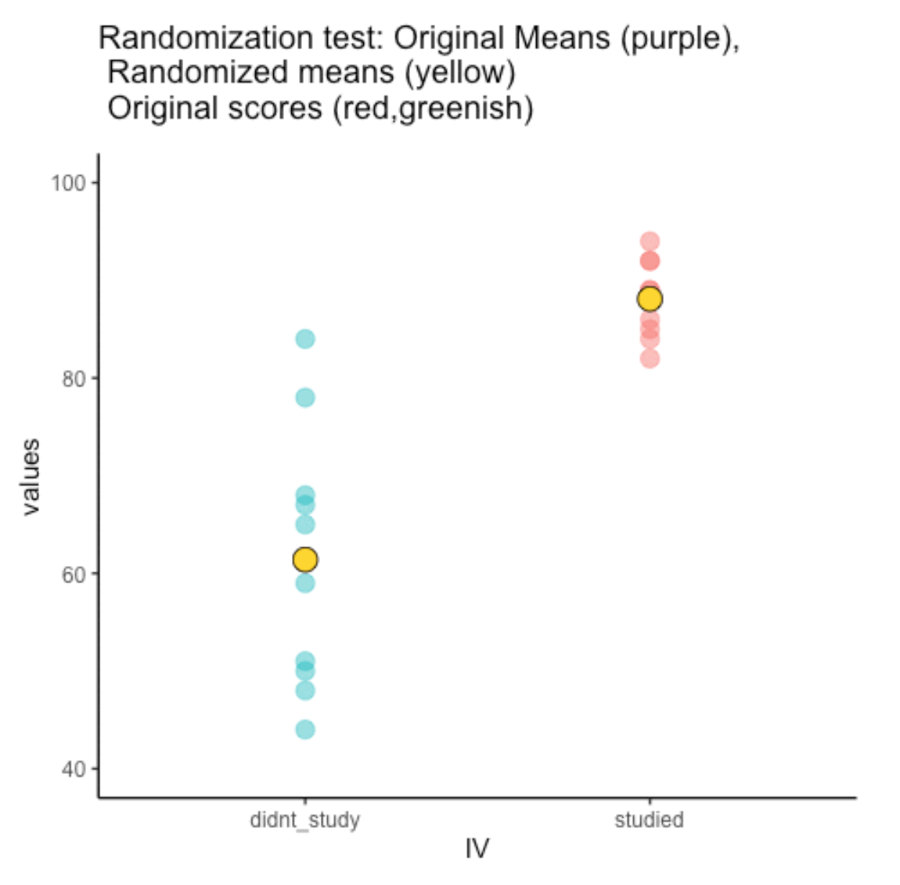
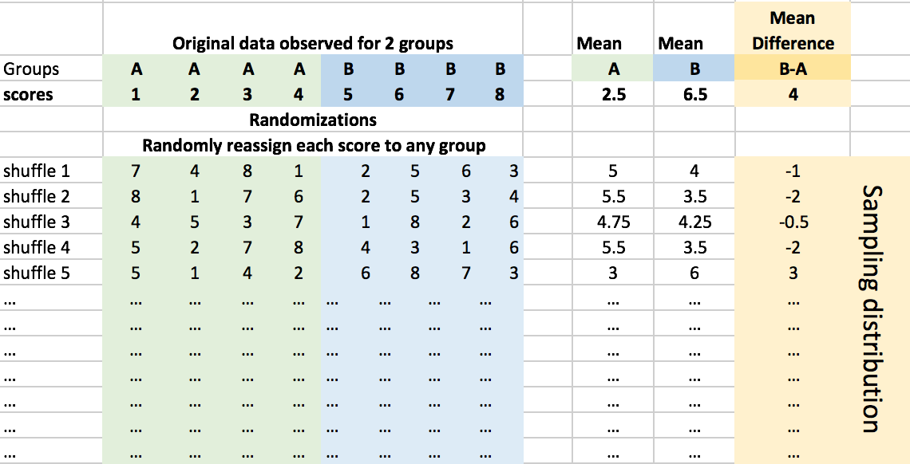

```{r setup, include=FALSE, echo=FALSE}
options(htmltools.dir.version = FALSE)
knitr::opts_chunk$set(echo = FALSE,message=FALSE,warning=FALSE, cache = TRUE,
                      comment=NA)
```


# Topics for class

1. Hypothesis Testing 
2. Randomization Test

---

class: pink, center, middle, clear

# Important skill: Interpreting results sections

---

# Results sections can be confusing

```{r}

```

---

# Learn to identify parts

```{r}

```

---

# Two parts to look for

```{r}

```

---

# Some general issues

**Problem**

Results can be written in different ways, and do not always include all information

**Solution**

Gain a conceptual understanding of the process so you know what is being reported, the purpose of reporting each element, and what isn't being reported.

---

class: center, middle, clear

```{r}

```

---


class: pink, center, middle, clear

# Controversy

---

# Controversy

Definition: disagreement, typically when prolonged, public, and heated.

Would you believe it, statistical inference is controversial. There are different ways to do it. And, reasonable people disagree. Sometimes in public. With heat.

---

class: pink, center, middle, clear

# Hypothesis testing

---

# What is the big idea

The big idea for inferential statistics is to make inferences about where the data came from.
  - You get samples in each condition of an experiment
  - Question: What kind of distribution(s) did these samples come from?

---

# Approaches

1. Hypothesis testing approaches
  - Make hypotheses about the distribution(s) that the sample data could have come from
  - Create a system of judgment or decision-making to accept or reject those hypotheses
  - Often binary outcomes
  
2. Bayesian approaches
 - System of judgment and decision-making is more continuous
 - Establish degree of belief
 
---

# Ronald Fisher

.pull-left[

Sir Ronald Fisher
 - Creator of ANOVA (we learn about this after the midterm)
 - Hypothesis testing as determining the probability that chance could have produced the pattern in your data

]

.pull-right[

```{r}

```

]

---

# A simple experiment

You collect sample data in two experimental conditions A and B.

1. You compare the means to see if they are different
2. You want to know if the experimental manipulation caused a difference
3. You recognize that random sampling error can also produce differences between the means.

---

# Fisherian Null-hypothesis testing

Fisher was primarily concerned with ruling out the possibility that chance could have produced the difference between means.

He was interested in testing the null-hypothesis

**Null-hypothesis**: The difference between the sample means could have been produced by chance alone


---

# How to test the null-hypothesis

1. Making a sampling distribution showing what chance can do. For example, we could make a sampling distribution of the mean differences between two samples drawn from the **same distribution**.
2. Any differences must be due to chance

Let's make a null-distribution


---

.pull-left[

1. Create a null-distribution. This is a chance-window, showing how a statistic can behave by chance alone

]

.pull-right[

```{r}
library(ggplot2)

mean_differences<-rnorm(10000,0,5)
df<-data.frame(sample=1:10000,mean_differences)
ggplot(df,aes(x=mean_differences))+
  geom_histogram(color="white",bins=30)+
  theme_classic(base_size=20)+
  ggtitle("Null Distribution")

```

]


---
# What does the null tell us?

- The null-distribution shows the probabilities of getting different ranges of values.
- More important, it tells us the probability that chance could have produced particular kinds of values.

How do we use this information?

---

# Interpreting the null

Question:

We see that the null can produce a range of values. What kind of value (e.g., mean difference) would you need to find to be confident that chance did not produce the value?

Answer:

There is no objective answer

But, there is common practice (for better or worse)

---

# p < .05

The most common standard is p < .05

- p stands for probability
- .05 refers to a 5% chance

---

# Using p <.05

Let's say that values larger than 10 only occur 5% of the time under the null.

We could adopt a decision-criteria of 5% to evaluate our sample data.

The decision criteria, is also called the **alpha value**.

---

# Rejecting the Null

Situation: Our sample shows a mean difference of 15. Based on the null-distribution, we know that a mean difference of 15 or greater, occurs **less than 5% of the time** (p<.05)

Decision: We reject the null-hypothesis

In other words, we reject the possibility that chance could have produced the result

---

# We might be wrong

If we reject the null, we might be wrong. After all, chance will have some probability of producing the difference.

**Type I error**: Concluding that chance **did not** produce the difference, even when it actually did.

---

# Failing to reject the null

Situation: Our sample shows a mean difference of 2. Based on the null-distribution, we know that a mean difference of 2 or greater, occurs **more than 5% of the time** (p > .05, p is greater than .05)

Decision: We fail to reject the null-hypothesis

In other words, we do not have enough evidence to reject the possibility that chance alone produced the differences

---

# We might be wrong again

If we fail to reject the null, we might be wrong. After all, the manipulation could have caused the difference. The effect may be very small.

**Type II error**: Concluding that the difference is not really caused by the manipulation, even when it actually was.

---


# What should alpha be?

In this tradition, alpha is a line in the sand. It tells us when we reject or fail to reject the null hypothesis.

What should alpha be?

- p < .05?
- p < .01?
- p < .005, or p <.000001?

The decision is up to you...

---

# Consequences of a high alpha

What are the consequences of a high alpha value. E.g., what if we raised to p <. 2, or p < .3?

- What would happen to type I error (wrongly rejecting the null)
- What would happen to type II error (wrongly failing to reject the null)

---

# Consequences of a low alpha

What are the consequences of a high alpha value. E.g., what if we lowered alpha to p <.01 , or p < .005?

- What would happen to type I error (wrongly rejecting the null)
- What would happen to type II error (wrongly failing to reject the null)

---

# Near the line?

What happens when your p-value is really close to the alpha value, say p = .056?

---

# Other hypothesis testing traditions

At the beginning of the lecture I mentioned other traditions...

We stay with Fisher for now, and introduce the others later in this course.

---

# Directional Hypotheses

**Non-directional hypothesis**: The manipulation will cause a difference. Any difference, up or down, positive or negative, just a difference

**Directional hypothesis**: The manipulation cause a difference in a particular direction, positive only, or negative only.

More on this when we get to t-tests

---

class: pink, center, middle, clear

# Randomization Test

---

# Randomization Test

- A way to find out what chance could have done in a particular situation

---


# Three steps

1. Get some data in two conditions, find the sample means for each
2. Randomly shuffle the numbers between the conditions, get the new means, repeat many times
3. Compare the observed difference between the oringal sample means with the sampling distribution of the mean difference scores from the randomly shuffled samples.


---

# Animation of randomization test

```{r, out.width="63%"}

```

---

# Animation of randomization test

```{r}
knitr::include_graphics("figs/randomization/randomizationTest-1.gif")
```

---

# Table of randomization test

```{r}

```

---

# Example: Original scores for A & B

.pull-left[
```{r}
A<-c(1,3,2,4,3,5)
B<-c(6,5,7,6,8,7)
df<-data.frame(A,B)
knitr::kable(df,"html")
```
]

.pull-right[

```{r,echo=T}
mean(A)
mean(B)
mean(B)-mean(A)
```


]


---

# Re-assign scores randomly to groups

.pull-left[
```{r}
all<-c(A,B)
all<-sample(all,12)
A<-all[1:6]
B<-all[7:12]
df<-data.frame(A,B)
knitr::kable(df,"html")
```
]

.pull-right[

```{r,echo=T}
mean(A)
mean(B)
mean(B)-mean(A)
```


]


---

# randomize the scores

```{r,echo=T}
A<-c(1,3,2,4,3,5)
B<-c(6,5,7,6,8,7)
all_scores<-c(A,B)
all_scores
random_scores<-sample(all_scores,12,replace=FALSE)
random_scores
```

---

# assign the random scores

Makes new random samples for A and B, compute new mean difference

```{r,echo=T}
random_A <- random_scores[1:6]
random_B <- random_scores[7:12]
mean(random_B)-mean(random_A)
```

---

# repeat many times

```{r,echo=T}
mean_differences<-c()
for(i in 1:1000){
  random_scores <- sample(all_scores,12,replace=FALSE)
  random_A <- random_scores[1:6]
  random_B <- random_scores[7:12]
  mean_differences[i] <- mean(random_B)-mean(random_A)
}

```

---

# Look at sampling distribution

Red line is original observed mean difference

```{r, out.width="50%"}
df <- data.frame(sim=1:1000,mean_differences)
ggplot(df, aes(x=mean_differences))+
  geom_histogram(bins=15, color="white")+
  geom_vline(xintercept=3.5, color="red", size=1.5)+
  theme_classic(base_size=20)+
  ggtitle("Sampling distribution of mean differences")
```

---

# Adopt an alpha criterion

Let's adopt a 5% alpha rule. We will run a directional test.

We need to find the line in the distribution where 95% of numbers are smaller, and only 5% of numbers are larger.

---

# Find the criticial value

1. Sort the mean_differences variable from smallest to largest. 
2. Find the 950th number

```{r,echo=T}
critical_difference <- sort(mean_differences)[950]
print(critical_difference)
```

---

# Compare

red = original difference, blue= critical value

```{r, out.width="50%"}
ggplot(df, aes(x=mean_differences))+
  geom_histogram(bins=15, color="white")+
  geom_vline(xintercept=3.5, color="red", size=1.5)+
  geom_vline(xintercept=critical_difference, color="blue", size=1.5)+
  theme_classic(base_size=20)+
  ggtitle("Sampling distribution of mean differences")
```

---

# test the null-hypothesis

Null hypothesis: The observed mean difference could have been produced by chance. 

**Reject the null hypothesis:** We reject the null-hypothesis when the probability of the observed mean difference (3.5) or larger is less than 5%

**Fail to the reject the null:** We retain (fail to reject) the null when the probability of the observed mean difference (3.5)  or larger is greater than 5%.

---

# test the null-hypothesis

We found that 5% of the mean differences from the simulation were `r critical_difference` or greater.

**Reject the null hypothesis:** We reject the null-hypothesis when the probability of the observed mean difference (3.5) or larger is less than 5%

**Fail to the reject the null:** We retain (fail to reject) the null when the probability of the observed mean difference (3.5)  or larger is greater than 5%.

---

# Probability of our observed difference

We could find the probability of obtaining our observed mean difference by chance alone.

1. Find all the numbers equal to or greater than 3.5
2. Count them, and divide by number of simulations

```{r}
get_bigger <- mean_differences[mean_differences>=3.5]
length(get_bigger)/1000
```


---

# Properties of Randomization tests

The number of simulations (randomizations) matter. 
  - what would happen if you ran too few?
  - how many do you need to run?
  
---

# varying the number of simulations

```{r}
num_sim<-c(20,50,100,200,500,1000,5000,10000)
critical<-c()
for(j in num_sim){
  mean_differences<-c()
  for(i in 1:j){
    random_scores <- sample(all_scores,12,replace=FALSE)
    random_A <- random_scores[1:6]
    random_B <- random_scores[7:12]
    mean_differences[i] <- mean(random_B)-mean(random_A)
  }
  critical<-c(critical,sort(mean_differences)[round(j*.95)])
}
df<-data.frame(num_sim,critical)
ggplot(df, aes(x=num_sim,y=critical))+
  geom_point()+
  geom_line()+
  theme_classic(base_size=20)+
  ggtitle("5% critical value by # of simulations")
```

---

# Non-parametric tests

Randomization tests are non-parametric

1. They do not make assumptions about distributional parameters
  - e.g., we did not assume our samples came from any particular kind of distribution


---

# Next class: T-Tests

- Quiz 4 is due tonight @ 11:59 pm
- Quiz 5 begins today, due next wednesday @ 11:59pm


