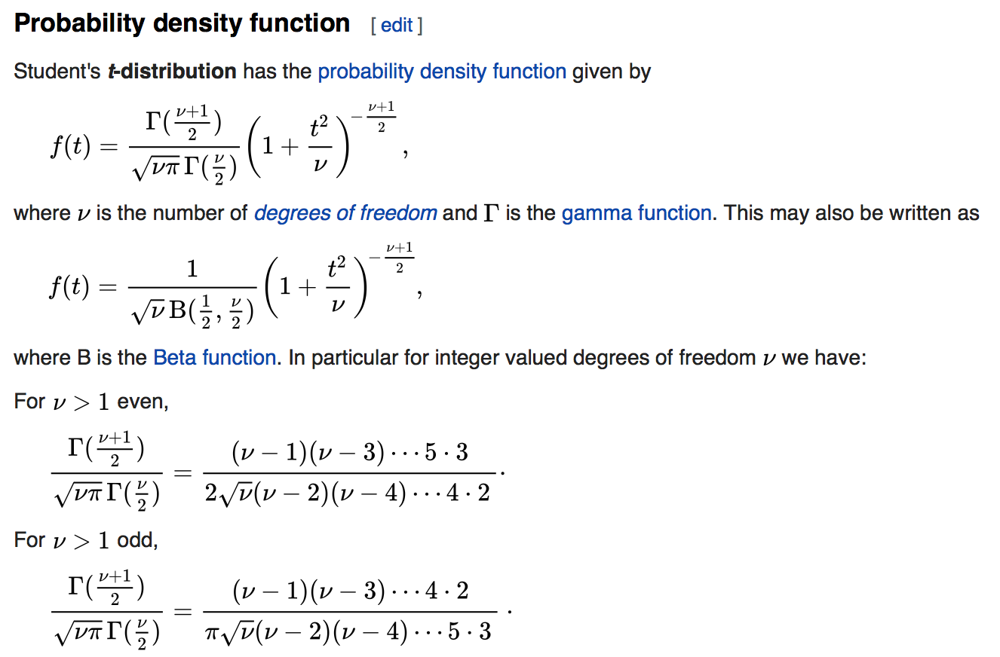
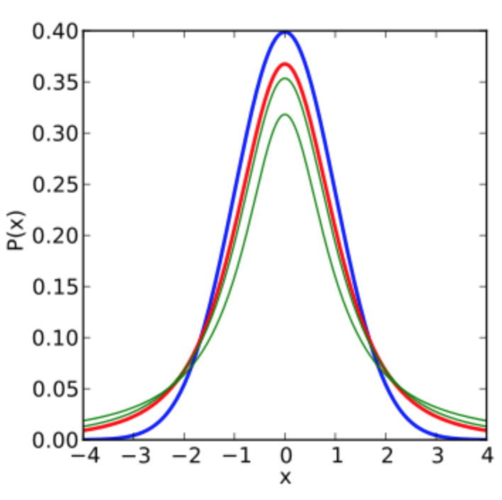
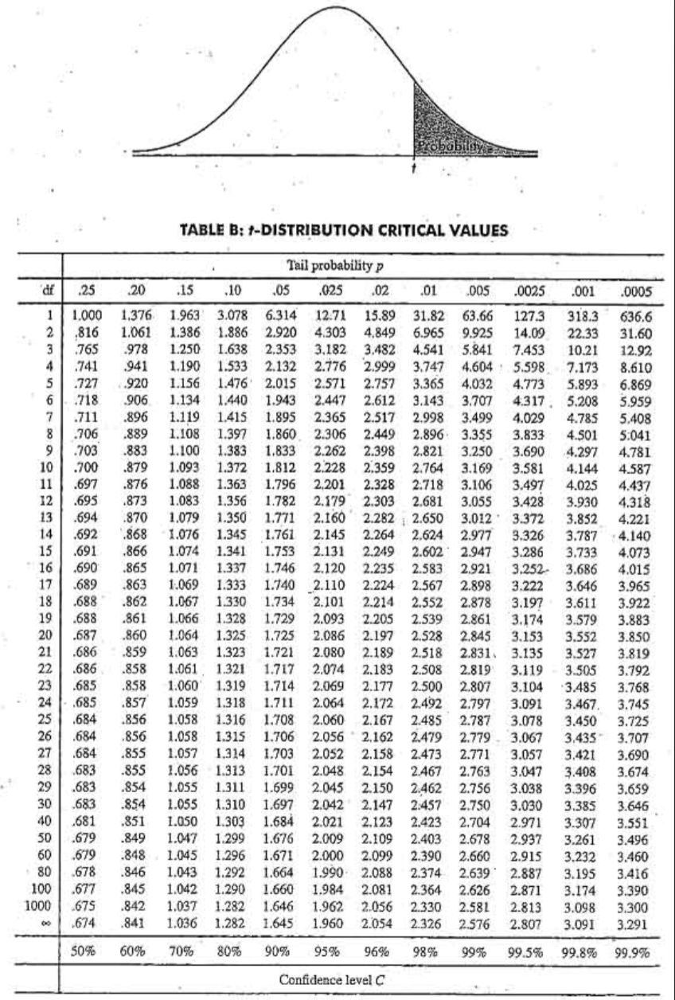

```{r setup, include=FALSE, echo=FALSE}
options(htmltools.dir.version = FALSE)
knitr::opts_chunk$set(echo = FALSE,message=FALSE,warning=FALSE, cache = TRUE)
```


class: pink, center, middle, clear

# Student's t-test

---

# William Sealy Gosset

.pull-left[

- Creator of t-test (1908)
- Worked for Guiness breweries, published under a pseuodnym (student)

]

.pull-right[

```{r}

```

]

---

class: center

# The Guiness Problem


```{r}

```

---

# This Class

1. The t statistic 
2. Experimental design and t-tests
3. One-sample t-test

---

# Common ratio in inferential stastics

Many inferential statistics have a common form

.center[
$\text{Inferential statistic}=\frac{\text{Measure of Effect}}{\text{Measure of Error}}$
]

Measure of effect = Some measure of the pattern in data
Measure of error = Some measure of random fluctuation in the data

---

# t-statistic (big idea)

(FYI, no one really knows what t stands for...)

.center[
$t = \frac{\text{Mean}}{\text{Standard Error of the Mean}}$
]

**Why would anyone bother dividing a mean by the SEM?**

---

# Confidence in mean

```{r}
Mean<-c(5,5,5,5,5)
SEM<-c(.1,.5,1,5,10)
t<-Mean/SEM
df<-data.frame(Mean,SEM,t)
knitr::kable(df,"html")
```

---

# Two questions

1. What must be true if a t-value is less than 1?
2. What must be true if a t-value is greater than 1?

---

# a bit of R

```{r,echo=T}
my_t <- function(x){
  mean(x)/(sd(x)/sqrt(length(x)))
}

sample <- c(1,5,4,3,6,7)
my_t(sample)
t.test(sample)$statistic

```

---

# The sampling distribution of t

1. Take a sample of size n from a normal population
2. Compute t
3. Repeat many times
4. Plot the distribution

---

# Simulating the t distribution

```{r, echo=T}
ts <- c()
for(i in 1:1000){
  sample <- rnorm(10,0,1)
  ts[i] <- t.test(sample)$statistic
}
  
```

---

# Plotting the histogram

```{r}
df <- data.frame(sims=1:1000,ts)
library(ggplot2)
ggplot(df, aes(x=ts))+
  geom_histogram(color="white")+
  ggtitle("Simulated t-distribution")+
  theme_classic(base_size=24)+
  xlab("t-value")

```


---

# Formula for t-distribution

```{r}

```


---

# t distributions

.pull-left[

- shaped like a normal
- **but**, more spread out
- depends on sample-size (df)

- blue is normal(0,1)
- red is t(df=1)
- green is t(df=2, and df=3)

]

.pull-right[

```{r}

```

]

---

# ts and ps

.pull-left[

- t-distribution with 9 degrees of freedom
- one-directional test
- Only 5% of ts are larger than `r qt(.95,9)`

]

.pull-right[
```{r}
dt<-dt(seq(-5,5,.1),9)
t_values<-seq(-5,5,.1)
df<-data.frame(t_values,dt)
ggplot(df,aes(y=dt,x=t_values))+
  geom_line()+
  xlab("t-value")+
  geom_vline(xintercept=qt(.95,9))+
  theme_classic(base_size=24)+
  ggtitle("t(df=9)")
```

]

---

class: center

# ts and ps the old way

```{r,out.width="45%"}

```


---

# pt(): find p for a t

Use the `pt()` function to find the probability (p) of t-values (from smallest possible to value of t)

- Must supply t-value, and df.


- For a t-distribution (df=9), what is the probability that a t-value will be 0 or smaller?

```{r,echo=T}
pt(q=0,df=9)
```

---

# pt(): more examples

- For a t-distribution (df=9), what is the probability that a t-value will be 1 or smaller?

```{r,echo=T}
pt(q=1,df=9)
```

- For a t-distribution (df=9), what is the probability that a t-value will be 1 or greater?

```{r,echo=T}
1-pt(q=1,df=9)
```

---


# qt(): find t for a p

Use the `qt()` function to find the t-value associated with a particular p-value.

- Must supply p-value, and df.


- For a t-distribution (df=9), what value of t has a probability of .5?

```{r,echo=T}
qt(p=0.5,df=9)
```

---

# qt(): more examples

- For a t-distribution (df=9), what value of t or smaller occurs 95% of the time?

```{r,echo=T}
qt(p=.95,df=9)
```

- For a t-distribution (df=9), what value of t or smaller occurs 5% of the time

```{r,echo=T}
qt(p=.05,df=9)
```

---

# comparing solutions

A simulated t-distribution gives similar p-values to analytic answer (using `pt()`)

```{r,echo=T}
all_ts<-replicate(10000,t.test(rnorm(10,0,1))$statistic)
length(all_ts[all_ts<=2])/10000

pt(2,9)
```

---

class: pink, center, middle, clear

# t-tests and designs

---

# Three kinds of t-tests

1. one-sample
2. paired-sample
3. Independent sample

---

# One-sample t-test

Purpose: Compare sample mean to a hypothetical population mean

---

# Paired-sample t-test

Purpose: Compare two sample means in a within-subjects design

Within-subjects design: Same subjects are measured across both levels of the experimental manipulation (independent variable)

---

# Independent-sample t-test

Purpose: Compare two sample means in a between-subjects design

Between-subjects design: Different subjects are measured across both levels of the experimental manipulation (independent variable)

---


class: pink, center, middle, clear

# One-sample t-test

---

# One-sample t-test

.pull-left[

Purpose: Compare sample mean to a hypothetical population mean

- $\bar{X}$ = sample mean
- $u$ = hypothetical population mean
- $s$ = sample standard deviation (divide by n-1)
- $n$ = sample-size

]

.pull-right[

$t = \frac{\bar{X}-u}{\text{SEM}}$

$t = \frac{\bar{X}-u}{\frac{s}{\sqrt{n}}}$

$s = \sqrt{\frac{\sum{(x_i-\bar{X})^2}}{N-1}}$

]

---

# An example

```{r}
subjects<-c(1,2,3,4,5)
scores<-c(.5,.56,.76,.8,.9)
df<-data.frame(subjects,scores)
```


.pull-left[

Question: 

What population did this sample come from?

```{r, echo=T}
mean(scores)
sd(scores)
```

]

.pull-right[

```{r}
knitr::kable(df)
```

]

---

# Best guesses

Remember

1. The sample mean is our best estimate of the population mean
2. The sample standard deviation (dividing by N-1) is our best estimate of the population standard deviation

---

# One possibility


.pull-left[

.font70[Our sample statistics are consistent with the data coming from a normal distribution with the following mean and standard deviation]

```{r, echo=T}
mean(scores)
sd(scores)
```

]

.pull-right[

```{r}
knitr::kable(df)
```

]


---

# Testing other possibilities

The one sample t-test allows us to test other possibilities. For example:

Could the data have come from a normal distribution with...

- mean = .25
- mean = .5
- mean = .75

---

# Conducting the t-test

Steps:

1. Compute the observed t-value $t_\text{observed}$
2. Set alpha criteria (p <. 05)
3. We will conduct a directional test
4. Find the probability that t could be $t_\text{observed}$ or larger

---

# Computing t for one-sample test

Could the scores have come from a normal distribution with mean =.25?

$t = \frac{\bar{X}-u}{\frac{s}{\sqrt{n}}}$

```{r, echo=T}
scores<-c(.5,.56,.76,.8,.9)
effect <- (mean(scores)-.25)
error  <- sd(scores)/sqrt(5)
t      <- effect/error
t
```

---

# Compute the associated p-value

Use pt(), df (degrees of freedom) is n-1.

```{r, echo=T}
pt(t,df=4) # left side
1-pt(t,df=4) # right side
```

---

# Looking at the evidence

- Our sample mean was `r mean(scores)`
- Observed t was `r t`
- The associated p was `r 1-pt(t,df=4)`

What does this mean? 

The probability that our sample mean (or greater) came from normal distribution with (mean =.25, sd = `r sd(scores)`) is `r 1-pt(t,df=4)`.

---

# Making a decision

Write up of results:

We conducted a one sample t-test comparing the sample mean (`r mean(scores)`) against a population mean of .25, t(4) = `r round(t,digits=2)`, p = `r round(1-pt(t,df=4),digits=4)`.

Our conclusion

- We set an alpha criteria of p<.05. We reject the hypothesis that our sample mean came from a normal population with mean =.25, and sd = `r round(sd(scores), digits=2)`.

---

# t.test()

R has a t-test function that let's you do all three kinds of t-tests. Here is how you conduct a one-sample t-test using the function.

```{r, eval=F, echo=T}
scores<-c(.5,.56,.76,.8,.9)
t.test(scores, mu = .25, alternative="greater")
```

- alternative="greater" specifies a directional test: to find probability  of t or greater
- alternative="lesser" directional test to find probability of t or less


---

# t.test() output

```{r, echo=T}
t.test(scores, mu=.25, alternative="greater")
```

---

# testing u =.5

```{r, echo=T}
t.test(scores, mu=.5, alternative="greater")
```

---

# testing u =.75

```{r, echo=T}
t.test(scores, mu=.75, alternative="greater")
```

---

# Extracting values

The `t.test()` function generates a bunch of output, sometime you might want to to extract the t-value, and the p-value.

```{r, echo=T}
x <- t.test(scores, mu=.75, alternative="greater")
x$statistic
x$p.value
```


---

class: pink, center, middle, clear

# Thinking ahead to paired samples-test

---

# Consider this

Within-subjects experiment, n=5, all subjects are measured in level A and B of the experiment.

```{r}
subjects<-c(1,2,3,4,5)
level_A <-c(1,4,3,6,5)
level_B <-c(4,8,7,9,10)
df<-data.frame(subjects,level_A, level_B)
knitr::kable(df, "html")
```


---

# Empirical question

Did the manipulation (A vs. B) cause a difference in the measure?

```{r}
knitr::kable(df, "html")
```

---

# Difference scores

How could a one-sample t-test be used to analyze the difference scores?

```{r}
df<-cbind(df, differences=level_B-level_A)
knitr::kable(df, "html")
```

---


# Next class: Paired-Sample t-test

1. Thursday, October 11th: paired sample t-tests

---

# Reminder

1. Quiz 5 is due today Tuesday, October, 9th end of day (11:59pm).
2. Quiz for this week will be posted tonight or tomorrow.
3. No quiz next week (midterm review)


---

```{r, eval=F}

t.test(scores, mu=.5, alternative="greater")

test_mean<-replicate(10000,mean(rnorm(5,.5, sd(scores))))
hist(test_mean)
length(test_mean[test_mean>mean(scores)])/10000

mean_test <- function(x,sims){
  m<-mean(x)
  s<-sd(x)
  all_sim<-replicate(sims,mean(rnorm(length(x),0,s)))
  possible<-c(all_sim[all_sim<=(-1*abs(m))],all_sim[all_sim>=abs(m)])
  p_value<-length(possible)/sims
  return(list(m,p_value))
}

save_df<-data.frame()

for(i in 1:100){
  sample_score<-rnorm(10,0,1)
  t_out<-t.test(sample_score)
  m_out<-mean_test(sample_score,10000)
  t <- t_out$statistic
  t_p <- t_out$p.value
  m_samp <- m_out[[1]]
  m_p <- m_out[[2]]
  
  t_df<-data.frame(t,t_p,m_samp,m_p)
  save_df<-rbind(save_df,t_df)
}

ggplot(save_df, aes(x=t_p,y=m_p))+
  geom_point()

t_outcome<-save_df$t_p<.05
m_outcome<-save_df$m_p<.05

mean(t_outcome==m_outcome)


```


