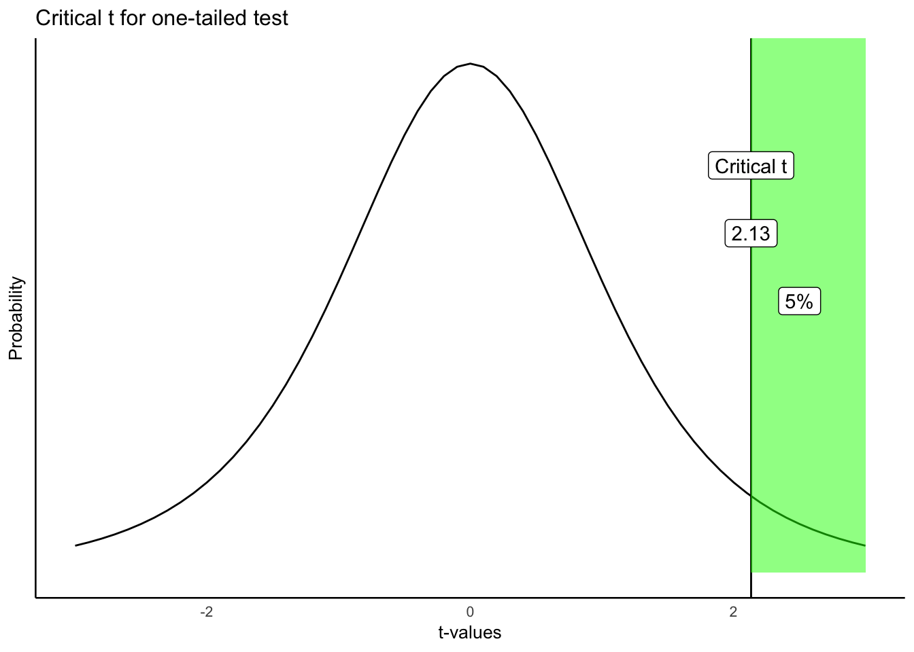

```{r setup, include=FALSE, echo=FALSE}
options(htmltools.dir.version = FALSE)
knitr::opts_chunk$set(echo = FALSE,message=FALSE,warning=FALSE, cache = TRUE)
```


class: pink, center, middle, clear

# t-tests and designs

---

# Three kinds of t-tests

1. one-sample
2. paired-sample
3. Independent sample

---

# One-sample t-test

Purpose: Compare sample mean to a hypothetical population mean

---

# Paired-sample t-test

Purpose: Compare two sample means in a within-subjects design

Within-subjects design: Same subjects are measured across both levels of the experimental manipulation (independent variable)

---

# Consider this

Within-subjects experiment, n=5, all subjects are measured in level A and B of the experiment.

```{r}
subjects<-c(1,2,3,4,5)
level_A <-c(1,4,3,6,5)
level_B <-c(4,8,7,9,10)
df<-data.frame(subjects,level_A, level_B)
knitr::kable(df, "html")
```


---

# Empirical question

Did the manipulation (A vs. B) cause a difference in the measure?

```{r}
knitr::kable(df, "html")
```

---

# Difference scores

How could a t-test be used to analyze the difference scores?

```{r}
df<-cbind(df, differences=level_B-level_A)
knitr::kable(df, "html")
```

---

# Paired samples t-test

.pull-left[

Purpose: Compare two means from paired samples

- $\bar{X}_D$ = mean of difference scores
- $u_0$ = hypothetical population mean of 0
- $s_D$ = sample standard deviation of difference scores (divide by n-1)
- $n$ = sample-size

]

.pull-right[

$t = \frac{\bar{X_D}-u_0}{\text{SEM}_D}$

$t = \frac{\bar{X_D}-u_0}{\frac{s_D}{\sqrt{n}}}$

$s = \sqrt{\frac{\sum{(x_i-\bar{X})^2}}{N-1}}$

]

---

# In other words

.pull-left[

A paired samples t-test is a one-sample t-test applied to the difference scores

We are testing the null-hypothesis that the differences have a mean of 0 (u=0).

]

.pull-right[

Observed $t$ for paired samples test:

$t = \frac{\text{Mean of Difference scores}}{\text{SEM of Difference scores}}$

]

---

# Calculating Difference scores

Assume 5 subjects participated in both conditions (A and B) of an experiment.

```{r,echo=T}
A <-c(1,4,3,6,5)
B <-c(4,8,7,9,10)
difference <- B-A
print(difference)

```

---

# Calculating Mean and SEM

```{r,echo=T}
A <-c(1,4,3,6,5)
B <-c(4,8,7,9,10)
difference <- B-A
# Calculate Mean
mean(difference)

# Calculate SEM
sd(difference)/sqrt(length(difference))

```

---

# Calculate t (paired samples)

```{r, echo=T}

A <-c(1,4,3,6,5)
B <-c(4,8,7,9,10)
difference <- B-A
mean_D <- mean(difference)
SEM_D <- sd(difference)/sqrt(length(difference))

# calculate t
mean_D/SEM_D

```

---

# using the t.test() function

There are two ways to use the t.test() function to calculate t for paired samples

1. Treat the data as difference scores

```{r, echo=T}
A <-c(1,4,3,6,5)
B <-c(4,8,7,9,10)
difference <- B-A

t.test(difference)$statistic

```


---

# using the t.test() function

2. Use both variables for each sample, and set `paired=TRUE`

```{r, echo=T}
A <-c(1,4,3,6,5)
B <-c(4,8,7,9,10)

t.test(A,B, paired=TRUE)$statistic

```

Note: t is (-) here because the t.test formula computes the differences as the first variable minus the second variable.

---

class: pink, center, middle, clear

# Hypothesis testing

---

# Where did t come from?

1. We can compute t for a paired sample

Next Steps for hypothesis testing:

Big Question: Could our observed t be produced by chance alone?

- How can we figure this out?

---

# Null distribution of t

Answer: We need to find out what kind of ts can be produced by chance alone

- we need to find the null distribution of t

---

# What is the null distribution of t?

Null distribution of t:
 - the distribution of t values that would occur by chance alone if the experimental manipulation caused no difference in the sample means

---

# Hypothetical possibilities

.pull-left[

The null

- both samples come from the same distribution

```{r,fig.height=4}
values<-seq(-5,5,.1)
density<-dnorm(values,0,1)
df<-data.frame(values,density)
library(ggplot2)
ggplot(df, aes(x=values,y=density))+
  geom_line()+
  theme_classic(base_size=20)
```


]

.pull-right[

The "alternative"

- each sample comes from it's own distribution

```{r,fig.height=4}
values<-seq(-5,5,.1)
density<-dnorm(values,0,1)
df<-data.frame(values,density)
library(ggplot2)
ggplot(df, aes(x=values-1,y=density))+
  geom_line()+
  geom_line(aes(x=values+1,y=density))+
  theme_classic(base_size=20)+
  xlab("values")
```

]


---

# Considering the null

.pull-left[

The null

- both samples come from the same distribution

```{r,fig.height=4}
values<-seq(-5,5,.1)
density<-dnorm(values,0,1)
df<-data.frame(values,density)
library(ggplot2)
ggplot(df, aes(x=values,y=density))+
  geom_line()+
  theme_classic(base_size=20)
```


]

.pull-right[

Question:

.font80[
- if we sampled two sets of scores from the **same distribution**, what would we expect for the sampling distribution of the mean difference scores?
- how about the sampling distribution of t?
]


]

---

# Observed vs. critical t

**Observed t**: 
- the t-value that you calculate from your data

**Critical t**:
 - a t-value associated with the null-distribution
 - depends on alpha, and df
 - e.g., if alpha =.05, then any t bigger than critical t occurs 5% of the time by chance


---

# simulating t

The following slide allows you to explore simulating a null and alternative distributions for a paired sample t-test

1. pick n (sample-size)
2. choose mean of normal distribution for each sample
3. choose sd of normal distribution
4. choose number of simulations

---

class: center, middle, clear

```{r, results='asis',out.extra=""}
cat('<iframe style="width:100%;height:100%;border-style:none;", src="https://crumplab.shinyapps.io/pairedTtest/" />\n')
```


---

# Questions to ask

1. When each sample comes from the same distribution, what is the average mean difference between the samples?

--

2. What happens to the range of the sampling distribution of mean differences as sample-size increases?

--

3. What happens to the range of the sampling distribution of mean differences as the standard deviation of the population increases?

---

# More questions

1. If the two samples are taken from the same distribution, what percent of the time will be the observed t-value be greater than critical t?

2. What happens to observed t when the samples are taken from distributions with different means?

3. What are some ways (e.g., change sample-size, sd, mean difference) to ensure that observed t will generally be larger than critical t?


---

# Critical t

Critical t is set by two properties:

1. the alpha criterion
2. whether the test is directional (one-tailed) or non-directional (two-tailed)

---

# Directional test (reminder)

A directional test assumes that the experimental manipulation will cause a difference in a particular direction.

- mean for A > (greater than) mean for B
- mean for A < (less than) mean for B

---

# Critical t (one-tailed) example

Critical t for a directional (one-tailed) test

- alpha = 0.05, or 5%

Critical t is the t-value associated with a null-distribution where this t-value or larger occurs 5% of the time.

---

# Critical t (one-tailed)

```{r}

```

---

# Critical t depends on df and alpha

.pull-left[

The table shows values of critical t for a one-tailed test

- alpha values of .10, .05, and .01
- degress of freedom from 5 to 100

]

.pull-right[

```{r}
df<-c(5,6,7,8,9,10,20,50,100)
p_05 <- round(qt(.95,df), digits=2)
p_01 <- round(qt(.99,df), digits=2)
p_10 <- round(qt(.90,df), digits=2)

t_df <- data.frame(df, p_10,p_05,p_01)
knitr::kable(t_df,"html")
```

]

---

# Non-Directional test 

A non-directional test assumes that the experimental manipulation will cause **any** difference.

- mean for A != (will not equal) mean for B

E.g., 

- Mean for A could be bigger or smaller than mean for B

---

# Non-directional test (2-tailed)

```{r}
knitr::include_graphics("figs/ttest/6twotailedt-1.png")
```

---

# Comparing critical t (1 vs 2 tailed)

.pull-left[

One-tailed

```{r}
df<-c(5,10,20,50,100)
p_05 <- round(qt(.95,df), digits=2)
p_01 <- round(qt(.99,df), digits=2)
p_10 <- round(qt(.90,df), digits=2)

t_df <- data.frame(df, p_10,p_05,p_01)
knitr::kable(t_df,"html")
```

]

.pull-right[

Two-tailed

```{r}
df<-c(5,10,20,50,100)
p_05 <- round(qt(.975,df), digits=2)
p_01 <- round(qt(.995,df), digits=2)
p_10 <- round(qt(.95,df), digits=2)

t_df <- data.frame(df, p_10,p_05,p_01)
knitr::kable(t_df,"html")
```

]

---

# Making decisions

.pull-left[
One-tailed
 - reject null 
  - observed t in green area
 - fail to reject null 
  - observed t in white area

]

.pull-right[

```{r,out.width="100%"}

```

]

---

# Making decisions

.pull-left[
Two-tailed
 - reject null 
  - observed t in green area
 - fail to reject null 
  - observed t in white area

]

.pull-right[

```{r,out.width="100%"}
knitr::include_graphics("figs/ttest/6twotailedt-1.png")
```

]

---

class: pink, center, middle, clear

# Example from lab

---

# Mehr, Song, and Spelke (2016)

```{r, out.width="100%"}
knitr::include_graphics("figs/ttest/song.png")
```

---

# Research question

Do infants use melodies as a cue about social interaction?

If an infant heard and watched an unfamiliar adult singing a familiar melody, would they pay more attention to that person (by looking at them)?

---

# Study design

```{r, out.width="90%"}
knitr::include_graphics("figs/ttest/design.png")
```

---

# Study predictions

```{r, out.width="90%"}
knitr::include_graphics("figs/ttest/predictions.png")
```

---

# Data from first 5 infants

```{r}
knitr::include_graphics("figs/ttest/first5.png")
```

---

# Means

```{r}
knitr::include_graphics("figs/ttest/first5b.png")
```

---

# observed t

```{r}
knitr::include_graphics("figs/ttest/first5c.png")
```

---

# r code

```{r, echo=T}
baseline <- c(.44,.41,.75,.44,.47)
test <- c(.6,.68,.72,.28,.5)
```

---
# r results (two-tailed)

```{r, echo=T}
t.test(test,baseline,paired=TRUE)
```

---

# Interpretation (two-tailed)

The results from the two-tailed test were:

- t(4) = .723, p = .5092

Interpretation:

- p is the probability that the null-distribution produces an **absolute value** of t=.723 or larger
- 50.92% of t-values from the null-distribution (assuming no difference) are larger than .723, and smaller than -.723.

---

# r results (one-tailed)

```{r, echo=T}
t.test(test,baseline,paired=TRUE,
       alternative="greater")
```

---

# Interpretation (one-tailed)

The results from the one-tailed test were:

- t(4) = .723, p = .2546

Interpretation:

- p is the probability that the null-distribution produces a value of t=.723 or larger
- 25.46% of t-values from the null-distribution (assuming no difference) were larger than .723.

---

# Increasing N

We only looked at data from the first 5 infants...

We found that the observed t-value could easily have been produced by chance, and we did not reject the null-hypotheses (p-values were not less than .05)

Let's see what happens when we use all of the data

---

# results using all of the data

```{r}

```


---


# Next class: Independent sample t-test

1. Tuesday, October 16th: Independent samples t-tests

---

# Reminder

1. Quiz for this week will be posted tonight (Thursday, Oct. 11), Due NEXT THURSDAY, Oct. 18 end of day.

2. Midterm review sheet will be posted before next class. I will announce on blackboard.


