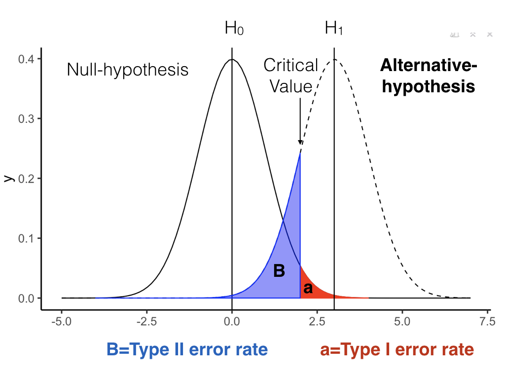
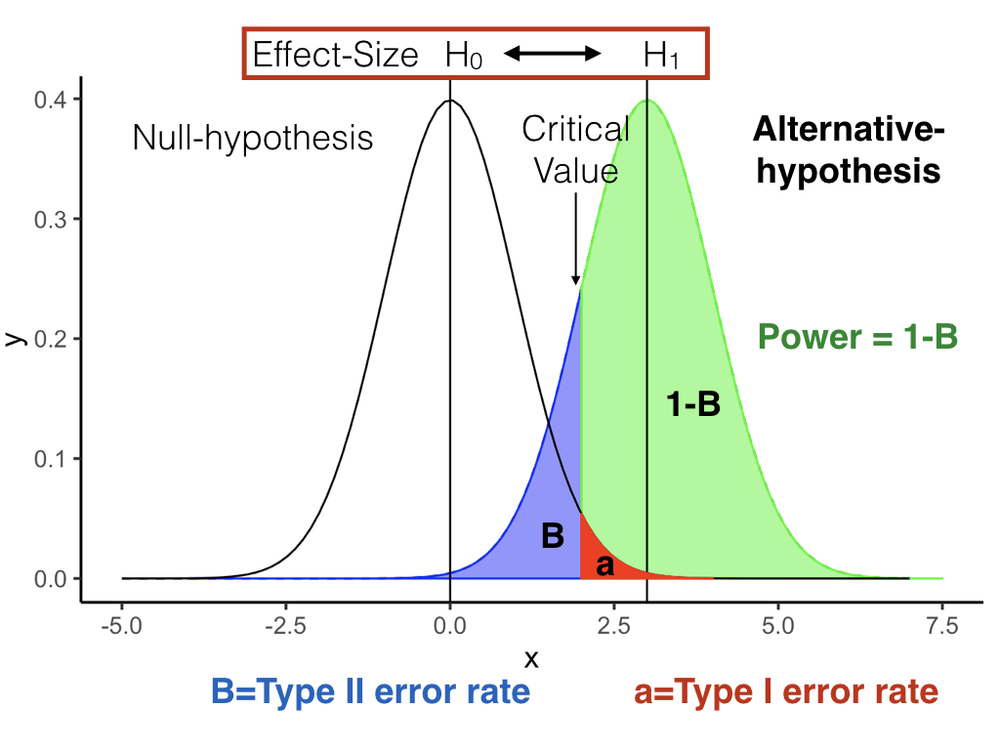

```{r setup, include=FALSE, echo=FALSE}
options(htmltools.dir.version = FALSE)
knitr::opts_chunk$set(echo = FALSE,message=FALSE,warning=FALSE, cache = FALSE)
```

class: pink, center, middle, clear

# Don't run an experiment that is designed to fail

---

class: pink, center, middle, clear

# How? Power analysis, effect-size, and sample-size planning

---

#overview

1. Z-score reminder
2. Effect-size
3. Power
4. Sample-size planning

---

class: pink, center, middle, clear

# z-scores

---

# z-score review

Formula for z-score

$z = \frac{\text{score} - \text{mean}}{\text{SD}}$

---

# what does z tell us?

A z-score tells us **how far away a score is from the mean, in standard deviation units**

```{r, fig.width=7, fig.height=5}
library(ggplot2)

ggplot(data = data.frame(x = c(25, 175)), aes(x)) +
  stat_function(fun = dnorm, n = 101, args = list(mean = 100, sd = 25)) + ylab("") +
  scale_x_continuous(breaks = c(25,50,75,100,125,150,175))+
  geom_vline(xintercept = 100)+
  theme_classic(base_size=25)

```


---

# What is Z?

.pull-left[
- Mean = 100
- SD = 25
- **Score = 125**
- **z = ?**
]

.pull-right[

```{r, fig.width=7, fig.height=5}
library(ggplot2)

ggplot(data = data.frame(x = c(25, 175)), aes(x)) +
  stat_function(fun = dnorm, n = 101, args = list(mean = 100, sd = 25)) + ylab("") +
  scale_y_continuous(breaks = c())+
  scale_x_continuous(breaks = c(25,50,75,100,125,150,175))+
  geom_vline(xintercept = 100)+
  theme_classic(base_size=35)

```
]

---


# What is Z?

.pull-left[
- Mean = 100
- SD = 25
- **Score = 50**
- **z = ?**
]

.pull-right[

```{r, fig.width=7, fig.height=5}
library(ggplot2)

ggplot(data = data.frame(x = c(25, 175)), aes(x)) +
  stat_function(fun = dnorm, n = 101, args = list(mean = 100, sd = 25)) + ylab("") +
  scale_y_continuous(breaks = c())+
  scale_x_continuous(breaks = c(25,50,75,100,125,150,175))+
  geom_vline(xintercept = 100)+
  theme_classic(base_size=35)

```
]

---


# What is Z?

.pull-left[
- Mean = 0
- SD = 1
- **Score = 1.5**
- **z = ?**
]

.pull-right[

```{r, fig.width=7, fig.height=5}
library(ggplot2)

ggplot(data = data.frame(x = c(-3, 3)), aes(x)) +
  stat_function(fun = dnorm, n = 101, args = list(mean = 0, sd = 1)) + ylab("") +
  scale_y_continuous(breaks = c())+
  scale_x_continuous(breaks = c(-3,-2,-1,0,1,2,3))+
  geom_vline(xintercept = 0)+
  theme_classic(base_size=35)

```
]

---

# review of z

- when z=1, the score is 1 sd from the mean
- when z=2, the score is 2 sd from the mean
- when z=3, the score is 3 sd from the mean

---

class: pink, center, middle, clear

# Effect-size

---

# Effect-size

When we run an experiment, we are interested in whether the **manipulation** caused a difference in our **measurement**

If, our **manipulation** causes a difference in our **measurement**, then there will be an **effect**.

**Effect-size** refers to how big or small the effect is

---

# Measures of effect-size

There are many different measures of effect size. Consider the simplest measure for two groups, A and B.

**Mean difference**

The difference between the mean of A, and the mean of B, is a measure of the effect size.

- Large mean difference is a large effect
- Small mean difference is a small effect

---

# How big is big?

- What if the mean difference is 50, is that big or small?

- What if the mean difference is 1, is that big or small?

---

# Relative to what?

Mean differences can be interpreted if we know what the difference is relative to.

- mean A = 1000, mean B = 1050
  - difference=50
  - 5% increase, not so big
  
- mean A = 1, mean B = 2
  - difference=1
  - 100% increase, pretty big


---

# Cohen's D

Cohen's D express a mean difference between two samples in terms of standard deviation units (like a z-score). This allows us to know something about the relative size.

- D = .1 (mean difference is shifted by .1 SD)
- D = 1 (mean difference is shifted by 1 SD)
- D = 2 (mean difference is shifted by 2 SD)

---

# Cohen's D formula

The general idea is:

$d = \frac{\text{MeanA}-\text{MeanB}}{SD}$

---

# M=0, SD=1, D=1

A = Black, B = Red, Cohen's D = 1

```{r, fig.width=8, fig.height=6}
ggplot(data = data.frame(x = c(-3, 4)), aes(x)) +
  stat_function(fun = dnorm, n = 101, args = list(mean = 0, sd = 1), aes(size=3)) + 
  stat_function(fun = dnorm, n = 101, args = list(mean = 1, sd = 1), aes(color="red", size=3)) + 
  ylab("") +
  scale_y_continuous(breaks = c())+
  scale_x_continuous(breaks = c(-3,-2,-1,0,1,2,3))+
  geom_vline(xintercept = 0)+
  geom_vline(xintercept = 1)+
  theme_classic(base_size=35)+
  theme(legend.position = "none")

```

---


# M=100, SD=25, D=1

A = Black, B = Red, Cohen's D = 1

```{r, fig.width=8, fig.height=6}
ggplot(data = data.frame(x = c(25, 200)), aes(x)) +
  stat_function(fun = dnorm, n = 101, args = list(mean = 100, sd = 25), aes(size=3)) + 
  stat_function(fun = dnorm, n = 101, args = list(mean = 125, sd = 25), aes(color="red", size=3)) + 
  ylab("") +
  scale_y_continuous(breaks = c())+
  scale_x_continuous(breaks = c(25,50,75,100,125,150,175))+
  geom_vline(xintercept = 100)+
  geom_vline(xintercept = 125)+
  theme_classic(base_size=35)+
  theme(legend.position = "none")

```

---

# No-difference

If there is no difference, how big is Cohen's D?

What do the distributione for A and B look like?

---

# No-difference

A and B come from the same distribution, no difference

```{r, fig.width=8, fig.height=6}
ggplot(data = data.frame(x = c(-3, 4)), aes(x)) +
  stat_function(fun = dnorm, n = 101, args = list(mean = 0, sd = 1), aes(size=3)) + 
  stat_function(fun = dnorm, n = 101, args = list(mean = 0, sd = 1), aes(color="red", size=2.5)) + 
  ylab("") +
  scale_y_continuous(breaks = c())+
  scale_x_continuous(breaks = c(-3,-2,-1,0,1,2,3))+
  geom_vline(xintercept = 0)+
  geom_vline(xintercept = 1)+
  theme_classic(base_size=35)+
  theme(legend.position = "none")

```


---

# Interpreting Cohen's D

Cohen gives these recommendations:

- **Small**: d = .2  
- **Medium**: d =.5
- **Large**: d >= .8

Note d's larger than 1 are really big, they shift the whole distribution by a whole standard deviation, that's a lot!

---

# D's in Psychology

Many effects in Psychology are **small**, with **d around .2**.

One reason is that we measure people, and people are highly variable.

---

class: pink, center, middle, clear

# Power

---

# Power

**Power** is the probability of rejecting the null-hypothesis, **when there is a TRUE DIFFERENCE**

- **Power = .2**, You will reject the null-hypothesis 20% of the time (20/100 experiments)
- **Power = .8**, (considered high power), You will reject the null-hypothesis 80% of the time (80/100 experiments)

---

# Power is a property of a design

Every design has it's own **Power** to detect effects of different sizes.

The power of a design depends on:
  - sample-size (n)
  - Effect-size (d)
  - alpha-criterion

---

# General info about power

1. Increasing sample-size, increases power
2. Increasing effect-size, increases power
3. Lowering alpha (making it easier to reject null), increases power

---

# type I error

```{r}
knitr::include_graphics("figs/power/Power.001.png")
```

---

# Alternative Hypothesis (d > 0)

```{r}

```

---

# B = type II error

```{r}

```

---

# Power = 1-B

```{r}

```

---

# Power and effect-size

```{r}

```

---

# Paired-sample t-test (n=10)

- Get 1,000 t-values assuming null is true
- Get 1,000 t-values assuming alternative is true (d=1)

```{r, echo=T}
t_null <- replicate(1000,t.test(rnorm(10,0,1),
                                rnorm(10,0,1),
                                paired=TRUE)$statistic)

t_alt <- replicate(1000,t.test(rnorm(10,1,1),
                                rnorm(10,0,1),
                                paired=TRUE)$statistic)
```


---

# look at both t-distributions

power = `r length(t_alt[t_alt > qt(.95,9)])/1000` to detect d=1

```{r, fig.width=8, fig.height=6}
df<- data.frame(type= rep(c("null","alternative"),each=1000),
                ts = c(t_null,t_alt))

ggplot(df, aes(x=ts, group=type,
               fill=type))+
  geom_histogram(alpha=0.7, position="identity")+
  theme_classic(base_size=25)+
  theme(legend.position="top")+
  geom_vline(xintercept=qt(.95,9))
```


---

# Increase N from 10 to 50

- Get 1,000 t-values assuming null is true
- Get 1,000 t-values assuming alternative is true (d=1)

```{r, echo=T}
t_null <- replicate(1000,t.test(rnorm(50,0,1),
                                rnorm(50,0,1),
                                paired=TRUE)$statistic)

t_alt <- replicate(1000,t.test(rnorm(50,1,1),
                                rnorm(50,0,1),
                                paired=TRUE)$statistic)
```


---

# n=50

power = `r length(t_alt[t_alt > qt(.95,9)])/1000` to detect d=1

```{r, fig.width=8, fig.height=6}
df<- data.frame(type= rep(c("null","alternative"),each=1000),
                ts = c(t_null,t_alt))

ggplot(df, aes(x=ts, group=type,
               fill=type))+
  geom_histogram(alpha=0.7, position="identity")+
  theme_classic(base_size=25)+
  theme(legend.position="top")+
  geom_vline(xintercept=qt(.95,9))
```


---

# N=10, Increase d to 2

- Get 1,000 t-values assuming null is true
- Get 1,000 t-values assuming alternative is true (d=1)

```{r, echo=T}
t_null <- replicate(1000,t.test(rnorm(10,0,1),
                                rnorm(10,0,1),
                                paired=TRUE)$statistic)

t_alt <- replicate(1000,t.test(rnorm(10,2,1),
                                rnorm(10,0,1),
                                paired=TRUE)$statistic)
```


---

# n=10, d=2

power = `r length(t_alt[t_alt > qt(.95,9)])/1000` to detect d=2

```{r, fig.width=8, fig.height=6}
df<- data.frame(type= rep(c("null","alternative"),each=1000),
                ts = c(t_null,t_alt))

ggplot(df, aes(x=ts, group=type,
               fill=type))+
  geom_histogram(alpha=0.7, position="identity")+
  theme_classic(base_size=25)+
  theme(legend.position="top")+
  geom_vline(xintercept=qt(.95,9))
```

---

# Power curves

A specific design, e.g., 

- Paired samples t-test, with n =10

Has different levels of power, to detect effects of different size. This can be shown on a power curve.

---

# Power curve, t.test, n=10

```{r,fig.width=8, fig.height=6}
library(pwr)

effect_sizes <- seq(.1,2,.1)
power <- sapply(effect_sizes, 
          FUN = function(x) {
            pwr.t.test(n=10,
            d=x,
            sig.level=.05,
            type="paired",
            alternative="two.sided")$power})
plot_df <- data.frame(effect_sizes,power)

library(ggplot2)
ggplot(plot_df, aes(x=effect_sizes,
                    y=power))+
  geom_point()+
  geom_line()+
  theme_classic(base_size=25)
```

---

# Sample-size planning

**How many subjects do you need for your experiment?**

1. Establish a minumum effect-size of interest
2. Conduct a power-analysis, to show how power changes as a function of sample-size to detect the minimum effect size of interest

---

# Example

1. Minimum effect-size of interest, d = .2
2. Plot the power function

---

# power as a function of n

```{r,fig.width=8, fig.height=6}
num_subjects <- seq(10,1000,10)
power <- sapply(num_subjects, 
          FUN = function(x) {
            pwr.t.test(n=x,
            d=.2,
            sig.level=.05,
            type="paired",
            alternative="two.sided")$power})
plot_df <- data.frame(num_subjects,power)

library(ggplot2)
ggplot(plot_df, aes(x=num_subjects,
                    y=power))+
  geom_point()+
  geom_line()+
  theme_classic(base_size=25)
```


---

class: pink, center, middle, clear

# Don't run an experiment that is designed to fail

---

class: pink, center, middle, clear

# How? Do a power analysis, beforehand

---


# Next class: Midterm Review

1. Quiz on t-tests, due next Monday
2. Midterm review next Monday
3. Midterm review sheet and info is posted on Blackboard


