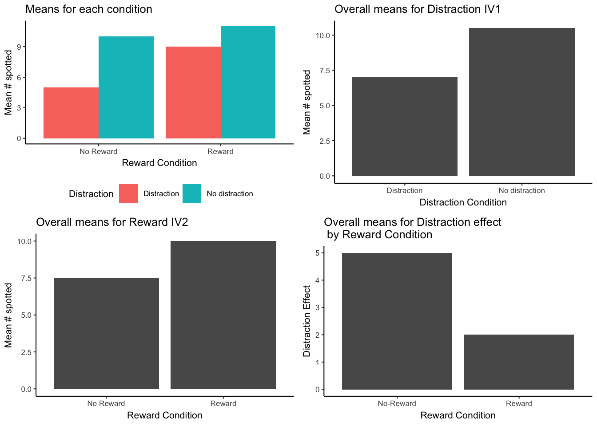

```{r setup, include=FALSE, echo=FALSE}
options(htmltools.dir.version = FALSE)
knitr::opts_chunk$set(echo = FALSE,message=FALSE,warning=FALSE, cache = TRUE)
```

# Overview

1. Factorial ANOVA basics
2. Main effects and interactions
3. Textbook Example

---

# Factorial ANOVA

When to use:

1. Your design has multiple independent variables.

  a. IVs could be all between-subject
  
  b. IVs could be all within-subject
  
  c. IVs could be a mix

---

# Factorial Notation

Each number represents one IV. The value is the number of levels in the manipulation. Multplying through gives number of conditions.

- 2x2 = 2 IVs, each has two levels
- 2x2x2 = 3 IVs, each has two levels
- 3x4 = 2 IVs, the first has 3 levels, the second has 4 levels.


---

# 2x2 Design

```{r, out.width="100%"}
knitr::include_graphics("figs/factorial/2x2Design.png")
```

---

# 2x3 Design

```{r}
knitr::include_graphics("figs/factorial/2x3Design.png")
```

---

# Fully Factorial

A design is fully factorial when the levels of each variable are fully crossed with the levels of every other variable.

e.g., the levels of of IV1 are manipulated across the levels of IV2 (in a 2x2 design)

-in other words, there are no missing cells

---

# Main effects and Interactions

1. Main effects: Differences between the means for each level of an IV.

2. Interaction: Occurs when the effect of one IV depends on the levels of another IV. (e.g, the differences between the means for IV 1 changes across the levels of IV2)

---

class: center, middle, clear, nopad

```{r, out.width="70%"}

```

---

class: center, middle, clear

Learning Goals

---

# Factorial skills

Be able to:

1. Identify the pattern of main effects in a table, bar graph or line graph

2. Identify the pattern of an interaction in a table, bar graph or line grpah

3. Conduct and interpret a 2x2 factorial ANOVA in R (betweem, repeated, or mixed)

---

# Possible outcomes for a 2x2

```{r, out.width="80%"}

```

---
class: center, middle, clear, nopad

```{r, out.width="80%"}

```

---

class: center, middle, clear, nopad

```{r, out.width="80%"}

```

---

class: center, middle, clear

Textbook Example

---

# Why have more than one IV?

- The first IV usually measures an effect of interest.
- Additional IVs allow a researcher to identify causal forces that change (modulate) the effect of interest

---

# Research interest: Distraction

Let's say you want to study the ability to maintain focus in the presence of distraction...you might:

1. Create a task to measure performance
2. Measure the effect of distraction on performance
3. Then, try out other manipulations that might change the distraction effect

---

# Pick a task to measure performance:

Spot the difference

```{r, out.width="80%"}
knitr::include_graphics("figs/factorial/spot_dif.png")
```

---

# Create a distraction effect

IV 1: Distraction (no distraction vs. distraction)

```{r, out.width="80%"}

```

---

# Manipulate the distraction effect

IV 2: Reward (no reward vs. reward)

```{r, out.width="80%"}

```

---

# Putting reward on x-axis

IV 2: Reward (no reward vs. reward)

```{r, out.width="80%"}

```

---

class: center, middle, clear, nopad

```{r, out.width="85%"}

```

---

# Main effects and Interaction

```{r, out.width="80%"}

```

---

class: center, middle, clear, nopad

```{r, out.width="95%"}

```

---

class: center, middle, clear, nopad

```{r, out.width="95%"}

```

---

class: center, middle, clear, nopad

```{r, out.width="95%"}

```

---

class: center, middle, clear, nopad

```{r, out.width="95%"}

```

---

# Factorial ANOVA Table

```{r, out.width="90%"}

```


---

# R: Between 2x2 Factorial

```{r, echo=T}
NR_D <- c(3,2,4,1)
NR_ND <- c(8,7,8,6)
R_D <- c(6,7,5,7)
R_ND <-c (9,8,7,10)
DV <- c(NR_D,NR_ND,R_D,R_ND)
Reward <- rep(c("NoReward","Reward"),each=8)
Distraction <- rep(c("Distraction","NoDistraction"),each=4)
Distraction <-rep(Distraction,2)
df<-data.frame(Reward,Distraction,DV)
```

---

# R: Factorial ANOVA formula (between)

```{r, echo=T}
summary(aov(DV~Reward*Distraction,df))
```

---

# 2x2 Factorial in Excel


---


# Next class: Extra credit tutorial

1. No quiz this week
2. Next class, Shira Stone will show you how to do the posted extra-credit assignments (1% each on final grade)


